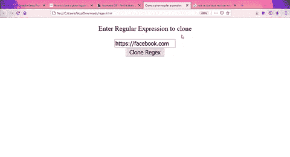
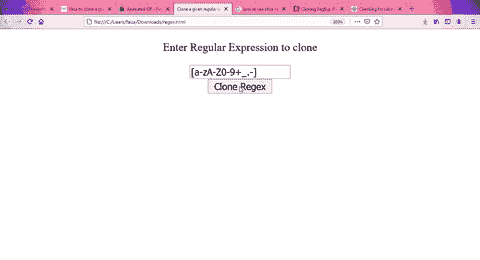

# 如何在 JavaScript 中克隆给定的正则表达式？

> 原文:[https://www . geesforgeks . org/如何克隆给定的 javascript 正则表达式/](https://www.geeksforgeeks.org/how-to-clone-a-given-regular-expression-in-javascript/)

在本文中，我们将了解如何使用 JavaScript 克隆正则表达式。我们可以使用构造函数 **RegExp()克隆一个给定的正则表达式。**

使用此构造函数的语法定义如下

**语法:**

```
new RegExp(regExp , flags)
```

这里，正则表达式是要克隆的表达式，标志决定了克隆的标志。主要使用三种标志。

*   **g:** 全局标志使用此标志，搜索将查找全局匹配。
*   **i:** 使用此标志时，搜索不区分大小写。
*   **m:** 使用此标志，我们执行多行匹配。

现在让我们看看如何使用 Javascript 中的 **RegExp( )** 构造函数克隆给定的正则表达式。

**示例:-**

## 超文本标记语言

```
<!DOCTYPE html>
<html lang="en">
  <head>
    <meta charset="utf-8" />
    <meta name="viewport" content="width=device-width" />

    <script src=
"https://ajax.googleapis.com/ajax/libs/jquery/3.5.1/jquery.min.js">
    </script>
    <title>Clone a given regular expression</title>
  </head>
  <body style="text-align: center">
    <p>Enter Regular Expression to clone</p>

    <input type="text" id="data" name="input" /><br />
    <button id="b1">Clone Regex</button>
    <div id="display"></div>

    <script>
      function cloneRegex(input, outputflag) {
        var pattern = input.source;
        const flags = [...new Set(input.flags + outputflag)].join("");
        // Using RegExp constructor to  for cloning regular expressions,
        // optionally while modifying flag also.
        return new RegExp(pattern, flags);
      }

      //Taking User data as input
      var d = $("#data").val();

      var regex = new RegExp(d, "i");
      //Passing user data to cloneRegex function with g set as flag.
      var clonedregex = cloneRegex(regex, "g");

      $("#b1").click(function () {
        $("#display").html("Cloned regex is as follows:-" + clonedregex);
      });
    </script>
  </body>
</html>
```

**输出 1:**



**输出 2:**

