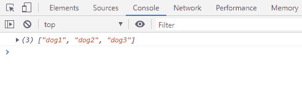

# ES6 中如何克隆阵列？

> 原文:[https://www.geeksforgeeks.org/how-to-clone-array-in-es6/](https://www.geeksforgeeks.org/how-to-clone-array-in-es6/)

ES6 中的 [**扩展运算符**](https://www.geeksforgeeks.org/javascript-spread-operator/) 用于克隆数组，而 JavaScript 中的 slice()方法是一种较旧的方法，它提供 0 作为第一个参数。这些方法创建一个新的、独立的数组，并将旧数组的所有元素复制到新数组中，也就是说，这两种方法都会对原始数组进行浅拷贝。

**语法:**

```
// Older way
var clonedArray= oldArray.slice(0)    

// ES6 way: spread operator
var clonedArrayES6= [...oldArray]    

```

**示例:**

```
<script>

// Cloning array using spread
// operator- ES6

const oldArray= ["dog1", "dog2", "dog3"];

const clonedArrayES6= [...oldArray];

// ["dog1", "dog2", "dog3"]
console.log(clonedArrayES6);  
</script>
```

**输出:**


**相等和相同:**不同于“=”运算符创建的新变量只是指向原始数组，而不是复制其元素，spread 运算符创建一个新的克隆数组，引用不同但值相同。因此“=”运算符创建原始数组的深层副本，而扩展运算符则创建浅层副本。扩展运算符创建的数组与旧数组的值相同，但与旧数组不同。

**示例:**

```
<script>
// Equality and sameness in cloning array

const oldArray= ["dog1", "dog2", "dog3"];

const clonedArrayES6 = [...oldArray];
const newArray = oldArray;

// False, i.e. shallow copy
console.log(clonedArrayES6===oldArray)  

// True, i.e. deep copy
console.log(newArray === oldArray)  
</script>
```

**输出:**


**注意:**以上所有示例都可以通过在 HTML 的脚本标签内输入或者直接输入浏览器的控制台进行测试。