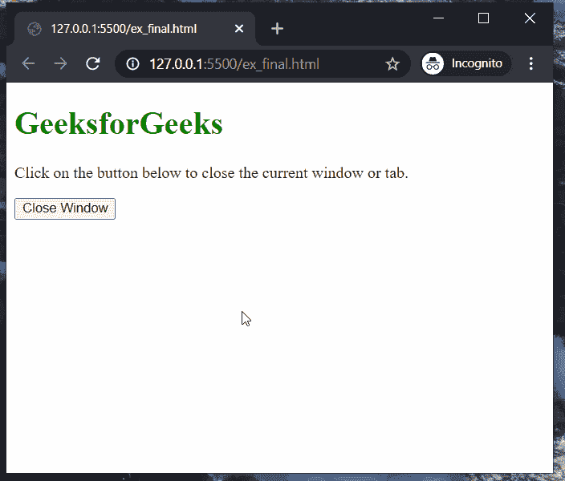

# 如何使用用户用 URL 打开的 JavaScript 关闭窗口？

> 原文:[https://www . geesforgeks . org/如何使用 javascript 关闭由用户用 url 打开的窗口/](https://www.geeksforgeeks.org/how-to-close-window-using-javascript-which-is-opened-by-the-user-with-a-url/)

由于安全问题，JavaScript 不允许用户使用 window.close()方法关闭用户打开的窗口。但是，我们可以使用一种变通方法来关闭窗口。要遵循的方法是使用 JavaScript 打开当前的 URL，这样就可以用脚本关闭它。

下面的步骤演示了这种方法:

**第一步:使用 open()方法打开一个新窗口:**首先我们需要使用 **window.open()** 方法打开一个新窗口。使用窗口对象的 l **位置**属性可以访问当前的网址。窗口的目标属性或名称值为 **_self** 。这很重要，因为它使网址取代了当前页面。

**步骤 2:使用 Close()方法关闭这个打开的窗口:**使用 **window.close()** 方法关闭调用它的窗口。使用此方法关闭第一步中打开的窗口。这是可行的，因为窗口现在已经由我们的脚本而不是用户打开了。

**注意:**由于浏览器安全的实现不同，这种方法可能无法在所有浏览器上工作。

下面的示例演示了上述步骤:

**示例:**

## 超文本标记语言

```html
<!DOCTYPE html>
<html>

<body>
    <h1 style="color: green;">
        GeeksforGeeks
    </h1>

    <p>
        Click on the button below to
        close the current window.
    </p>

    <!-- Define the button to 
       close the window -->
    <button onclick="return closeWindow();">
        Close Window
    </button>

    <script type="text/javascript">
        function closeWindow() {

            // Open the new window 
            // with the URL replacing the
            // current page using the
            // _self value
            let new_window =
                open(location, '_self');

            // Close this window
            new_window.close();

            return false;
        }
    </script>
</body>

</html>
```

**输出:**

