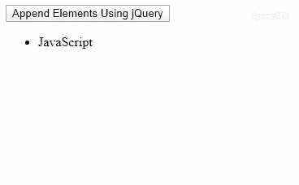
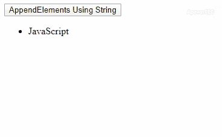
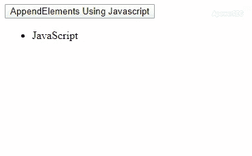

# 如何使用 JavaScript 组合多个元素，并将结果追加到 div 中？

> 原文:[https://www . geeksforgeeks . org/如何组合多个元素并使用 javascript 将结果追加到 div 中/](https://www.geeksforgeeks.org/how-to-combine-multiple-elements-and-append-the-result-into-a-div-using-javascript/)

组合多个元素并将元素添加到 DOM 中是一个非常关键的过程，它会变得非常耗时。如果处理不当，那么作为开发人员，我们应该知道如何有效地更新 DOM。下面是将 HTML 元素附加到 DOM 的三种方法。以下方法按时间复杂度的降序排列。

*   使用 jQuery 的追加方法。
*   使用字符串而不是节点追加元素。
*   使用纯 JavaScript 创建和追加节点。

对于本指南，我们将假设我们的任务是在网页正文中添加 10 个列表项。

**方法 1:** 该方法使用 jQuery **[append()方法](https://www.geeksforgeeks.org/jquery-append-method/)** 放入想要插入的 DOM 元素。

*   **例:**

    ```html
    <!DOCTYPE html>
    <html>

    <head>
        <title>
            Appending new elements to document body .
        </title>
        <script src=
    "https://ajax.googleapis.com/ajax/libs/jquery/3.4.1/jquery.min.js">
        </script>
        <script>
            var Elements = ["C", "C++", "Java", "Python",
                            "R", "Perl", "C#", "PHP"];

            function AddNewElementsByJquery() {
                for (var i = 0; i < Elements.length; i++) {
                    $("#Languages")
                    .append('<li>' + Elements[i] + '</li>');
                }
            }
        </script>
    </head>

    <body>
        <button onclick="AddNewElementsByJquery()">
            Append Elements Using jQuery
        </button>
        <div id="LanguagesDiv">
            <ul id="Languages">
                <li>JavaScript</li>
            </ul>
        </div>
    </body>

    </html>       
    ```

*   **输出:** 

**方法 2:** 用字符串代替节点追加元素。声明一个空的 JavaScript 字符串来存储该字符串中的 HTML 元素。不断向字符串中添加新元素。使用 jQuery 的 **[追加()方法](https://www.geeksforgeeks.org/jquery-append-method/)** 将该字符串追加到文档或一些已经存在的 DOM 节点。

*   **例:**

    ```html
    <!DOCTYPE html>
    <html>

    <head>
        <title>
            Appending new elements to document body .
        </title>
        <script src=
    "https://ajax.googleapis.com/ajax/libs/jquery/3.4.1/jquery.min.js">
        </script>
        <script>
            var Elements = ["C", "C++", "Java", "Python",
                            "R", "Perl", "C#", "PHP"];

            function AddNewElementUsingString() {
                var NodesString = "";
                for (var i = 0; i < Elements.length; i++) {
                    NodesString += "<li>" + Elements[i] + "</li>";
                }
                var UlElement = document.getElementById('Languages');
                $("#Languages").append(NodesString);
            }
        </script>
    </head>

    <body>
        <button onclick="AddNewElementUsingString()">
          AppendElements Using String
        </button>
        <div id="LanguagesDiv">
            <ul id="Languages">
                <li>JavaScript</li>
            </ul>
        </div>
    </body>

    </html>  
    ```

*   **输出:** 

**方法 3:** 使用纯 JavaScript 追加元素。使用 **[document.createElement()方法](https://www.geeksforgeeks.org/html-dom-createelement-method/)** 在参数中标记元素名称。在元素的属性中设置值。下面是设置列表元素的 innerHTML 属性。使用 appendChild 方法将新创建的元素追加到片段中。将片段附加到 DOM 的主体或 DOM 的某个已经存在的节点。

*   **例:**

    ```html
    <!DOCTYPE html>
    <html>

    <head>
        <title>
            Appending new elements to document body .
        </title>
        <script src=
    "https://ajax.googleapis.com/ajax/libs/jquery/3.4.1/jquery.min.js">
        </script>
        <script>
            var Elements = ["C", "C++", "Java", "Python", 
                            "R", "Perl", "C#", "PHP"];

            function AddElementsByPureJs() {
                var fragment = document.createDocumentFragment();
                for (var i = 0; i < Elements.length; i++) {
                    var e = document.createElement("li");
                    e.innerHTML = Elements[i];
                    fragment.appendChild(e);
                }
                var UlElement = document.getElementById('Languages');
                UlElement.appendChild(fragment);
            }
        </script>
    </head>

    <body>
        <button onclick="AddElementsByPureJs()">
          AppendElements Using Javascript
        </button>
        <div id="LanguagesDiv">
            <ul id="Languages">
                <li>JavaScript</li>
            </ul>
        </div>
    </body>

    </html>    
    ```

*   **输出:** 