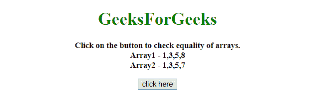
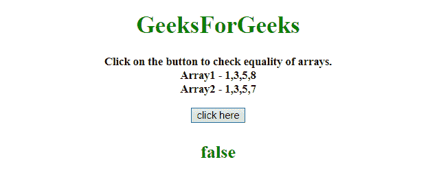
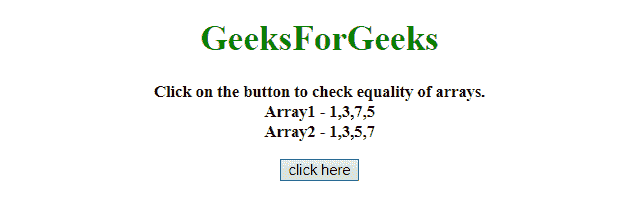
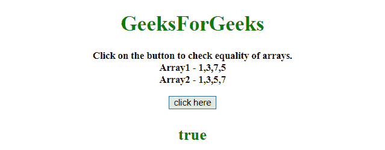
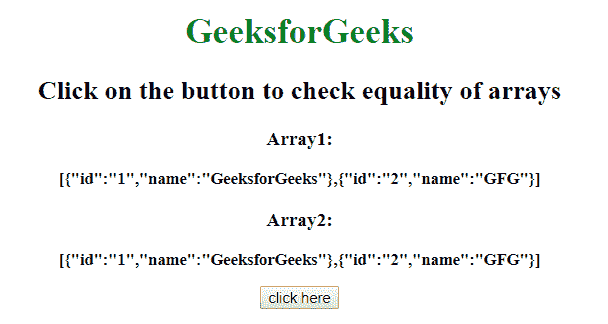
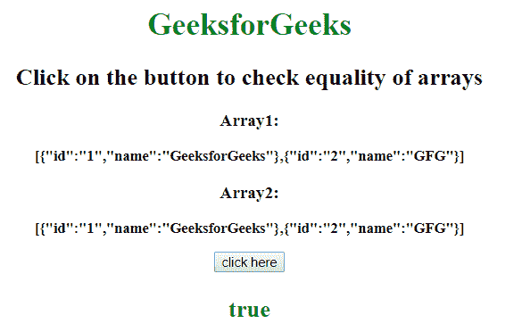

# 如何使用 jQuery/JavaScript 比较两个 JavaScript 数组对象？

> 原文:[https://www . geesforgeks . org/how-to-compare-two-JavaScript-array-objects-use-jquery-JavaScript/](https://www.geeksforgeeks.org/how-to-compare-two-javascript-array-objects-using-jquery-javascript/)

给定两个 JavaScript 数组/数组对象，任务是比较两个数组对象的相等性。
**进场 1:**

*   使用 [jQuery not()方法](https://www.geeksforgeeks.org/jquery-not-method-with-examples/)检查数组 1 的每个元素，如果它不存在于数组 2 中，或者检查数组 2 的每个元素，如果它不存在于数组 1 中，则在这两种情况下都返回 false。
*   还要检查两个数组的长度。

**示例:**本示例使用 [jQuery not()方法](https://www.geeksforgeeks.org/jquery-not-method-with-examples/)比较两个数组的相等性。

## 超文本标记语言

```
<!DOCTYPE HTML> 
<html> 

<head> 
    <title> 
        How to compare two JavaScript
        array objects using jQuery ?
    </title>

    <script src=
"https://ajax.googleapis.com/ajax/libs/jquery/3.4.1/jquery.min.js">
    </script>
</head> 

<body style = "text-align:center;"> 

    <h1 style = "color:green;" > 
        GeeksForGeeks 
    </h1>

    <p id = "GFG_UP" style =
        "font-size: 15px; font-weight: bold;">
    </p>

    <button onclick = "GFG_Fun()">
        click here
    </button>

    <p id = "GFG_DOWN" style =
        "font-size: 24px; font-weight: bold; color: green;">
    </p>

    <script> 
        var up = document.getElementById('GFG_UP');
        var down = document.getElementById('GFG_DOWN');
        var arr1 = [1, 3, 5, 8];
        var arr2 = [1, 3, 5, 7];

        up.innerHTML = "Click on the button to check "
                + "equality of arrays.<br>Array1 - "
                + arr1 + "<br>Array2 - " + arr2;

        function GFG_Fun() {
            down.innerHTML =
                    $(arr1).not(arr2).length === 0 &&
                    $(arr2).not(arr1).length === 0;
        }
    </script> 
</body> 

</html>
```

**输出:**

*   **点击按钮前:**



*   **点击按钮后:**



**进场 2:**

*   首先，使用 sort()函数以升序对两个数组进行排序。
*   然后开始逐个匹配元素，如果发现不匹配，则返回 false，否则返回 true。

**示例:**该示例使用如上所述的方法。

## 超文本标记语言

```
<!DOCTYPE HTML> 
<html> 

<head> 
    <title> 
        How to compare two JavaScript
        array objects using jQuery ?
    </title>

    <script src=
"https://ajax.googleapis.com/ajax/libs/jquery/3.4.1/jquery.min.js">
    </script>
</head> 

<body style = "text-align:center;"> 

    <h1 style = "color:green;" > 
        GeeksForGeeks 
    </h1>

    <p id = "GFG_UP" style =
        "font-size: 15px; font-weight: bold;">
    </p>

    <button onclick = "GFG_Fun()">
        click here
    </button>

    <p id = "GFG_DOWN" style =
        "font-size: 24px; font-weight: bold; color: green;">
    </p>

    <script> 
        var up = document.getElementById('GFG_UP');
        var down = document.getElementById('GFG_DOWN');
        var arr1 = [1, 3, 7, 5];
        var arr2 = [1, 3, 5, 7];

        up.innerHTML = "Click on the button to check "
                + "equality of arrays.<br>Array1 - "
                + arr1 + "<br>Array2 - " + arr2;

        function compare(ar1, ar2) {
            ar1.sort();
            ar2.sort();

            if(ar1.length != ar2.length)
                return false;

            for(var i = 0; i < ar1.length; i++) {
                if (ar1[i] != ar2[i])
                    return false;
            }
            return true;
        }
        function GFG_Fun() {
            down.innerHTML = compare(arr1, arr2);
        }
    </script> 
</body> 

</html>
```

**输出:**

*   **点击按钮前:**



*   **点击按钮后:**



**进场 3:**

*   创建两个数组对象，并将其存储到 arr1 和 arr2 变量中。
*   使用 [JSON.stringify()函数](https://www.geeksforgeeks.org/javascript-json-stringify-with-examples/)将对象转换为 JSON 字符串。
*   现在使用比较运算符(==)比较两个 JSON 字符串，以检查两个数组对象是否相等。

**注意:**该方法仅在两个数组对象以相同方式排序时有效。
**例:**

## 超文本标记语言

```
<!DOCTYPE HTML> 
<html> 

<head> 
    <title> 
        How to compare two JavaScript
        array objects using jQuery ?
    </title>

    <script src=
"https://ajax.googleapis.com/ajax/libs/jquery/3.4.1/jquery.min.js">
    </script>
</head> 

<body style = "text-align:center;"> 

    <h1 style = "color:green;" > 
        GeeksForGeeks 
    </h1>

    <h2>
        Click on the button to check
        equality of arrays
    </h2>

    <p id = "GFG_UP" style =
        "font-size: 15px; font-weight: bold;">
    </p>

    <button onclick = "GFG_Fun()">
        click here
    </button>

    <p id = "GFG_DOWN" style =
        "font-size: 24px; font-weight: bold; color: green;">
    </p>

    <script> 
        var up = document.getElementById('GFG_UP');
        var down = document.getElementById('GFG_DOWN');

        var arr1 = [
            {id: "1", name: "GeeksforGeeks"},
            {id: "2", name: "GFG"}
        ];

        var arr2 = [
            {id: "1", name: "GeeksforGeeks"},
            {id: "2", name: "GFG"}
        ];

        up.innerHTML = "<h3>Array1:</h3> "
                    + JSON.stringify(arr1)
                    + "<h3>Array2:</h3> "
                    + JSON.stringify(arr2);

        function compare(ar1, ar2) {
            if(JSON.stringify(arr1) == JSON.stringify(arr2)){
                return true;
            }
            else
                return false;
        }
        function GFG_Fun() {
            down.innerHTML = compare(arr1, arr2);
        }
    </script> 
</body> 

</html>
```

**输出:**

*   **之前点击按钮:**



*   **点击按钮后:**

