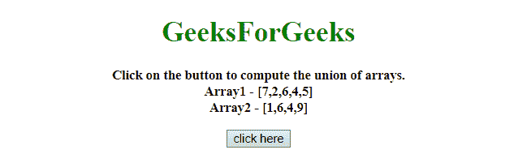
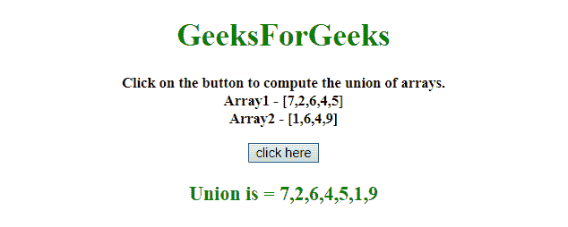
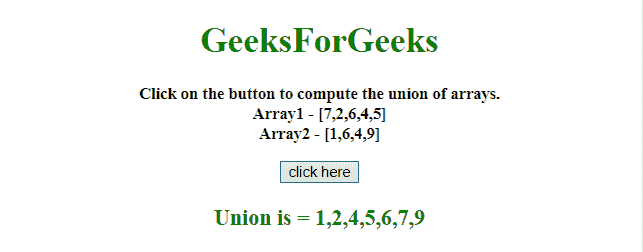

# 如何计算 JavaScript 数组的并集？

> 原文:[https://www . geeksforgeeks . org/计算方法-javascript 数组联盟/](https://www.geeksforgeeks.org/how-to-compute-union-of-javascript-arrays/)

给定两个包含数组元素的数组，任务是在 JavaScript 的帮助下计算两个数组的并集。有两种方法可以解决这个问题，讨论如下:

**方法 1:**

*   将数组命名为 **A** 和 **B** 。
*   使用**展开运算符**连接两个数组并将其存储为集合。
*   因为，set 会删除重复的元素。
*   删除重复元素后，将显示数组元素的并集。

**示例:**该示例实现了上述方法。

```
<!DOCTYPE HTML> 
<html> 

<head> 
    <title> 
        How to compute union of
        JavaScript arrays ?
    </title>
</head>

<body style = "text-align:center;"> 

    <h1 style = "color:green;" id = "h1"> 
        GeeksForGeeks 
    </h1>

    <p id = "GFG_UP" style =
        "font-size: 15px; font-weight: bold;">
    </p>

    <button onclick = "GFG_Fun()">
        click here
    </button>

    <p id = "GFG_DOWN" style = 
        "color:green; font-size: 20px; font-weight: bold;">
    </p>

    <script> 
        var up = document.getElementById('GFG_UP');
        var down = document.getElementById('GFG_DOWN');
        var A = [7, 2, 6, 4, 5];
        var B = [1, 6, 4, 9];

        up.innerHTML = "Click on the button to compute"
                    + " the union of arrays.<br>" 
                    + "Array1 - [" + A + "]<br>Array2 - [" 
                    + B + "]";

        function GFG_Fun() {
            var union = [...new Set([...A, ...B])];
            down.innerHTML = "Union is = " + union;
        }
    </script> 
    </body> 
</html>
```

**输出:**

*   **点击按钮前:**
    
*   **点击按钮后:**
    

**方法 2:**

*   这里，所有元素都存储在一个 JavaScript 对象中。
*   在 JavaScript 对象中存储元素将删除重复的元素。
*   最后，推送 JavaScript 数组中的所有元素。

**示例:**该示例实现了上述方法。

```
<!DOCTYPE HTML> 
<html> 

<head> 
    <title> 
        How to compute union of
        JavaScript arrays ?
    </title>
</head>

<body style = "text-align:center;"> 

    <h1 style = "color:green;" id = "h1"> 
        GeeksForGeeks 
    </h1>

    <p id = "GFG_UP" style =
        "font-size: 15px; font-weight: bold;">
    </p>

    <button onclick = "GFG_Fun()">
        click here
    </button>

    <p id = "GFG_DOWN" style =
        "color:green; font-size: 20px; font-weight: bold;">
    </p>

    <script> 
        var up = document.getElementById('GFG_UP');
        var down = document.getElementById('GFG_DOWN');
        var A = [7, 2, 6, 4, 5];
        var B = [1, 6, 4, 9];

        up.innerHTML = "Click on the button to compute"
            + " the union of arrays.<br>" + "Array1 - ["
            + A + "]<br>Array2 - [" + B + "]";

        function computeUnion(a, b) {
            var object = {};

            for (var i = a.length-1; i >= 0; -- i)
                object[a[i]] = a[i];

            for (var i = b.length-1; i >= 0; -- i)
                object[b[i]] = b[i];

            var ret = []

            for (var i in object) {
                if (object.hasOwnProperty(i))
                ret.push(object[i]);
            }

            return ret;
        }

        function GFG_Fun() {
            down.innerHTML = "Union is = " 
                    + computeUnion(A, B);
        }
    </script> 
</body> 

</html>
```

**输出:**

*   **点击按钮前:**
    
*   **点击按钮后:**
    