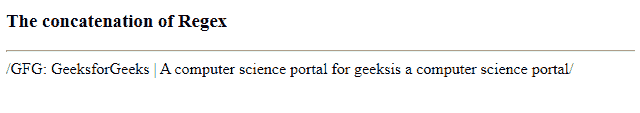
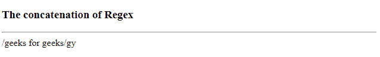

# 如何在 JavaScript 中串联正则表达式文字？

> 原文:[https://www . geesforgeks . org/如何连接-regex-文字-in-javascript/](https://www.geeksforgeeks.org/how-to-concatenate-regex-literals-in-javascript/)

**Regex** 是用于与模式匹配的模式序列。在文本中搜索数据时，搜索模式描述了我们要搜索的内容。它可以是单个字符或更复杂的模式。它可用于执行所有类型的文本搜索。Regex 有自己的静态和实例属性。

**语法:**

```html
/pattern/modifiers

```

**例:**一个正则表达式。

```html
/gfg/g
```

哪里，

*   **gfg** 是一个模式(用于搜索)。
*   **g** 是一个修饰符(将搜索修改为不区分大小写)。

编程世界中 Regex 的串联可以理解为组合文本模式
得到一个新的文本模式，比如“HelloWorld”就是/HelloWorld/。每当调用**正则表达式()**时，它都会创建一个新的**正则表达式**对象。

**示例 1:** 本示例创建一个表达式，但实际上没有使用 Regex 文字语法。这允许您在字符串成为 Regex 对象之前进行任意的字符串操作。

```html
<!DOCTYPE html>
<html>

<head>
    <meta name="viewport" content=
        "width=device-width,initial-scale=1.0" />

    <title>
        Concatenation of Regex
    </title>

</head>

<body>
    <h3>The concatenation of Regex </h3>
    <hr>

    <script>
        function gfg() {
            var segment_part = " GeeksforGeeks |"
                + " A computer science portal for geeks";

            var pattern = new RegExp("GFG:" + 
                    /*comment here */
                    segment_part + 
                    /* that was defined just now */
                    "is a computer science portal");

            document.write(pattern);
        }
        gfg();
    </script>
</body>

</html>
```

**输出:**


**示例 2:** 如果您有两个 regex 文字，您可以使用一种技术将它们连接起来，该技术删除重复项，但保持唯一值的顺序，将两个 Regex 文字连接起来。

**示例:** /hello/y + / world/g 会是/hello world/gy

```html
<!DOCTYPE html>
<html>

<head>
    <meta name="viewport" content=
        "width=device-width, initial-scale=1.0"/>

    <title>
        Concatenation of Regex
    </title>
</head>

<body>
    <h3>Concatenation of Regex </h3>
    <hr>
    <script>
        function gfg() {
            var regex1 = /geeks/g;
            var regex2 = / for geeks/y;
            var flags = (regex1.flags + 
                regex2.flags).split("")
                    .sort().join("")

                    .replace(/(.)(?=.*\1)/g, "");
            var regex3 = new RegExp(regex1.source
                        + regex2.source, flags);

            document.write(regex3);
        }
        gfg();
    </script>
</body>

</html>
```

**输出:**
