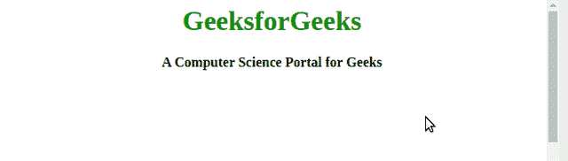

# 如何使用 JavaScript 配置跨浏览器的鼠标滚轮速度？

> 原文:[https://www . geesforgeks . org/如何使用 javascript 配置跨浏览器鼠标滚轮速度/](https://www.geeksforgeeks.org/how-to-configure-mouse-wheel-speed-across-browsers-using-javascript/)

鼠标滚轮的滚动速度随着网页浏览器的选择而变化，甚至改变滚动速度的 DOM 事件和方法也不一样。为了在网页上提供缩放和动画，通常需要配置鼠标速度。车轮的速度可以通过标准化车轮行驶的距离来控制。在不同的网络浏览器中，有多种技术可以改变鼠标滚轮的速度。

**对于 IE、Safari、Chrome:** 操作鼠标滚轮或类似设备时会触发`mousewheel`事件。以下功能可用于控制鼠标滚轮的速度。归一化的距离可以用在类似于网络应用编程接口的**动画、翻译**的功能中，以提供不同的变换和动画。

*   **程序:**

    ```
    var wheelDistance = function(evt) {

        // wheelDelta inidicates how 
        // Far the wheel is turned
        var w = evt.wheelDelta;

        // Returning normalized value
        return w / 120;
    }

    // Adding event listener for some element
    somEl.addEventListener("mousewheel", wheelDistance);
    ```

**火狐:**在火狐中，当鼠标滚轮被操作时，**多鼠标滚动**事件被触发。与上述情况一样，下面函数返回的归一化距离可以在**动画**函数中使用，以提供不同的变换。

*   **程序:**

    ```
    var wheelDistance = function(evt) {

        // Detail describes the scroll precisely
        // Positive for downward scroll
        // Negative for upward scroll
        var d = evt.detail;

        // Returning normalized value
        return -d / 3;
    }

    // Adding event listener for some element
    var speed = somEl.addEventListener(
           "DOMMouseScroll", wheelDistance);
    ```

*   **程序:**我们还可以针对各种网页浏览器做一个可以归一化鼠标滚轮/触控板滚动速度的功能，一个功能就可以服务于各种浏览器的目的。

    ```
    function wheelDistance(e) {
       if (!e) {
            e = window.event;
       }
        let w = e.wheelDelta,
            d = e.detail;
        if (d) {
            return -d / 3; // Firefox;
        }

        // IE, Safari, Chrome & other browsers
        return w / 120;
    }

    // Adding event listeners for some element in DOM
    someEl.addEventListener("mousewheel", handleScroll);
    someEl.addEventListener("DOMMouseScroll", handleScroll);
    ```

**示例:**我们来看一个示例，在这个示例中，我们将使用上面标准化的函数来配置网页的滚动速度。在我们的例子中，我们将使用由 Javascript 库 **jQuery** 提供的动画功能。这个函数在一组数字 CSS 属性上执行自定义动画，如边距、滚动条等。这个函数以及我们上面定义的规范化函数将在我们的 HTML 页面上提供平滑的滚动效果。

*   **程序:**

    ```
    <!DOCTYPE html>
    <html>
    <head>
        <style>
            h1 {
                color: green;
            }
            div {
                text-align: center;
                height: 1200px;
            }

        </style>
        <script src=
    "https://ajax.googleapis.com/ajax/libs/jquery/3.3.1/jquery.min.js">
        </script>
    </head>

    <body>
        <div id="my-div">
          <h1>GeeksforGeeks</h1>
          <b>A Computer Science Portal for Geeks</b>
        </div>

        <script type="text/javascript">
            window.addEventListener("DOMMouseScroll", handleScroll);
            window.addEventListener("mousewheel", handleScroll);

            function wheelDistance(e) {
                console.log(e);
                if (!e) {
                    e = window.event;
                }
                var w = e.wheelDelta,
                    d = e.detail;
                if (d) {
                    return -d / 3; // Firefox;
                }

                // IE, Safari, Chrome & other browsers
                return w / 120;
            }

            function handleScroll(e) {
                var delta = wheelDistance(e);
                console.log(delta);
                var time = 1000;
                var distance = 200;

                $('html, body').stop().animate({
                    scrollTop: $(window).scrollTop()
                              - (distance * delta)
                }, time);
            }
        </script>
    </body>

    </html>
    ```

*   **输出:** 