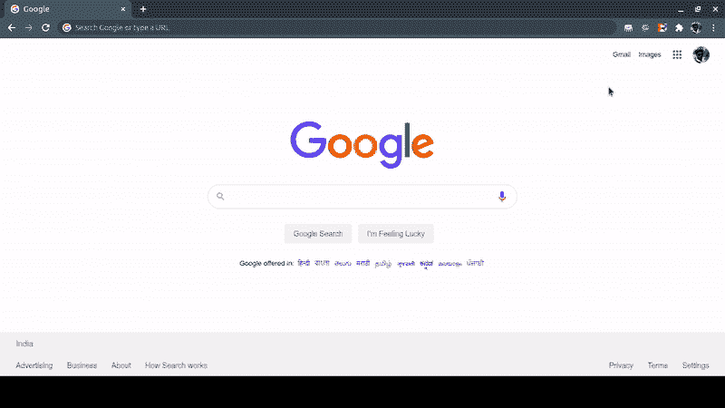

# 如何在浏览器中从 JavaScript 连接 SQL Server 数据库？

> 原文:[https://www . geesforgeks . org/how-connect-SQL-server-database-from-JavaScript-in-browser/](https://www.geeksforgeeks.org/how-to-connect-sql-server-database-from-javascript-in-the-browser/)

从 JavaScript 客户端连接到 SQL Server 数据库没有通用的方法，每个浏览器都有自己的 API 和包来连接到 SQL Server。比如在 Windows 操作系统中，Internet Explorer 有一个类名叫做 **ActiveXObject** ，用来创建 OLE Automation 对象的实例，这些对象帮助我们创建一个 SQL Driver 连接的环境。
出于几个原因，不建议使用 JavaScript 客户端访问数据库。例如，这不是一个好的做法，存在一些安全问题，并且存在漏洞问题。
Node.js 为我们提供了一个在浏览器之外运行 JavaScript 代码的环境，它还提供了一些有用的好处，比如安全性、可伸缩性、健壮性等等。
**SQL Server:** 微软 SQL Server 是微软开发的关系数据库管理系统。作为数据库服务器，它是一种软件产品，主要功能是根据其他软件应用程序的请求存储和检索数据，这些软件应用程序可以在同一台计算机上运行，也可以在网络上的另一台计算机上运行。
**节点。Js:** Node.js 是一个开源的、跨平台的 JavaScript 运行时环境，在 web 浏览器之外执行 JavaScript 代码。

这里，我们在 Node.js 环境中使用 JavaScript 来表示 MS SQL Server 数据库的连接。要开始，我们需要安装某些软件包，并且必须在本地系统中安装**MS SQL Server****node . js**。

强烈建议使用任何命令行工具(CLI)如 terminal、cmd 来运行以下查询和命令。

开始之前 [MS SQL Server](https://www.microsoft.com/en-gb/sql-server/sql-server-downloads) 应该安装在本地系统。

*   点击列出的命令以获得与 SQL Server 的连接。

```
sqlcmd -S localhost -U SA -P "<password>"
```

*   发出列出的查询以创建名为**“极客”的数据库名称。**

```
> CREATE DATABASE geek;
> GO
```

*   使用创建的数据发出列出的查询。

```
> Use <your database name>;
> GO
```

*   发出列出的查询以创建名为**“学生”**的表名，该表名有三个字段 id、名字和姓氏。

```
> CREATE TABLE student (id INT, 
    firstname NVARCHAR(30), lastname NVARCHAR(30));
> GO
```

*   发出列出的查询，将一些值插入表**“学生”。**

```
> INSERT INTO student VALUES (1, 'Stephen', 'Hawking');
> INSERT INTO student VALUES (2, 'Isaac', 'Newton');
> INSERT INTO student VALUES (3, 'Chandrasekhara Venkata', 'Raman');
> GO
```

*   要检查表的条目，请发出列出的查询。

```
> SELECT * from student;
> GO
```

开始之前 [Node.js](https://nodejs.org/en/download/) 应该安装在本地系统中。

*   要创建 Node.js 环境，请发出以下命令。

```
npm init
```

*   Express 允许我们设置中间件来响应 HTTP 请求。

```
npm install express --save
```

*   微软的服务器客户端给了我们与服务器连接的功能。

```
npm install mssql --save
```

首先从 Node.js 部分开始，我们需要在本地系统中创建我们的服务器文件 **server.js** 。

## java 描述语言

```
// Requiring modules
const express = require('express');
const app = express();
const mssql = require("mysql");

// Get request
app.get('/', function (req, res) {

    // Config your database credential
    const config = {
        user: 'SA',
        password: 'Your_Password',
        server: 'localhost',
        database: 'geek'
    };

    // Connect to your database
    mssql.connect(config, function (err) {

        // Create Request object to perform
        // query operation
        var request = new mssql.Request();

        // Query to the database and get the records
        request.query('select * from student',
            function (err, records) {

                if (err) console.log(err)

                // Send records as a response
                // to browser
                res.send(records);

            });
    });
});

var server = app.listen(5000, function () {
    console.log('Server is listening at port 5000...');
});
```

使用以下命令运行 **server.js** 文件:

```
node server.js
```

执行上述命令后，您将在控制台上看到以下输出:

```
Server is listening at port 5000...
```

现在在本地浏览器中点击网址 **http://localhost:5000/** 。

**输出:**

