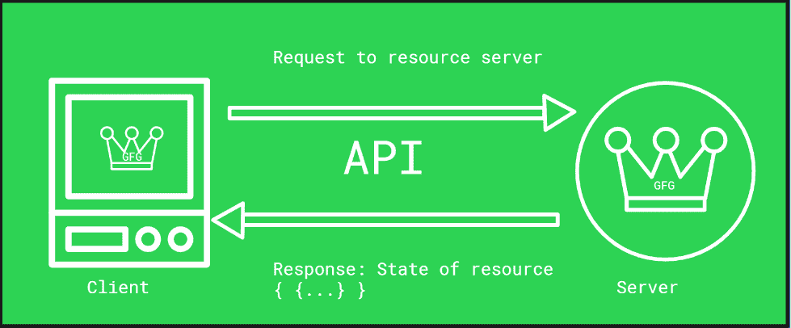
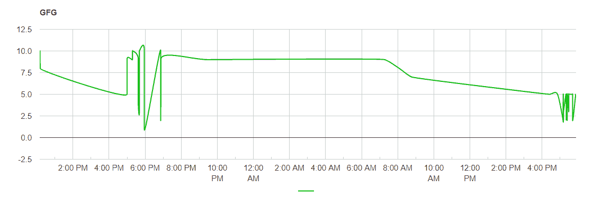

# 如何用 JavaScript 连接一个 API？

> 原文:[https://www . geesforgeks . org/如何连接到 javascript 中的 API/](https://www.geeksforgeeks.org/how-to-connect-to-an-api-in-javascript/)

**应用编程接口或应用编程接口是在通道的**端点**之间传送请求/响应数据的媒介。我们可以想象一个类似于餐馆服务员的 API。一个典型的餐馆服务员会欢迎你并要求你点菜。他/她也确认了这一点，并把这条信息发送到订单队列/厨房。一旦你的饭做好了，他/她也会从厨房把它拿到你的桌子上。因此，在典型场景中，当客户端端点从资源服务器端点请求资源时，该请求通过应用编程接口被传送到服务器。符合特定模式规范的应用程序接口携带了各种相关信息，如 **OpenAPI** 、 **GraphQL** 等提供的信息。这些信息可能包括端点 URL、操作(GET、POST、PUT 等)、身份验证方法、令牌、许可证和其他操作参数。最常见的应用编程接口遵循 **JSON** 和 **XML** 格式作为交换请求/响应的关键模式，而一些应用编程接口也遵循 **YAML** 格式。

**

大多数情况下，资源服务器生成的响应是一个 JSON 模式，它携带了在另一个端点请求的资源的状态信息。因此，这些原料药被命名为 **REST 原料药**，其中 **REST** 代表 **RE** 代表 **S** 状态 **T** 转移。资源的状态会受到 API 操作的影响。还应该注意的是，还有操作系统用来访问内核函数的系统应用编程接口。一个常见的例子包括 **Win32** 应用编程接口，这是一个 windows 平台应用编程接口，作为系统级操作的桥梁，如文件/文件夹选择、按钮样式等。大多数有图形用户界面库的编程语言都在这一层。

**应用编程接口(谷歌地理定位应用编程接口)**样本请求:

```
{
    "homeMobileCountryCode": 310,
    "homeMobileNetworkCode": 311,
    "radioType": "gsm",
    "carrier": "airtel",
    "considerIp": "true",
    "cellTowers": [
        {
            "cellId": 22,
            "locationAreaCode": 115,
            "mobileCountryCode": 310,
            "mobileNetworkCode": 311,
            "age": 0,
            "signalStrength": -40,
            "timingAdvance": 12
          }
    ],
    "wifiAccessPoints": [
        {
        "macAddress": "00:25:9e:ff:jc:wc",
        "signalStrength": -33,
        "age": 0,
        "channel": 12,
        "signalToNoiseRatio": 0
        }
    ]
  }

```

**样本响应:**

```
{
    "location": {
      "lat": 41.1,
      "lng": -0.1
    },
    "accuracy": 1200.2
  }

```

应用编程接口的模式、使用定价等取决于提供应用编程接口的组织。有免费提供的 API，如 PageCDN API，也有基于付费模式的 API，如 Street View Static API。API 使客户/程序员能够使用组织的基础设施和云服务来访问互联网上的各种资源。一个应用编程接口通常需要一个**应用编程接口密钥**(唯一的)以及一些可选的凭证来验证客户端发出的资源请求。网络程序员经常依靠应用编程接口完成各种令人敬畏的技巧，比如在主页上通过推特应用编程接口显示过滤后的推文，通过 HTML2PDF 应用编程接口将 HTML 转换为 pdf 等。对于理科生和爱好者，各种 API 如 NASA APIs(系外行星、Insight 等)按需提供内容。移动应用开发者也在很大程度上使用 API，比如天气 API、地理定位、谷歌分析 API 等。

### **使用 JavaScript 连接到一个 API:**

要使用 JavaScript 进行 API 调用，可以在<脚本>标签下引用包含函数的 JavaScript 库，以及应该进行的与 API 相关的其他配置参数。一个好的应用编程接口总是为其功能和参数维护适当的文档。在大多数情况下，这个 js 库通过内容交付网络(CDN)提供，以便做出响应。JavaScript 包含序列化和反序列化 JSON 对象的函数，因此处理 JSON 响应和遍历/解析响应也在同一个脚本中管理。

下面的片段显示了使用谷歌可视化应用编程接口从谷歌工作表(电子表格)中的数据
构建图表的最简单示例。

包含必要功能的 js 库参考如下:

```
<script type="text/javascript" 
        src=
"https://www.gstatic.com/charts/loader.js">
</script>
```

```

    google.load('visualization', '1', 
            {
              'packages':['corechart', 'table', 'geomap']
            }
    );

    google.setOnLoadCallback(drawGID);

        function drawGID() {
          //var queryString = encodeURIComponent('SELECT A, B LIMIT 5');
      var query = 
new google.visualization.Query(
     'https://docs.google.com/spreadsheets/d/spreadsheetId/gviz/tq?range=');
      query.send(handleQueryResponse);
    }
    var resp;
    function handleQueryResponse(response) {
      if (response.isError()) {
        alert('Error in query: ' + response.getMessage() +
            ' ' + response.getDetailedMessage());
        return;
      }

      var data = response.getDataTable();
      resp = response;
      var chart =
 new google.visualization.LineChart(
      document.getElementById('any_div_or_container'));
      chart.draw(data, { height: 400, curveType: 'function',
          legend: { position: 'bottom' }});
    }
```

上面的代码包含一个回调函数，该函数在窗口加载时触发。包含电子表格标识和其他参数的查询字符串被传递给服务器。这里 **spreadsheetId** 需要被相关电子表格的电子表格 Id 替换。**“any _ div _ or _ container”**字符串将被我们希望在页面中显示结果的 DOM 元素替换。响应处理程序分析响应并检查内容类型，然后解析数据以产生所需的输出。上面的代码是用一个示例电子表格运行的，该电子表格生成如下所示的 JSON 响应:

```
gvjs_rl {wva: "0.6", qX: "ok", hv: Array(0), Sw: Array(0), O2: "1651350667", …}
wva: "0.6"
qX: "ok"
hv: []
Sw: []
O2: "1651350667"
R: gvjs_L
$p: null
Ff: Array(2)
0: {id: "A", label: "", type: "datetime", pattern: "M/d/yyyy H:mm:ss", p: {…}}
1: {id: "B", label: "", type: "number", pattern: "General"}
length: 2
__proto__: Array(0)
eg: (98) [{…}, {…}, {…}, {…}, {…}, {…}, {…}, {…}, {…}, ...]
Fr: null
cache: []
version: "0.6"
__proto__: gvjs_$k
__proto__: Object

```

**样张线图输出截图:**

