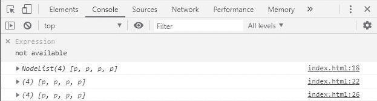

# 如何用 JavaScript 将 DOM 节点列表转换成数组？

> 原文:[https://www . geesforgeks . org/如何使用 javascript 将 dom-nodelist 转换为数组/](https://www.geeksforgeeks.org/how-to-convert-a-dom-nodelist-to-an-array-using-javascript/)

NodeList 对象是节点的集合，通常由属性返回，如 **Node.childNodes** 和方法，如 **document.querySelectorAll()。**虽然 NodeList 不是一个实际的数组，但是可以借助 **forEach()** 方法对其进行迭代。NodeList 也可以通过以下方法转换成实际的数组。

**方法 1:** 使用**array . prototype . slice . call()**方法。

*   **语法:**

```html
const array = Array.prototype.slice.call(nodeList);
```

*   **示例:**

## 超文本标记语言

```html
<!DOCTYPE html>
<html lang="en">

<head>
    <meta charset="UTF-8" />
    <meta name="viewport" content=
        "width=device-width, initial-scale=1.0" />
    <title>Document</title>
</head>

<body>

<p>Hello geeks 1</p>

<p>Hello geeks 2</p>

<p>Hello geeks 3</p>

<p>Hello geeks 4</p>

    <script>

        // This is nodeList
        const nodeList = document.querySelectorAll('p');
        console.log(nodeList);

        // Converting using Array.prototype.slice.call
        const array1 = Array.prototype.slice.call(nodeList);
        console.log(array1);
    </script>
</body>

</html>
```

*   **输出:**



**法二:**借助 [**阵.从()法**](https://www.geeksforgeeks.org/javascript-array-from-method/) 。

*   **语法:**

```html
const array = Array.from(nodeList);
```

*   **示例:**

## 超文本标记语言

```html
<!DOCTYPE html>
<html lang="en">

<head>
    <meta charset="UTF-8" />
    <meta name="viewport" content=
        "width=device-width, initial-scale=1.0" />
    <title>Document</title>
</head>

<body>

<p>Hello geeks 1</p>

<p>Hello geeks 2</p>

<p>Hello geeks 3</p>

<p>Hello geeks 4</p>

    <script>

        // This is nodeList
        const nodeList = document.querySelectorAll('p');
        console.log(nodeList);

        // Converting to array using Array.from() method
        const array = Array.from(nodeList);
        console.log(array);
    </script>
</body>

</html>
```

*   **输出:**


**方法 3:** 使用 ES6 扩展语法，它允许在预期有零个或多个参数或元素的地方扩展可迭代对象，如数组表达式或字符串。

*   **语法:**

```html
const array = [ ...nodeList ]
```

*   **示例:**

## 超文本标记语言

```html
<!DOCTYPE html>
<html lang="en">

<head>
    <meta charset="UTF-8" />
    <meta name="viewport" content=
        "width=device-width, initial-scale=1.0" />
    <title>Document</title>
</head>

<body>

<p>Hello geeks 1</p>

<p>Hello geeks 2</p>

<p>Hello geeks 3</p>

<p>Hello geeks 4</p>

    <script>

        // This is nodeList
        const nodeList = document.querySelectorAll('p');
        console.log(nodeList);

        // Converting using Spread syntax
        const array1 = [...nodeList];
        console.log(array1);
    </script>
</body>

</html>
```

*   **输出:**


**注意:**方法 2 和方法 3 在旧浏览器中可能无法正常工作，但在所有现代浏览器中都可以正常工作。