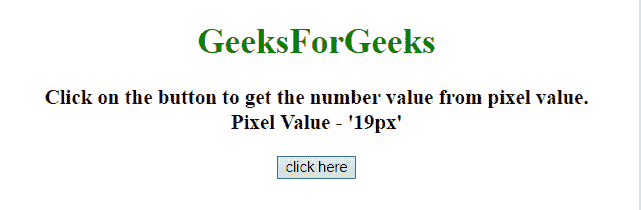
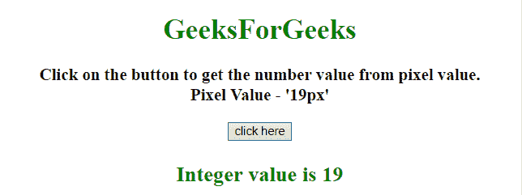

# 如何用 JavaScript 将一个像素值转换成一个数值？

> 原文:[https://www . geesforgeks . org/如何使用 javascript 将像素值转换为数字值/](https://www.geeksforgeeks.org/how-to-convert-a-pixel-value-to-a-number-value-using-javascript/)

任务是借助 JavaScript 将包含**‘px’**的字符串值转换为整数值。这里，很少讨论方法。
**进场 1:**

*   使用 **[【解析】方法](https://www.geeksforgeeks.org/javascript-parseint-with-examples/)** ，该方法以字符串为第一个参数，返回整数值。

**示例 1:** 该示例使用如上所述的方法

```
<!DOCTYPE HTML>
<html>

<head>
    <title>
        Convert a pixel value to a number value using JavaScript.
    </title>
</head>

<body style="text-align:center;">
    <h1 style="color:green;">  
        GeeksForGeeks 
    </h1>
    <p id="GFG_UP" style="font-size: 19px; font-weight: bold;">
    </p>
    <button onclick="GFG_Fun()">
        click here
    </button>
    <p id="GFG_DOWN" 
       style="color: green;
              font-size: 24px; 
              font-weight: bold;">
    </p>
    <script>
        var el_up = document.getElementById("GFG_UP");
        var el_down = document.getElementById("GFG_DOWN");
        var n = el_up.style.fontSize;
        el_up.innerHTML = 
          "Click on the button to get the number value "+
          "from pixel value.<br>Pixel Value - '" + n + "'";

        function GFG_Fun() {
            el_down.innerHTML = "Integer value is " + parseInt(n, 10);
        }
    </script>
</body>

</html>
```

**输出:**

*   **点击按钮前:**
    
*   **点击按钮后:**
    

**方法 2:**

*   使用**正则表达式**将**【px】**替换为空字符串，然后使用**数字()**将结果转换为整数。

**示例 2:** 该示例使用如上所述的方法。

```
<!DOCTYPE HTML>
<html>

<head>
    <title>
        Convert a pixel value to a number value using JavaScript.
    </title>
</head>

<body style="text-align:center;">
    <h1 style="color:green;">  
        GeeksForGeeks 
    </h1>
    <p id="GFG_UP" style="font-size: 19px; font-weight: bold;">
    </p>
    <button onclick="GFG_Fun()">
        click here
    </button>
    <p id="GFG_DOWN" 
       style="color: green; 
              font-size: 24px; 
              font-weight: bold;">
    </p>
    <script>
        var el_up = document.getElementById("GFG_UP");
        var el_down = document.getElementById("GFG_DOWN");
        var n = el_up.style.fontSize;
        el_up.innerHTML = "Click on the button to get the "+
          "number value from pixel value.<br>Pixel Value - '" + n + "'";

        function GFG_Fun() {
            el_down.innerHTML = 
              "Integer value is " + Number(n.replace(/px$/, ''));
        }
    </script>
</body>

</html>
```

**输出:**

*   **点击按钮前:**
    
*   **点击按钮后:**
    