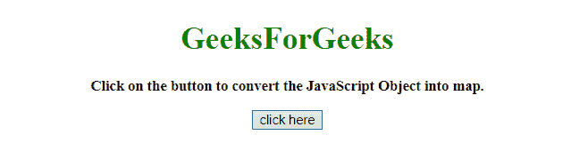
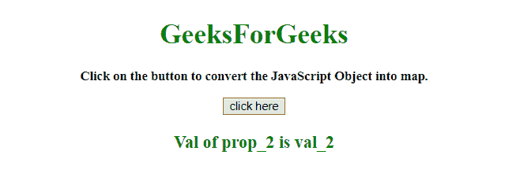
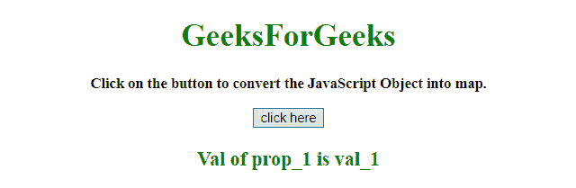

# 如何用 JavaScript 将一个普通对象转换成 ES6 Map？

> 原文:[https://www . geesforgeks . org/如何使用 javascript 将普通对象转换为 es6 地图/](https://www.geeksforgeeks.org/how-to-convert-a-plain-object-into-es6-map-using-javascript/)

任务是使用 JavaScript 将一个 JavaScript 对象转换成普通的 ES6 地图。我们将讨论一些技巧。

**接近**

*   创建一个对象。
*   创建新地图。
*   将对象传递给地图并设置其属性。

**例 1:**

```
<!DOCTYPE HTML>
<html>

<head>
    <title>
        How to convert a plain object into
        ES6 Map using JavaScript ?
    </title>
</head>

<body style="text-align:center;">

    <h1 style="color:green;"> 
        GeeksForGeeks 
    </h1>

    <p id="GFG_UP" style=
        "font-size: 15px; font-weight: bold;">
    </p>

    <button onclick="GFG_Fun()">
        click here
    </button>

    <p id="GFG_DOWN" style=
        "color:green; font-size: 20px; font-weight: bold;">
    </p>

    <script>
        var up = document.getElementById('GFG_UP');

        up.innerHTML = "Click on the button to "+
                "convert the JavaScript Object into map.";

        var down = document.getElementById('GFG_DOWN');

        var obj = {
            prop_1: 'val_1',
            prop_2: 'val_2',
            prop_3: 'val_3'
        };

        var heading = document.getElementById('h1');

        function GFG_Fun() {
            const map = new Map(Object.entries(obj));
            down.innerHTML = 
            "Val of prop_2 is " + map.get('prop_2');
        }
    </script>
</body>

</html>
```

**输出:**

*   **点击按钮前:**
    
*   **点击按钮后:**
    

**例 2:**

```
<!DOCTYPE HTML>
<html>

<head>
    <title>
        How to convert a plain object into
        ES6 Map using JavaScript ?
    </title>
</head>

<body style="text-align:center;">

    <h1 style="color:green;"> 
        GeeksForGeeks 
    </h1>

    <p id="GFG_UP" style=
        "font-size: 15px; font-weight: bold;">
    </p>

    <button onclick="GFG_Fun()">
        click here
    </button>

    <p id="GFG_DOWN" style=
        "color:green; font-size: 20px; font-weight: bold;">
    </p>

    <script>
        var up = document.getElementById('GFG_UP');
        up.innerHTML = "Click on the button to "+
                "convert the JavaScript Object into map.";

        var down = document.getElementById('GFG_DOWN');
        var obj = {
            prop_1: 'val_1',
            prop_2: 'val_2',
            prop_3: 'val_3'
        };

        function createMap(obj) {
            let map = new Map();
            Object.keys(obj).forEach(key => {
                map.set(key, obj[key]);
            });
            return map;
        }

        function GFG_Fun() {
            const map = createMap(obj);
            down.innerHTML = 
            "Val of prop_1 is " + map.get('prop_1');
        }
    </script>
</body>

</html>    
```

**输出:**

*   **点击按钮前:**
    
*   **点击按钮后:**
    