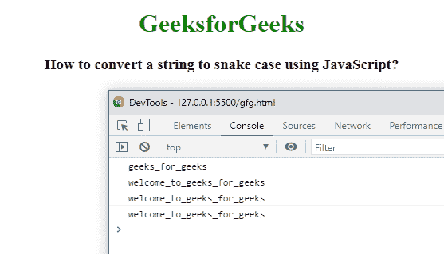

# 如何用 JavaScript 将字符串转换成蛇格？

> 原文:[https://www . geesforgeks . org/如何使用 javascript 将字符串转换为蛇的大小写/](https://www.geeksforgeeks.org/how-to-convert-a-string-to-snake-case-using-javascript/)

在中给定一个字符串，任务是编写一个 JavaScript 代码，将给定的字符串转换为 snake case 并打印修改后的字符串。

**示例:**

```html
Input: GeeksForGeeks
Output: geeks_for_geeks
Input: CamelCaseToSnakeCase
Output: camel_case_to_snake_case
```

我们使用 match()、map()、join 和 toLowerCase()方法将给定的字符串转换为 snake case 字符串。match()方法用于给定字符串与模式匹配，然后使用 map()和 toLowerCase()方法将给定字符串转换为小写，然后使用 join()方法使用下划线(_)连接字符串。

**示例:**

## 超文本标记语言

```html
<!DOCTYPE html>
<html>

<head>
    <title>
        How to convert a string to
        snake case using JavaScript?
    </title>
</head>

<body style="text-align: center;">
    <h1 style="color: green;">
        GeeksforGeeks
    </h1>

    <h3>
        How to convert a string to
        snake case using JavaScript?
    </h3>

    <script>
        function snake_case_string(str) {
            return str && str.match(
/[A-Z]{2,}(?=[A-Z][a-z]+[0-9]*|\b)|[A-Z]?[a-z]+[0-9]*|[A-Z]|[0-9]+/g)
                .map(s => s.toLowerCase())
                .join('_');
        }

        console.log(snake_case_string('GeeksForGeeks'));
        console.log(snake_case_string('Welcome to GeeksForGeeks'));
        console.log(snake_case_string('Welcome-to-GeeksForGeeks'));
        console.log(snake_case_string('Welcome_to_GeeksForGeeks'));
    </script>
</body>

</html>
```

**输出:**

