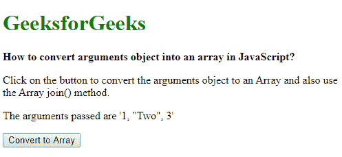
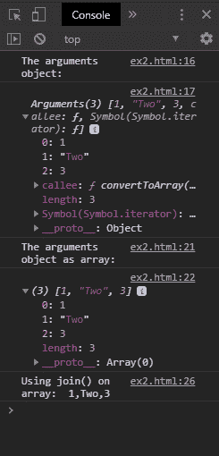

# 如何在 JavaScript 中将参数对象转换成数组？

> 原文:[https://www . geesforgeks . org/如何将参数对象转换为 javascript 数组/](https://www.geeksforgeeks.org/how-to-convert-arguments-object-into-an-array-in-javascript/)

arguments 对象是一个类似数组的对象，表示调用函数时传入的参数。这个类似数组的对象没有数组原型链，因此它不能使用任何数组方法。可以使用两种方法将该对象转换为适当的数组:

**方法 1:使用 Array.from()方法:**可以使用 **Array.from()方法**创建一个新的数组，该数组是类似数组或可迭代对象的浅拷贝。它包含三个参数，这三个参数由要转换的类似数组的对象、可以在数组的每个元素上调用的可选映射函数和可以与映射函数一起使用的“this”参数组成。
arguments 对象作为参数传递给这个方法，它将返回对象的数组形式。该数组具有数组原型链，可以与各种数组方法一起使用。

**语法:**

```
argumentsArray = Array.from(arguments)
```

**示例:**

```
<!DOCTYPE html>
<html>

<head>
    <title>
        How to convert arguments object into
        an array in JavaScript?
    </title>
</head>

<body>
    <h1 style="color: green">
        GeeksforGeeks
    </h1>

    <b> 
        How to convert arguments object into
        an array in JavaScript?
    </b>

    <p>
        Click on the button to convert the
        arguments object to an Array
        and also use the Array join() method.
    </p>

    <p>The arguments passed are '1, "Two", 3'</p>

    <button onclick="convertToArray(1, 'Two', 3)">
        Convert to Array
    </button>

    <script type="text/javascript">

        function convertToArray(a, b, c) {
            console.log("The arguments object:")
            console.log(arguments);

            argumentsArray = Array.from(arguments);

            console.log("The arguments object as array:")
            console.log(argumentsArray);

            // Example of using the join() method
            joinedArray = argumentsArray.join(', ');

            console.log("Using join() on array: ",
                                    joinedArray);
        }
    </script>
</body>

</html>
```

**输出:**

*   **显示:**
    
*   **控制台:**
    

**方法二:使用 Array.prototype.slice()方法:****array . prototype . slice()方法**用于将数组的一部分返回到新的数组对象中。这个数组将是原始数组的浅拷贝。此方法有两个可选参数，指示数组的开始和结束索引。如果省略参数，索引将设置为数组的第一个和最后一个索引。
这个方法可以通过绑定这个方法到对象来转换参数对象。绑定是通过使用**调用()**函数并将类似数组的对象作为参数传递给它来完成的。它将返回 arguments 对象的数组形式。该数组具有数组原型链，可以与各种数组方法一起使用。

**语法:**

```
argumentsArray = Array.prototype.slice.call(arguments)
```

**示例:**

```
<!DOCTYPE html>
<html>

<head>
    <title>
        How to convert arguments object
        into an array in JavaScript?
    </title>
</head>

<body>
    <h1 style="color: green">
        GeeksforGeeks
    </h1>

    <b>
        How to convert arguments object into
        an array in JavaScript?
    </b>

    <p>
        Click on the button to convert the
        arguments object to an Array and
        also use the Array join() method.
    </p>

    <p>The arguments passed are '1, "Two", 3'</p>

    <button onclick="convertToArray(1, 'Two', 3)">
        Convert to Array
    </button>

    <script type="text/javascript">

        function convertToArray(a, b, c) {
            console.log("The arguments object:")
            console.log(arguments);

            argumentsArray = 
                Array.prototype.slice.call(arguments);

            console.log("The arguments object as array:")
            console.log(argumentsArray);

            // Example of using the join() method
            joinedArray = 
                argumentsArray.join(', ');

            console.log("Using join() on array: ",
                                       joinedArray);
        }
    </script>
</body>

</html>
```

**输出:**

*   **显示:**
    
*   **控制台:**
    