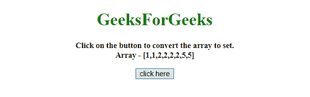
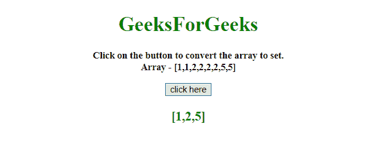
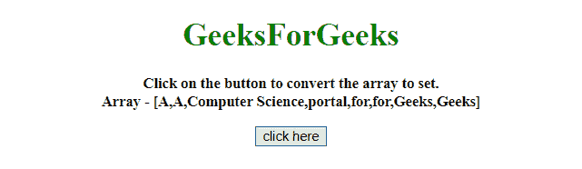
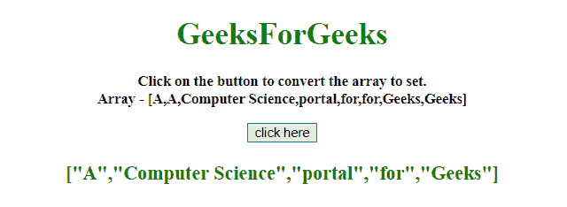

# 如何在 JavaScript 中将数组转换为集合？

> 原文:[https://www . geesforgeks . org/如何将数组转换为 javascript 中的集合/](https://www.geeksforgeeks.org/how-to-convert-array-to-set-in-javascript/)

任务是在 JavaScript 的帮助下将一个 JavaScript 数组转换成一个集合。我们将讨论一些技巧。

**进场:**

*   将 JavaScript 数组转换成一个变量。
*   使用 **new** 关键字创建一个新集合，并将 JavaScript 数组作为第一个也是唯一一个参数传递。
*   这将自动创建所提供数组的集合。

**示例 1:** 在该示例中，使用上面定义的相同方法将数组转换为集合。

```
<!DOCTYPE HTML>
<html>

<head>
    <title>
        JavaScript 
      | Convert Array to Set.
    </title>
</head>

<body style="text-align:center;"
      id="body">
    <h1 style="color:green;" 
        id="h1">  
            GeeksForGeeks  
        </h1>
    <p id="GFG_UP" 
       style="font-size: 15px; 
              font-weight: bold;">
    </p>
    <button onclick="GFG_Fun()">
        click here
    </button>
    <p id="GFG_DOWN" 
       style="color:green; 
              font-size: 20px;
              font-weight: bold;">
    </p>
    <script>
        var up = document.getElementById('GFG_UP');
        var down = document.getElementById('GFG_DOWN');
        var A = [1, 1, 2, 2, 2, 2, 5, 5];

        up.innerHTML = "Click on the button to convert"+
          " the array to set.<br>" + "Array - [" + A + "]";

        function GFG_Fun() {
            var set = new Set(A);
            down.innerHTML = JSON.stringify([...set]);
        }
    </script>
</body>

</html>
```

**输出:**

*   **点击按钮前:**
    
*   **点击按钮后:**
    

**示例 2:** 在该示例中，使用比上述更为比特的方法将数组转换为集合。

```
<!DOCTYPE HTML>
<html>

<head>
    <title>
        JavaScript 
      | Convert Array to Set.
    </title>
</head>

<body style="text-align:center;" id="body">
    <h1 style="color:green;" id="h1">  
            GeeksForGeeks  
        </h1>
    <p id="GFG_UP" 
       style="font-size: 15px; 
              font-weight: bold;">
    </p>
    <button onclick="GFG_Fun()">
        click here
    </button>
    <p id="GFG_DOWN" 
       style="color:green; 
              font-size: 20px; 
              font-weight: bold;">
    </p>
    <script>
        var up = document.getElementById('GFG_UP');
        var down = document.getElementById('GFG_DOWN');

        var A = ["A", "A", "Computer Science", "portal", 
                 "for", "for", "Geeks", "Geeks"];

        up.innerHTML = "Click on the button to convert "+
          "the array to set.<br>" + "Array - [" + A + "]";

        function GFG_Fun() {
            var set = new Set(A);
            down.innerHTML = JSON.stringify([...set.keys()]);
        }
    </script>
</body>

</html>
```

**输出:**

*   **点击按钮前:**
    
*   **点击按钮后:**
    