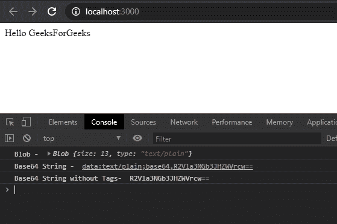

# 如何使用 JavaScript 将 blob 转换为 base64 编码？

> 原文:[https://www . geesforgeks . org/如何使用 javascript 将 blob 转换为 base64 编码/](https://www.geeksforgeeks.org/how-to-convert-blob-to-base64-encoding-using-javascript/)

**Blob** 是 JavaScript 中的一种基本数据类型。Blob 代表**二进制大对象**，它是字节数据的表示。网络浏览器支持 Blob 数据类型来保存数据。Blob 是**文件**对象和**文件阅读器**应用编程接口的底层数据结构。Blob 和普通文件一样有特定的大小和文件类型，可以从系统内存中存储和检索。Blob 也可以作为**缓冲区**进行转换和读取。缓冲区非常便于存储二进制数据，例如图像或文件的二进制数据。我们将使用**文件阅读器**应用编程接口将 Blob 转换为 JavaScript 中的 **Base64** 编码字符串。

我们不能通过网络传输原始格式的二进制数据。这是因为由于网络中涉及的协议不同，原始字节可能会被错误地解释。通过网络传输时，它被破坏的可能性也更高。因此，在通过网络传输之前，该二进制数据使用 **Base64** 编码被编码成字符，例如电子邮件附件、HTML 表单数据等。Base64 编码是将任意二进制数据转换为 **ASCII** 字符的一种方式。使用 Base64 编码，这样我们就不必依赖网络浏览器中的外部文件和脚本。

**示例:**使用**文件阅读器**应用编程接口将**斑点**转换为 **Base64** 编码字符串。**文件阅读器. readAsDataURL()** 读取指定 Blob 数据类型的内容，并将返回一个带有**数据:**属性的 **Base64** 编码字符串。当数据读取成功完成或遇到错误时，触发**文件读取器. onloadend** 事件。我们已经使用 **Blob()** 构造函数创建了一个示例 Blob。构造函数接受**字符串[]** 和由字符串**类型**组成的对象中的值。

**程序:**

*   ```
    <!DOCTYPE html>
    <html lang="en">

    <head>
        <meta charset="UTF-8">
        <title>Convert Blob to Base64 String</title>
    </head>

    <body>
    <div>Hello GeeksForGeeks</div>
    <script type="text/javascript">
        let blob = new Blob(["GeeksForGeeks"], { type: "text/plain" });
        // The full Blob Object can be seen 
        // in the Console of the Browser
        console.log('Blob - ', blob);

        var reader = new FileReader();
        reader.readAsDataURL(blob);
        reader.onloadend = function () {
        var base64String = reader.result;
        console.log('Base64 String - ', base64String);

        // Simply Print the Base64 Encoded String,
        // without additional data: Attributes.
        console.log('Base64 String without Tags- ', 
       base64String.substr(base64String.indexOf(', ') + 1));
            }
        </script>
    </body>
    </html>
    ```

*   **输出:**
    