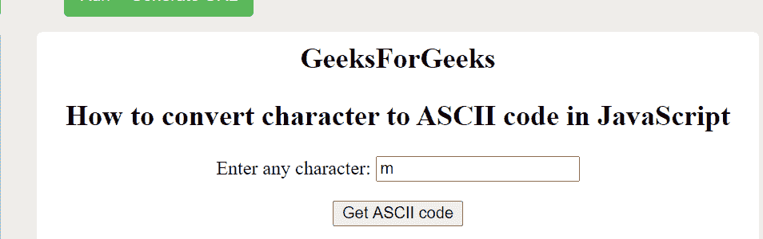
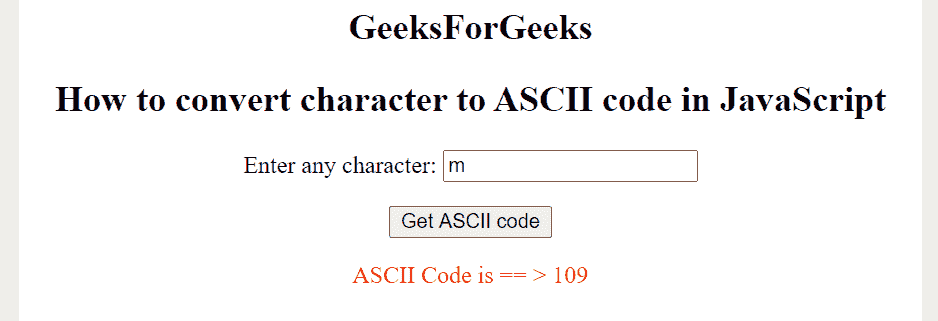

# 如何用 JavaScript 将字符转换成 ASCII 码？

> 原文:[https://www . geesforgeks . org/如何使用 javascript 将字符转换为 ascii 码/](https://www.geeksforgeeks.org/how-to-convert-character-to-ascii-code-using-javascript/)

本文的目的是使用 JavaScript **charCodeAt()** 方法获取任意字符的 ASCII 码。此方法用于返回指示指定索引处字符的 Unicode 值的数字。

**语法:**

```html
string.charCodeAt(index); 
```

**示例:**下面的代码说明了他们可以从用户那里获取字符并显示该字符的 ASCII 码。

**HTML 代码:**

## 超文本标记语言

```html
<!DOCTYPE html>
<html>

<body style="text-align:center;">
    <h2>
        GeeksForGeeks
    </h2>
    <h2>
        How to convert character to
        ASCII code in JavaScript
    </h2>

    <p>
        Enter any character:
        <input type="text" id="id1" 
            name="text1" maxLength="1">
    </p>

    <button onclick="myFunction()">
        Get ASCII code
    </button>

    <p id="demo" style="color:red;">
</body>

</html>
```

**JavaScript 代码:**下面的代码片段说明了上述 HTML 代码中使用的 JavaScript 代码。

```html
function myFunction() {
    var str = document.getElementById("id1");
    if (str.value == "") {
        str.focus();
        return;
    }
    var a = "ASCII Code is == >  ";
    document.getElementById("demo").innerHTML
        = a + str.value.charCodeAt(0);
}
```

**最终代码:**以下示例是上述两个代码片段的组合。

```html
<!DOCTYPE html>
<html>

<body style="text-align:center;">
    <h2>
        GeeksForGeeks
    </h2>
    <h2>
        How to convert character to 
        ASCII code in JavaScript
    </h2>

    <script>
        function myFunction() {
            var str = document.getElementById("id1");
            if (str.value == "") {
                str.focus();
                return;
            }
            var a = "ASCII Code is == >  ";
            document.getElementById("demo").innerHTML
                = a + str.value.charCodeAt(0);
        }
    </script>

    <p>
        Enter any character:
        <input type="text" id="id1" 
            name="text1" maxLength="1">
    </p>

    <button onclick="myFunction()">
        Get ASCII code
    </button>

    <p id="demo" style="color:red;">
</body>

</html>
```

**输出:**

*   **点击按钮前:**

    

*   **点击按钮后:**

    

    **支持的浏览器:**

    *   谷歌 Chrome
    *   微软公司出品的 web 浏览器
    *   火狐浏览器
    *   歌剧
    *   旅行队