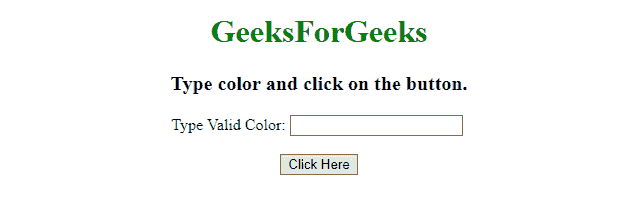
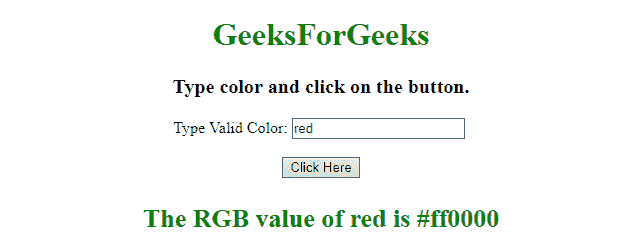
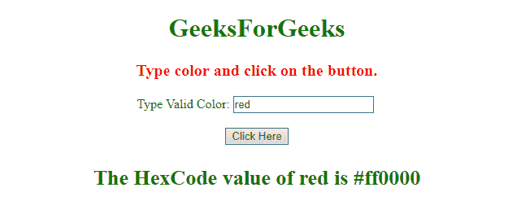

# 如何使用 JavaScript 将颜色名称转换为十六进制代码？

> 原文:[https://www . geesforgeks . org/如何使用 javascript 将颜色名称转换为十六进制代码/](https://www.geeksforgeeks.org/how-to-convert-color-names-to-hexcode-using-javascript/)

给定一个颜色名称，任务是获取颜色名称的十六进制代码。在 JavaScript 的帮助下，讨论最多的技术很少。

**方法 1:**

*   将所有可能的颜色名称的十六进制代码存储在一个 JavaScript 对象中。
*   将给定的颜色名称与颜色对象列表进行比较，如果找到匹配，则返回相应的颜色十六进制代码，如果没有找到匹配，则返回假。

**示例:**该示例实现了上述方法。

```
<!DOCTYPE HTML> 
<html> 

<head> 
    <title> 
        How to Convert Color Names to
        Hexcode using JavaScript ?
    </title>
</head> 

<body style = "text-align:center;"> 

    <h1 style = "color: green"> 
        GeeksForGeeks 
    </h1>

    <p id = "GFG_UP" style =
        "font-size: 20px; font-weight: bold;">
    </p>

    Type Valid Color: 
        <input id = "input" type = "text"/>

    <br><br>

    <button onclick = "gfg_Run()"> 
        Click Here
    </button>

    <p id = "GFG_DOWN" style = "color:green;
        font-size: 26px; font-weight: bold;">
    </p>

    <script>
        var el_up = document.getElementById("GFG_UP");
        var el_down = document.getElementById("GFG_DOWN");

        el_up.innerHTML = 
            "Type color and click on the button.";

        function convert(color) {
            var colours = {
                "aliceblue":"#f0f8ff", "antiquewhite":"#faebd7", "aqua":"#00ffff", "aquamarine":"#7fffd4", "azure":"#f0ffff",  "beige":"#f5f5dc", "bisque":"#ffe4c4", "black":"#000000", "blanchedalmond":"#ffebcd", "blue":"#0000ff", "blueviolet":"#8a2be2", "brown":"#a52a2a", "burlywood":"#deb887",  "cadetblue":"#5f9ea0", "chartreuse":"#7fff00", "chocolate":"#d2691e", "coral":"#ff7f50", "cornflowerblue":"#6495ed", "cornsilk":"#fff8dc", "crimson":"#dc143c", "cyan":"#00ffff",  "darkblue":"#00008b", "darkcyan":"#008b8b", "darkgoldenrod":"#b8860b", "darkgray":"#a9a9a9", "darkgreen":"#006400", "darkkhaki":"#bdb76b", "darkmagenta":"#8b008b", "darkolivegreen":"#556b2f",  "darkorange":"#ff8c00", "darkorchid":"#9932cc", "darkred":"#8b0000", "darksalmon":"#e9967a", "darkseagreen":"#8fbc8f", "darkslateblue":"#483d8b", "darkslategray":"#2f4f4f", "darkturquoise":"#00ced1",  "darkviolet":"#9400d3", "deeppink":"#ff1493", "deepskyblue":"#00bfff", "dimgray":"#696969", "dodgerblue":"#1e90ff",  "firebrick":"#b22222", "floralwhite":"#fffaf0", "forestgreen":"#228b22", "fuchsia":"#ff00ff",  "gainsboro":"#dcdcdc", "ghostwhite":"#f8f8ff", "gold":"#ffd700", "goldenrod":"#daa520", "gray":"#808080", "green":"#008000", "greenyellow":"#adff2f",
                "honeydew":"#f0fff0", "hotpink":"#ff69b4", "indianred ":"#cd5c5c", "indigo":"#4b0082", "ivory":"#fffff0", "khaki":"#f0e68c",  "lavender":"#e6e6fa", "lavenderblush":"#fff0f5", "lawngreen":"#7cfc00", "lemonchiffon":"#fffacd", "lightblue":"#add8e6", "lightcoral":"#f08080", "lightcyan":"#e0ffff", "lightgoldenrodyellow":"#fafad2",  "lightgrey":"#d3d3d3", "lightgreen":"#90ee90", "lightpink":"#ffb6c1", "lightsalmon":"#ffa07a", "lightseagreen":"#20b2aa", "lightskyblue":"#87cefa", "lightslategray":"#778899", "lightsteelblue":"#b0c4de",  "lightyellow":"#ffffe0", "lime":"#00ff00", "limegreen":"#32cd32", "linen":"#faf0e6",  "magenta":"#ff00ff", "maroon":"#800000", "mediumaquamarine":"#66cdaa", "mediumblue":"#0000cd", "mediumorchid":"#ba55d3", "mediumpurple":"#9370d8", "mediumseagreen":"#3cb371", "mediumslateblue":"#7b68ee",        "mediumspringgreen":"#00fa9a", "mediumturquoise":"#48d1cc", "mediumvioletred":"#c71585", "midnightblue":"#191970", "mintcream":"#f5fffa", "mistyrose":"#ffe4e1", "moccasin":"#ffe4b5", "navajowhite":"#ffdead", "navy":"#000080",  "oldlace":"#fdf5e6", "olive":"#808000", "olivedrab":"#6b8e23", "orange":"#ffa500", "orangered":"#ff4500", "orchid":"#da70d6",  "palegoldenrod":"#eee8aa",
                "palegreen":"#98fb98", "paleturquoise":"#afeeee", "palevioletred":"#d87093", "papayawhip":"#ffefd5", "peachpuff":"#ffdab9", "peru":"#cd853f", "pink":"#ffc0cb", "plum":"#dda0dd", "powderblue":"#b0e0e6", "purple":"#800080",  "rebeccapurple":"#663399", "red":"#ff0000", "rosybrown":"#bc8f8f", "royalblue":"#4169e1",  "saddlebrown":"#8b4513", "salmon":"#fa8072", "sandybrown":"#f4a460", "seagreen":"#2e8b57", "seashell":"#fff5ee", "sienna":"#a0522d", "silver":"#c0c0c0", "skyblue":"#87ceeb", "slateblue":"#6a5acd", "slategray":"#708090", "snow":"#fffafa", "springgreen":"#00ff7f", "steelblue":"#4682b4",   "tan":"#d2b48c", "teal":"#008080", "thistle":"#d8bfd8", "tomato":"#ff6347", "turquoise":"#40e0d0", "violet":"#ee82ee",   "wheat":"#f5deb3", "white":"#ffffff", "whitesmoke":"#f5f5f5", "yellow":"#ffff00", "yellowgreen":"#9acd32"
            };

            if (typeof colours[color.toLowerCase()] != 'undefined')
                return colours[color.toLowerCase()];
            return false;
        }

        function gfg_Run() {
            color = document.getElementById('input').value;
            el_up.style.color = color;
            el_down.innerHTML = "The RGB value of " + color
                        + " is " + convert(color);
        } 
    </script> 
</body> 

</html>
```

**输出:**

*   **点击按钮前:**
    
*   **点击按钮后:**
    

**方法 2:**

*   首先从用户那里获取有效的颜色名称。
*   将该颜色设置为 DIV 元素的 **CSS 颜色属性**。
*   使用 **window.getComputedStyle(元素)。颜色属性**，返回颜色的 RGB 值。
*   调用 convert()用户定义函数，并使用 RGB 值作为参数。
*   使用 match()方法选择红色、绿色和蓝色的值。RGB 的值以数组的形式存储。
*   函数的作用是:将 RGB 值转换成 hexCode。
*   slice()方法获取字符串的一部分，并在新字符串中返回提取的部分。toString()方法将数字转换为字符串。
*   参考[链接](https://www.geeksforgeeks.org/how-to-get-hex-color-value-of-rgb-value/)将 RGB 转换为十六值。

**示例 2:** 该示例使用了上面讨论的方法。

```
<!DOCTYPE HTML> 
<html> 

<head> 
    <title> 
        How to Convert Color Names to
        Hexcode using JavaScript ?
    </title>
</head> 

<body style = "text-align:center;"> 

    <h1 style = "color: green"> 
        GeeksForGeeks 
    </h1>

    <p id = "GFG_UP" style =
        "font-size: 20px; font-weight: bold;">
    </p>

    Type Valid Color: 
        <input id = "input" type = "text"/>

    <br><br>

    <button onclick = "gfg_Run()"> 
        Click Here
    </button>

    <p id = "GFG_DOWN" style = "color:green;
        font-size: 26px; font-weight: bold;">
    </p>

    <script>
        var el_up = document.getElementById("GFG_UP");
        var el_down = document.getElementById("GFG_DOWN");
        el_up.innerHTML = "Type color and click on the button.";

        function getVal(color) {

            // Setting the text color
            // of el_up element.
            el_up.style.color = color;
        }

        function convert(rgb) { 
            rgb = rgb.match(/^rgb\((\d+), \s*(\d+), \s*(\d+)\)$/); 
            function hexCode(i) { 

                // Take the last 2 characters and convert
                // them to Hexadecimal.
                return ("0" + parseInt(i).toString(16)).slice(-2);
            } 
            return "#" + hexCode(rgb[1]) + hexCode(rgb[2]) 
                            + hexCode(rgb[3]); 
        }

        function gfg_Run() {

            // Taking the input
            var color = document.getElementById('input').value;

            getVal(color);

            // Getting the Color in RGB format
            var rgb = window.getComputedStyle(el_up).color;
                el_down.innerHTML = "The HexCode value of "
                        + color +" is "+ convert(rgb);
        }
    </script> 
</body> 

</html>
```

**输出:**

*   **点击按钮前:**
    
*   **点击按钮后:**
    