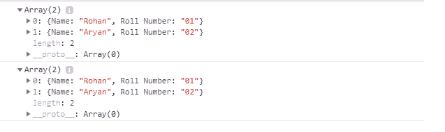

# 如何用 JavaScript 将 CSV 字符串文件转换成对象的 2D 数组？

> 原文:[https://www . geesforgeks . org/how-convert-CSV-string-file-to-a-2d-array-of-objects-use-JavaScript/](https://www.geeksforgeeks.org/how-to-convert-csv-string-file-to-a-2d-array-of-objects-using-javascript/)

一个 **CSV** 是一个逗号分隔的值文件，带有一个*。csv* 扩展，允许数据以表格格式保存。

在本文中，我们将学习使用 **JavaScript** 将CSV 字符串的数据转换为对象的 2D 数组，其中字符串的第一行是标题行。

给定一个逗号分隔值(CSV)字符串到 2D 数组，使用 JS.f

```
Input: 'Name,Roll Number\nRohan,01\nAryan,02' 

Output:  [
             {Name: "Rohan", Roll Number: "01"},
             {Name: "Aryan", Roll Number: "02"}
        ]
// With delimiter ;    

Input: 'Name;Roll Number\nRohan;01\nAryan;02' 

Output:    [
             {Name: "Rohan", Roll Number: "01"},
             {Name: "Aryan", Roll Number: "02"}
        ]    
```

我们必须知道一些在这方面有帮助的数组和字符串原型函数。

**indexOf 函数:****[**string . prototype . index of()**](https://www.geeksforgeeks.org/javascript-array-indexof-method/)函数查找给定字符串中参数字符串第一次出现的索引，返回的值在基于 0 的索引中。**

****示例:****

```
str = 'How\**n**are**\n**you?' 

str.indexOf('\n');
```

****输出:****

```
**3**
```

****切片函数:**[**array . prototype . Slice()**](https://www.geeksforgeeks.org/javascript-array-slice-method/)方法返回一个新数组，该数组包含实现它的数组的一部分，并且原始数组保持不变。**

****示例:****

```
['a','b','c','d'].slice(1)
```

****输出:****

```
 ['b','c','d']
```

****映射函数:****[array . prototype . Map()](https://www.geeksforgeeks.org/javascript-array-map-method-2/)方法返回一个新数组，结果是对每个元素调用一个提供的函数。****

******示例:******

```
**arr = [2, 4, 8, 16]

// Dividing each element of the array by 2
newArr = arr.map( item => item/2)** 
```

******输出:******

```
**[1, 2, 4, 8]**
```

******Split 函数:****[**String . prototype . Split()**](https://www.geeksforgeeks.org/javascript-string-prototype-split-function/)方法用于使用参数中提供的指定分隔符将给定的字符串分成子字符串，从而将其拆分为字符串数组。******

******示例:******

```
**str = "Geeks for Geeks"

// Split the array when ' ' is located
arr = str.split(' ');**
```

******输出:******

```
**[ 'Geeks', 'for', 'Geeks' ]**
```

******Reduce 函数:**JavaScript 中的**[**array . prototype . Reduce()**](https://www.geeksforgeeks.org/javascript-array-reduce-method/)方法用于将数组缩减为单个值，并从左到右为数组的每个元素执行提供的函数，函数的返回值存储在累加器中。******

******示例:******

```
 **arr = [2,4,6,8]

 // Here 0 is the initial value of the accumulator
 // while traversing, currentValue has been added

 arr.reduce(function(accumulator,currentValue){
     return accumulator+currentValue;
 },0)**
```

******输出:******

```
**20**
```

******进场:******

*   ****JavaScript 字符串 [**slice()**](https://www.geeksforgeeks.org/javascript-string-slice/) 方法提取字符串的一部分，并以“\n”作为第一个匹配项返回新字符串中提取的部分。****
*   ****使用“\n”作为分隔符存储数据值。****
*   ****JavaScript [**map()**](https://www.geeksforgeeks.org/map-in-javascript/) 函数将迭代标题值数组的所有值，并在数组末尾追加每个对象****
*   ****“存储键值”变量用于存储每个键及其各自的值。****

******示例:******

## ****java 描述语言****

```
**<script>

    function CSVstring_to_Array(data, delimiter = ',') {

        /* This variable will collect all the titles
           from the data variable
           ["Name", "Roll Number"] */

        const titles = data.slice(0, data
            .indexOf('\n')).split(delimiter);

        /* This variable will store the values
           from the data
           [ 'Rohan,01', 'Aryan,02' ] */
        const titleValues = data.slice(data
            .indexOf('\n') + 1).split('\n');

        /* Map function will itterate over all
           values of title values array and
           append each object at the end of
           the array */
        const ansArray = titleValues.map(function (v) {

            /* Values variable will store individual
               title values        
               [ 'Rohan', '01' ] */
            const values = v.split(delimiter);

            /* storeKeyValue variable will store
               object containing each title
               with their respective values i.e
               { Name: 'Rohan', 'Roll Number': '01' } */
            const storeKeyValue = titles.reduce(
                function (obj, title, index) {
                    obj[title] = values[index];
                    return obj;
                }, {});

            return storeKeyValue;
        });

        return ansArray;
    };

    var inputString1 = "Name,Roll Number\nRohan,01\nAryan,02";
    console.log(CSVstring_to_Array(inputString1));

    var inputString2 = "Name;Roll Number\nRohan;01\nAryan;02";
    console.log(CSVstring_to_Array(inputString2,';'));
</script>**
```

******输出:******

********