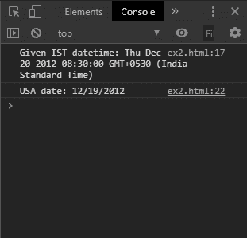
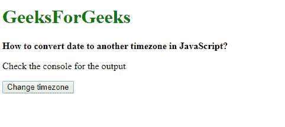
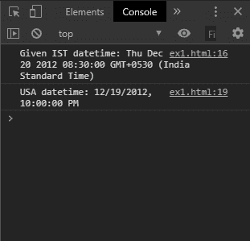

# 如何在 JavaScript 中将日期转换成另一个时区？

> 原文:[https://www . geesforgeks . org/如何将日期转换为 javascript 中的另一个时区/](https://www.geeksforgeeks.org/how-to-convert-date-to-another-timezone-in-javascript/)

**方法一:使用 Intl。日期时间格式()和格式()方法:**T2 国际机场。NumberFormat()方法用于以对语言敏感的格式表示数字。根据指定的区域设置，它可用于表示货币或百分比。
该对象的 **format()** 方法用于返回具有指定区域设置和格式选项的日期字符串。这将把日期格式化为所需的时区，并返回一个带有转换日期的字符串。

**语法:**

```
usaTime = date.toLocaleString("en-US", {timeZone: "America/New_York"});

```

**示例:**

```
<!DOCTYPE html>
<html>

<head>
    <title>
        How to convert date to another
        timezone in JavaScript?
    </title>
</head>

<body>
    <h1 style="color: green">
        GeeksForGeeks
    </h1>

    <b>
        How to convert date to another
        timezone in JavaScript?
    </b>

    <p>Check the console for the output</p>

    <button onclick="changeTimezone()">
        Change timezone
    </button>

    <script type="text/javascript">

        function changeTimezone() {

            let date = new Date(Date.UTC(2012, 11, 20, 3, 0, 0));

            console.log('Given IST datetime: ' + date);

            let intlDateObj = new Intl.DateTimeFormat('en-US', {
                timeZone: "America/New_York"
            });

            let usaTime = intlDateObj.format(date);
            console.log('USA date: ' + usaTime);
        }
    </script>
</body>

</html>
```

**输出:**

*   **输出:**
    
*   **控制台输出:**
    

**方法 2:使用 ToLocalString()方法:****ToLocalString()**方法用于返回一个字符串，该字符串根据指定的区域设置和选项格式化日期。它会将使用该方法的日期从一个时区转换为另一个时区。

**语法:**

```
usaTime = date.toLocaleString("en-US", {timeZone: "America/New_York"});
```

**示例:**

```
<!DOCTYPE html>
<html>

<head>
    <title>
        How to convert date to another
        timezone in JavaScript?
    </title>
</head>

<body>
    <h1 style="color: green">
        GeeksForGeeks
    </h1>

    <b>
        How to convert date to another
        timezone in JavaScript?
    </b>

    <p>Check the console for the output</p>

    <button onclick="changeTimezone()">
        Change timezone
    </button>

    <script type="text/javascript">

        function changeTimezone() {

            let date = 
                new Date(Date.UTC(2012, 11, 20, 3, 0, 0));
            console.log('Given IST datetime: ' + date);

            let usaTime = 
                date.toLocaleString("en-US", {
                    timeZone: "America/New_York" 
                });
            console.log('USA datetime: ' + usaTime);
        }
    </script>
</body>

</html>
```

**输出:**

*   **输出:**
    
*   **控制台输出:**
    