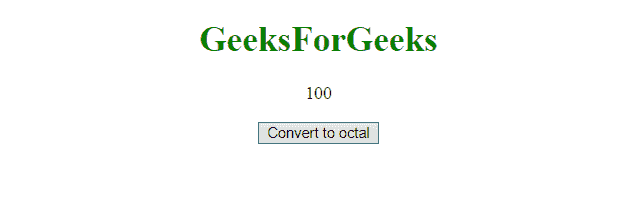
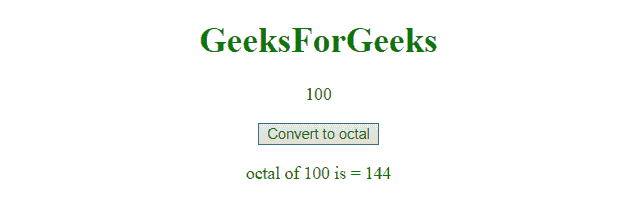

# 在 JavaScript 中如何将十进制转换为十六进制？

> 原文:[https://www . geesforgeks . org/如何将十进制转换为十六进制 javascript/](https://www.geeksforgeeks.org/how-to-convert-decimal-to-hex-in-javascript/)

给定一个数字，任务是将数字从十进制转换为十六进制。这可以通过使用 **toString()方法**来完成。它接受参数，该参数是转换后的字符串的基础。在这种情况下，基数将是 16。

**语法:**

```
decimalNumber.toString( radix )
```

**参数:**接受两个参数，如下所示:

*   **十进制数:**保存需要转换的十进制格式的数字。
*   **底数:**保存数字转换所在的数字系统的底数。

**例 1:** 本例将 **20** 转换为十六进制数字系统。

```
<!DOCTYPE html> 
<html> 

<head> 
    <title> 
        How to convert decimal to
        hex in JavaScript ?
    </title>
</head> 

<body style = "text-align:center;"> 

    <h1 style = "color:green;" > 
        GeeksForGeeks 
    </h1> 

    <p id="up"></p>

    <button onclick="myGFG()"> 
        Convert to hex
    </button> 

    <p id="down" style="color: green"></p>

    <script> 
        var GFG_Var = 20;
        var up = document.getElementById("up");
        up.innerHTML = GFG_Var;
        var down = document.getElementById("down");

        function myGFG() {
            var GFG_Var2 = GFG_Var.toString(16); 
            down = document.getElementById("down");
            down.innerHTML = "hex of "+ GFG_Var
                    + " is = " + GFG_Var2;
        }
    </script> 
</body> 

</html>                                
```

**输出:**

*   **点击按钮前:**
    
*   **点击按钮后:**
    

**示例 2:** 本示例将数字 **100** 转换为其八进制数字系统。

```
<!DOCTYPE html> 
<html> 
    <head> 
        <title> 
            Decimal to octal number 
            system in JavaScript
        </title>
    </head> 

    <body style = "text-align:center;"> 

        <h1 style = "color:green;" > 
            GeeksForGeeks 
        </h1> 

        <p id = "up"></p>

        <button onclick="myGFG()"> 
            Convert to octal
        </button> 

        <p id = "down" style="color: green"></p>

        <script> 
            var GFG_Var = 100;
            var up = document.getElementById("up");
            up.innerHTML = GFG_Var;
            var down = document.getElementById("down");

            function myGFG() {
                var GFG_Var2 = GFG_Var.toString(8); 
                down = document.getElementById("down");
                down.innerHTML = "octal of "+ GFG_Var 
                        + " is = " + GFG_Var2;
            }
        </script> 
    </body> 
</html>                            
```

**输出:**

*   **点击按钮前:**
    
*   **点击按钮后:**
    