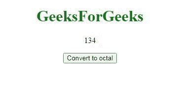
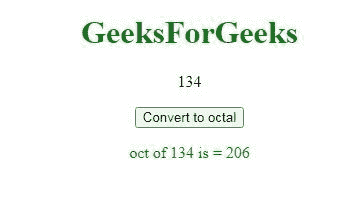

# 在 JavaScript 中如何将十进制转换为八进制？

> 原文:[https://www . geesforgeks . org/如何用 javascript 将十进制转换为八进制/](https://www.geeksforgeeks.org/how-to-convert-decimal-to-octal-in-javascript/)

给定一个数字，任务是将数字从十进制转换为八进制。这可以通过使用 **number.toString(8)** 方法来完成。它接受参数，该参数是转换后字符串的基础。在这种情况下，基数将是 8。

**语法:**

```
number.toString(8)
```

**参数:**

*   **数字:**保存需要转换的十进制格式的数字。

**示例:**

```
Input: 34
       24680
Output: a = 42
        b = 60150
Input: 20
       56789
Output: 24
        156725
```

**例 1:**

## java 描述语言

```
<!DOCTYPE html> 
<html>

<body>
    <script>        
        var a = 34;
        var b = 24680;

        document.write("a = " + a.toString(8) + "<br>");
        document.write("b = " + b.toString(8) + "<br>");        
     </script>
</body>

</html>
```

**输出:**

```
a = 42
b = 60150
```

**例 2:**

## java 描述语言

```
<!DOCTYPE html>
<html>

<body>
    <script>
        dec_to_bho = function (n, base) {
            if (n < 0) {
                n = 0xFFFFFFFF + n + 1;
            }
            switch (base) {
                case 'O':
                    return parseInt(n, 10).toString(8);
                    break;
                case 'P':
                    return parseInt(n, 10).toString(8);
                    break;
                case 'Q':
                    return parseInt(n, 10).toString(8);
                    break;
                default:
                    return ("Wrong input");
            }
        }

        console.log(dec_to_bho(20, 'O'));
        console.log(dec_to_bho(56789, 'P'));
        console.log(dec_to_bho(321, 'Q'));
    </script>
</body>

</html>
```

**输出:**

```
24
156725
501
```

**例 3:**

## java 描述语言

```
<!DOCTYPE html>
<html>

<body style="text-align:center;">
    <h1 style="color:green;">
        GeeksForGeeks
    </h1>

    <p id="up"></p>

    <button onclick="myGFG()">
        Convert to octal
    </button>

    <p id="down" style="color: green"></p>

    <script>
        var GFG_Var = 134;
        var up = document.getElementById("up");
        up.innerHTML = GFG_Var;
        var down = document.getElementById("down");

        function myGFG() {
            var GFG_Var2 = GFG_Var.toString(8);
            down = document.getElementById("down");
            down.innerHTML = "oct of " + GFG_Var
                + " is = " + GFG_Var2;
        } 
    </script>
</body>

</html>
```

**输出:**

*   在单击按钮之前:



*   单击按钮后:

