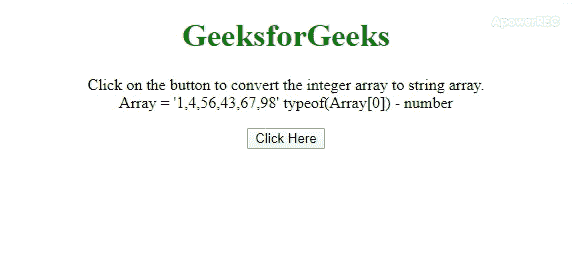
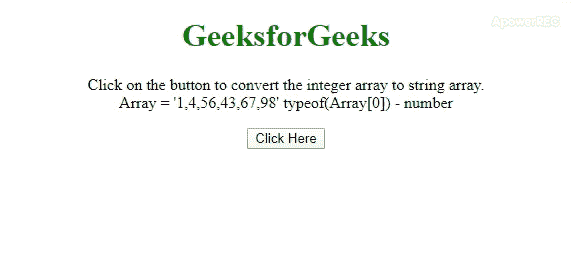

# 如何用 JavaScript 将整数数组转换成字符串数组？

> 原文:[https://www . geesforgeks . org/如何使用 javascript 将整数数组转换为字符串数组/](https://www.geeksforgeeks.org/how-to-convert-integer-array-to-string-array-using-javascript/)

任务是将整数数组转换为字符串数组。这里讨论了一些在 JavaScript 帮助下最常用的技术。在第一种方法中，我们将使用 **[。](https://www.geeksforgeeks.org/javascript-tostring-function/)** 同 **[。map()方法](https://www.geeksforgeeks.org/javascript-array-map-method/)** 而在秒进场我们将使用 **[。用](https://www.geeksforgeeks.org/javascript-array-prototype-join-function/)**[连接()方法](https://www.geeksforgeeks.org/javascript-string-prototype-split-function/)** 。split()方法** 。

**方法 1:** 在这种方法中，我们使用**。在**的帮助下，对数组的每个元素执行 toString()方法**。地图()方法**。

*   **示例:**该示例使用了上面讨论的方法。

    ```
    <!DOCTYPE html>
    <html>

    <head>
        <title>
            How to Convert Integer array to
            String array using JavaScript ?
        </title>

        <style>
            body {
                text-align: center;
            }
            h1 {
                color: green;
            }
            #geeks{
                font-weight: bold;
            }
        </style>
    </head>

    <body>
        <h1>GeeksforGeeks</h1>

        <p id="GFG"></p>

        <button onclick="gfg_Run()">
            Click Here
        </button>

        <p id="geeks"></p>

        <script>
            var el_up = document.getElementById("GFG");
            var el_down = document.getElementById("geeks");
            var arr = [1, 4, 56, 43, 67, 98];

            el_up.innerHTML = "Click on the button to "
                    + "convert the integer array" + 
                    " to string array.<br>Array = '"
                    + arr + "' typeof(Array[0]) - "
                    + typeof(arr[0]);

            function gfg_Run() {
                var gfg = arr.map(function(e){
                    return e.toString()
                });

                el_down.innerHTML = "Array - " + gfg + 
                    " typeof(Array[0]) - " + typeof(gfg[0]); 
            } 
        </script> 
    </body>

    </html>
    ```

*   **输出:**
    

**方法 2:** 在这种方法中，我们使用**。join()方法**，它连接数组并将其作为字符串返回。然后**。拆分()方法**将字符串拆分在“，”上，由**连接()方法**返回。

*   **示例:**该示例使用了上面讨论的方法。

    ```
    <!DOCTYPE HTML>
    <html>

    <head>
        <title>
            How to Convert Integer array to
            String array using JavaScript ?
        </title>

        <style>
            body {
                text-align: center;
            }
            h1 {
                color: green;
            }
            #geeks{
                font-weight: bold;
            }
        </style>
    </head>

    <body>
        <h1>GeeksforGeeks</h1>

        <p id="GFG"></p>

        <button onclick="gfg_Run()">
            Click Here
        </button>

        <p id="geeks"></p>

        <script>
            var el_up = document.getElementById("GFG");
            var el_down = document.getElementById("geeks");
            var arr = [1, 4, 56, 43, 67, 98];

            el_up.innerHTML = "Click on the button to "
                    + "convert the integer array" +
                    " to string array.<br>Array = '" 
                    + arr + "' typeof(Array[0]) - "
                    + typeof(arr[0]);

            function gfg_Run() {
                var gfg = arr.join().split(', ');

                el_down.innerHTML = "Array - " + gfg + 
                " typeof(Array[0]) - " + typeof(gfg[0]);
            }
        </script>
    </body>

    </html>
    ```

*   **输出:**
    