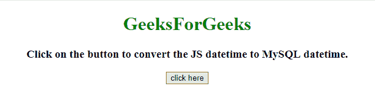
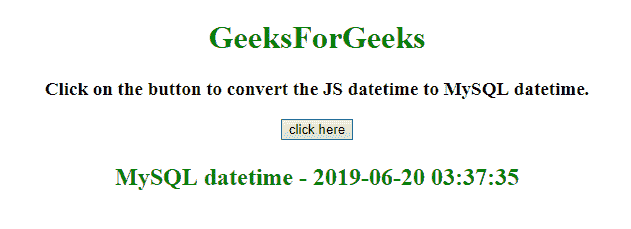
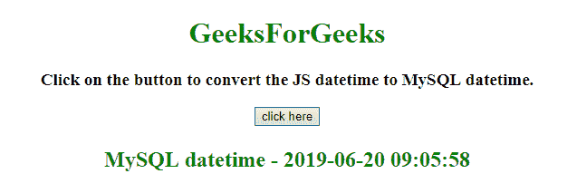

# 如何将 JavaScript datetime 转换为 MySQL datetime？

> 原文:[https://www . geesforgeks . org/how-convert-JavaScript-datetime-to-MySQL-datetime/](https://www.geeksforgeeks.org/how-to-convert-javascript-datetime-to-mysql-datetime/)

给定一个 JavaScript DateTime 格式的日期，任务是使用 JavaScript 将这个时间转换为 MySQL DateTime 格式。

**进场:**

*   使用 date.toISOString()函数将日期对象转换为字符串 ISO 格式，即 YYYY-MM-DDTHH:mm:ss.sssZ 或 YYYYYY-MM-DDTHH:mm:ss.sssZ 格式。
*   使用 slice()方法提取字符串的一部分。
*   使用 replace()方法将“T”字符替换为空格“”。

**示例 1:** 在本例中，使用 **slice()** 和 <strng>replace()方法将 JavaScript datetime 对象转换为 MySQL datetime (UTC 格式)。</strng>

```
<!DOCTYPE HTML> 
<html> 
    <head> 
        <title> 
            How to convert JavaScript datetime
            to MySQL datetime ?
        </title>
    </head> 

    <body style = "text-align:center;"> 

        <h1 style = "color:green;" > 
            GeeksForGeeks
        </h1>

        <p id = "GFG_UP" style =
            "font-size: 19px; font-weight: bold;">
        </p>

        <button onclick = "GFG_Fun()">
            click here
        </button>

        <p id = "GFG_DOWN" style = 
            "color: green; font-size: 24px; font-weight: bold;">
        </p>

        <script>
            var el_up = document.getElementById("GFG_UP");
            var el_down = document.getElementById("GFG_DOWN");

            el_up.innerHTML = "Click on the button to convert "
                        + "the JS datetime to MySQL datetime.";

            function GFG_Fun() {
                var date = new Date();
                el_down.innerHTML = "MySQL datetime - " + 
                date.toISOString().slice(0, 19).replace('T', ' ');
            }
        </script> 
    </body> 
</html>
```

**输出:**

*   **Before clicking the button:**
    
*   **Click the button:**
    

**示例 2:** 这与前面的示例相同，但方法不同，时间在 IST，通过使用 **slice()** 和 **replace()方法**将 JS datetime 转换为 MySQL datetime。

```
<!DOCTYPE HTML> 
<html> 
    <head> 
        <title> 
            How to convert JavaScript datetime
            to MySQL datetime ?
        </title>
    </head> 

    <body style = "text-align:center;"> 

        <h1 style = "color:green;" > 
            GeeksForGeeks
        </h1>

        <p id = "GFG_UP" style =
            "font-size: 19px; font-weight: bold;">
        </p>

        <button onclick = "GFG_Fun()">
            click here
        </button>

        <p id = "GFG_DOWN" style = 
            "color: green; font-size: 24px; font-weight: bold;">
        </p>

        <script>
            var el_up = document.getElementById("GFG_UP");
            var el_down = document.getElementById("GFG_DOWN");

            el_up.innerHTML = "Click on the button to convert "
                        + "the JS datetime to MySQL datetime.";

            function GFG_Fun() {
                var date = new Date();
                el_down.innerHTML = "MySQL datetime - " + 
                        date.toISOString().split('T')[0] + ' ' 
                        + date.toTimeString().split(' ')[0];
            }
        </script> 
    </body> 
</html>
```

**输出:**

*   **点击按钮前:**
    
*   **点击按钮后:**
    