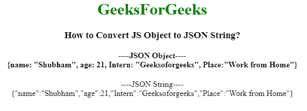
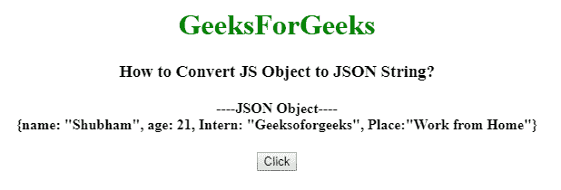
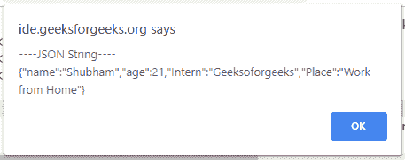

# 如何在 JQuery/Javascript 中将 JS 对象转换为 JSON 字符串？

> 原文:[https://www . geesforgeks . org/how-convert-js-object-JSON-string-in-jquery-JavaScript/](https://www.geeksforgeeks.org/how-to-convert-js-object-to-json-string-in-jquery-javascript/)

给定一个 JS 对象，任务是将其转换为 JSON 字符串。
**使用 [JSON.stringify()方法:](https://www.geeksforgeeks.org/javascript-json-stringify-with-examples/)**javascript 中的 JSON.stringify()方法允许我们获取一个 JavaScript 对象或数组，并从中创建一个 JSON 字符串。

**语法:**

```
JSON.stringify(value, replacer, space)
```

**进场:**

*   将 JSON 对象存储到变量中。
*   将该变量作为参数传递到 **JSON.stringify()** 中。
*   它将返回要转换成 JSON 字符串的值。

**示例 1:** JavaScript 对象转换为字符串。

```
<!DOCTYPE html>
<html>

<head>
    <title>How to Convert JS Object
      to JSON String?</title>
    <script src="https://code.jquery.com/jquery-1.12.4.min.js">
  </script>
</head>

<body>
    <center>
        <h1 style="color:green;"> 
        GeeksForGeeks 
    </h1>
        <h3>How to Convert JS Object to JSON String?
    </h3>
        <h4>
        ----JSON Object----<br>
        {name: "Shubham", age: 21,
          Intern: "Geeksoforgeeks",
          Place:"Work from Home"}
    </h4> ----JSON String----
        <br>
        <script>
            // Sample JS object
            var geeks = {
                name: "Shubham",
                age: 21,
                Intern: "Geeksoforgeeks",
                Place: "Work from Home"
            };

            // Converting JS object to JSON string
            var gfg = JSON.stringify(geeks);

            document.write(gfg);
            /* Prints: {"name": "Shubham", "age": 21,
            "Intern": "Geeksoforgeeks",
            "Place":"Work from Home"}*/
        </script>
    </center>
</body>

</html>
```

**输出:**


**示例 2:** 将 JavaScript 对象转换为字符串并生成告警消息。

```
<!DOCTYPE html>
<html>

<head>
    <title>How to Convert JS Object 
      to JSON String?</title>
    <script src="https://code.jquery.com/jquery-1.12.4.min.js">
  </script>
</head>

<body>
    <center>
        <h1 style="color:green;"> 
        GeeksForGeeks 
    </h1>
        <h3>How to Convert JS Object to JSON String?
    </h3>
        <h4>
        ----JSON Object----<br>
        {name: "Shubham", age: 21,
          Intern: "Geeksoforgeeks",
          Place:"Work from Home"}
    </h4>
        <button onclick="myFunction()">Click</button>
        <script>
            function myFunction() {
                // Sample JS object
                var geeks = {
                    name: "Shubham",
                    age: 21,
                    Intern: "Geeksoforgeeks",
                    Place: "Work from Home"
                };

                // Converting JS object to JSON string
                var gfg = JSON.stringify(geeks);
                var print = "----JSON String----";
                alert(print + "\n" + gfg);
                /* alert: {"name": "Shubham", "age": 21,
                "Intern": "Geeksoforgeeks",
                "Place":"Work from Home"}*/
            }
        </script>
    </center>
</body>

</html>
```

**输出:**
**之前点击按钮:**

**之后点击按钮:**


jQuery 是一个开源的 JavaScript 库，它简化了 HTML/CSS 文档之间的交互，它以其“少写多做”的理念而闻名。
跟随本 [jQuery 教程](https://www.geeksforgeeks.org/jquery-tutorials/)和 [jQuery 示例](https://www.geeksforgeeks.org/jquery-examples/)可以从头开始学习 jQuery。