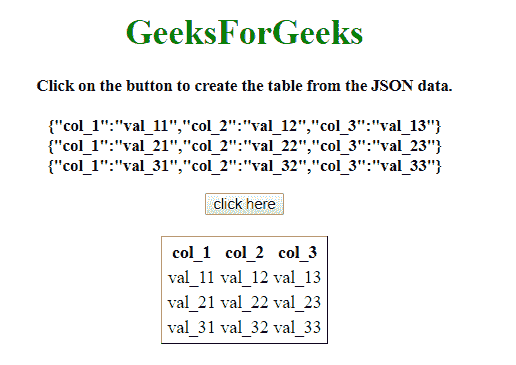

# 如何用 JavaScript/jQuery 将 JSON 数据转换成 html 表？

> 原文:[https://www . geesforgeks . org/how-convert-JSON-data-to-a-html-table-using-JavaScript-jquery/](https://www.geeksforgeeks.org/how-to-convert-json-data-to-a-html-table-using-javascript-jquery/)

给定一个包含 JSON 数据的 HTML 文档，任务是将 JSON 数据转换成一个 HTML 表。

**方法 1:**

*   以变量中的 JSON 对象为例。
*   调用一个函数，首先将列名添加到< table >元素中。(它正在查找所有列，这是列名的联合)。
*   遍历 JSON 数据，并将关键字与列名匹配。将该键的值放在相应的列中。
*   如果该键没有值，请将该列留空。

**示例 1:** 该示例实现了上述方法。

## 超文本标记语言

```
<!DOCTYPE HTML> 
<html> 

<head>
    <title>
        How to convert JSON data to a
        html table using JavaScript ?
    </title>

    <script src=
"https://ajax.googleapis.com/ajax/libs/jquery/3.4.1/jquery.min.js">
    </script>
</head>

<body style = "text-align:center;" id = "body"> 

    <h1 style = "color:green;" > 
        GeeksForGeeks 
    </h1>

    <p id = "GFG_UP" style =
        "font-size: 15px; font-weight: bold;">
    </p>

    <button onclick = "constructTable('#table')">
        click here
    </button>

    <br><br>

    <table align = "center"
            id="table" border="1">
    </table>

    <script>
        var el_up = document.getElementById("GFG_UP");

        var list = [
            { "col_1": "val_11", "col_3": "val_13" },
            { "col_2": "val_22", "col_3": "val_23" },
            { "col_1": "val_31", "col_3": "val_33" }
        ];

        el_up.innerHTML = "Click on the button to create "
                +   "the table from the JSON data.<br><br>"
                + JSON.stringify(list[0]) + "<br>"
                + JSON.stringify(list[1]) + "<br>"
                + JSON.stringify(list[2]);  

        function constructTable(selector) {

            // Getting the all column names
            var cols = Headers(list, selector); 

            // Traversing the JSON data
            for (var i = 0; i < list.length; i++) {
                var row = $('<tr/>');  
                for (var colIndex = 0; colIndex < cols.length; colIndex++)
                {
                    var val = list[i][cols[colIndex]];

                    // If there is any key, which is matching
                    // with the column name
                    if (val == null) val = ""; 
                        row.append($('<td/>').html(val));
                }

                // Adding each row to the table
                $(selector).append(row);
            }
        }

        function Headers(list, selector) {
            var columns = [];
            var header = $('<tr/>');

            for (var i = 0; i < list.length; i++) {
                var row = list[i];

                for (var k in row) {
                    if ($.inArray(k, columns) == -1) {
                        columns.push(k);

                        // Creating the header
                        header.append($('<th/>').html(k));
                    }
                }
            }

            // Appending the header to the table
            $(selector).append(header);
                return columns;
        }      
    </script>
</body> 

</html>
```

**输出:**

*   **点击按钮前:**


*   **点击按钮后:**


**方法 2:**

*   将 JSON 对象存储到变量中。
*   首先把所有的键放在一个列表中。
*   创建元素。

*   为表格的标题创建一个元素。
*   访问键列表，为每个值创建一个，并将其插入为标题创建的元素。
*   然后，为对象中的每个条目创建一个单元格，并将其插入特定行。
*   如果该键没有值，请将该列留空。

**示例 2:** 该示例实现了上述方法。

## 超文本标记语言

```
<!DOCTYPE HTML> 
<html> 

<head>
    <title>
        How to convert JSON data to a html
        table using JavaScript/jQuery ?
    </title>

    <script src=
"https://ajax.googleapis.com/ajax/libs/jquery/3.4.1/jquery.min.js">
    </script>
</head>

<body style = "text-align:center;"> 

    <h1 style = "color:green;"> 
        GeeksForGeeks 
    </h1>

    <p id = "GFG_UP" style =
            "font-size: 15px; font-weight: bold;">
    </p>

    <button onclick = "GFG_FUN()">
        click here
    </button>

    <br><br>

    <table id="table" align = "center" border="1px"></table>

    <script>
        var el_up = document.getElementById("GFG_UP");

        var list = [
            {"col_1":"val_11", "col_2":"val_12", "col_3":"val_13"},
            {"col_1":"val_21", "col_2":"val_22", "col_3":"val_23"},
            {"col_1":"val_31", "col_2":"val_32", "col_3":"val_33"}
        ];

        el_up.innerHTML = "Click on the button to create the "
                + "table from the JSON data.<br><br>"
                + JSON.stringify(list[0]) + "<br>"
                + JSON.stringify(list[1]) + "<br>"
                + JSON.stringify(list[2]);  

        function GFG_FUN() {
            var cols = [];

            for (var i = 0; i < list.length; i++) {
                for (var k in list[i]) {
                    if (cols.indexOf(k) === -1) {

                        // Push all keys to the array
                        cols.push(k);
                    }
                }
            }

            // Create a table element
            var table = document.createElement("table");

            // Create table row tr element of a table
            var tr = table.insertRow(-1);

            for (var i = 0; i < cols.length; i++) {

                // Create the table header th element
                var theader = document.createElement("th");
                theader.innerHTML = cols[i];

                // Append columnName to the table row
                tr.appendChild(theader);
            }

            // Adding the data to the table
            for (var i = 0; i < list.length; i++) {

                // Create a new row
                trow = table.insertRow(-1);
                for (var j = 0; j < cols.length; j++) {
                    var cell = trow.insertCell(-1);

                    // Inserting the cell at particular place
                    cell.innerHTML = list[i][cols[j]];
                }
            }

            // Add the newly created table containing json data
            var el = document.getElementById("table");
            el.innerHTML = "";
            el.appendChild(table);
        }   
    </script>
</body> 

</html>
```

**输出:**

*   **点击按钮前:**


*   **点击按钮后:**



JavaScript 最出名的是网页开发，但它也用于各种非浏览器环境。您可以通过以下 [JavaScript 教程](https://www.geeksforgeeks.org/javascript-tutorial/)和 [JavaScript 示例](https://www.geeksforgeeks.org/javascript-examples/)从头开始学习 JavaScript。