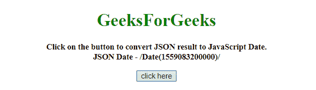
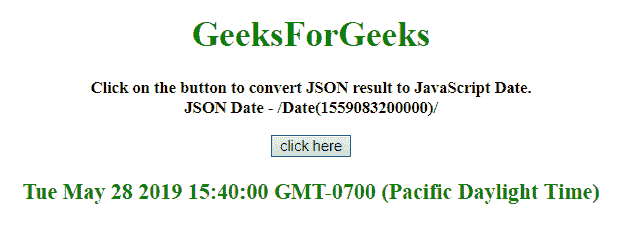

# 如何用 JavaScript 将 JSON 结果转换成日期？

> 原文:[https://www . geesforgeks . org/如何使用 javascript 将 json 结果转换为日期/](https://www.geeksforgeeks.org/how-to-convert-json-results-into-a-date-using-javascript/)

任务是在 JavaScript 的帮助下将一个 JSON 结果转换成 JavaScript 日期。下面讨论两种方法:

**方法 1:**

*   使用 **substr()方法**获取字符串的整数部分。
*   使用**parsent()方法**后跟 **Date()** 获取 JavaScript 日期。

**示例:**该示例实现了上述方法。

```
<!DOCTYPE HTML> 
<html> 

<head> 
    <title> 
        How to convert JSON results into
        a date using JavaScript ?
    </title>
</head> 

<body style = "text-align:center;"> 

    <h1 style = "color:green;" > 
        GeeksForGeeks 
    </h1>

    <p id = "GFG_UP" style = 
        "font-size: 15px; font-weight: bold;">
    </p>

    <button onclick = "gfg_Run()">
        click here
    </button>

    <p id = "GFG_DOWN" style = "color:green;
        font-size: 20px; font-weight: bold;">
    </p>

    <script>
        var el_up = document.getElementById("GFG_UP");
        var el_down = document.getElementById("GFG_DOWN");
        var jsonDate = '/Date(1559083200000)/';

        el_up.innerHTML = "Click on the button to convert"
                    + " JSON result to JavaScript Date."
                    + "<br>JSON Date - " + jsonDate;

        function gfg_Run() {
            var date = new Date(parseInt(jsonDate.substr(6)));
            el_down.innerHTML = date;
        }         
    </script> 
</body> 

</html>
```

**输出:**

*   **点击按钮前:**
    
*   **点击按钮后:**
    

**方法 2:**

*   使用**正则表达式**获取字符串的整数部分。
*   使用 **Date()方法**获取 JavaScript 日期。

**示例:**该示例实现了上述方法。

```
<!DOCTYPE HTML> 
<html> 

<head> 
    <title> 
        How to convert JSON results into
        a date using JavaScript ?
    </title>
</head> 

<body style = "text-align:center;"> 

    <h1 style = "color:green;" > 
        GeeksForGeeks 
    </h1>

    <p id = "GFG_UP" style = 
        "font-size: 15px; font-weight: bold;">
    </p>

    <button onclick = "gfg_Run()">
        click here
    </button>

    <p id = "GFG_DOWN" style = "color:green;
        font-size: 20px; font-weight: bold;">
    </p>

    <script>
        var el_up = document.getElementById("GFG_UP");
        var el_down = document.getElementById("GFG_DOWN");
        var jsonDate = '/Date(1559083200000)/';

        el_up.innerHTML = "Click on the button to convert"
                    + " JSON result to JavaScript Date."
                    + "<br>JSON Date - " + jsonDate;

        function gfg_Run() {
            var date = new Date(jsonDate.match(/\d+/)[0] * 1);
            el_down.innerHTML = date;
        }         
    </script> 
</body> 

</html>
```

**输出:**

*   **点击按钮前:**
    
*   **点击按钮后:**
    