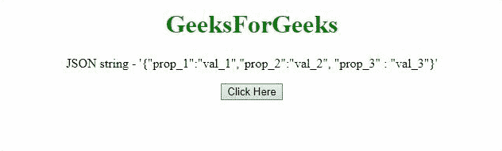

# 如何用 JavaScript 将 JSON 字符串转换成 JSON 对象的数组？

> 原文:[https://www . geesforgeks . org/how-convert-JSON-string-to-array-of-JSON-objects-use-JavaScript/](https://www.geeksforgeeks.org/how-to-convert-json-string-to-array-of-json-objects-using-javascript/)

给定一个 JSON 字符串，任务是将 JSON 字符串转换为 JSON 对象数组。这个数组包含在 JavaScript 的帮助下从 JSON 字符串中获得的 JavaScript 对象的值。有两种方法可以解决这个问题，讨论如下:

**方法 1:** 首先使用 [**JSON 将 JSON 字符串转换为 JavaScript 对象。解析()方法**](https://www.geeksforgeeks.org/javascript-json-parse-method/) ，然后使用 [**push()方法**](https://www.geeksforgeeks.org/javascript-array-prototype-push-function/) 将对象的值推入数组。

*   **例:**

    ```html
    <!DOCTYPE HTML> 
    <html> 

    <head> 
        <title> 
            How to convert JSON string to array
            of JSON objects using JavaScript?
        </title>
    </head> 

    <body style = "text-align:center;"> 

        <h1 style = "color:green;" > 
            GeeksForGeeks 
        </h1>

        <p id = "GFG_UP"></p>

        <button onclick = "myGFG()">
            Click Here
        </button>

        <p id = "GFG_DOWN"></p>

        <script>
            var up = document.getElementById("GFG_UP");

            var JS_Obj = 
            '{"prop_1":"val_1", "prop_2":"val_2", "prop_3" : "val_3"}';

            up.innerHTML = "JSON string - '" + JS_Obj + "'";

            var down = document.getElementById("GFG_DOWN");

            function myGFG() {
                var obj = JSON.parse(JS_Obj);
                var res = [];

                for(var i in obj)
                    res.push(obj[i]);

                down.innerHTML = "Array of values - ["
                                + res + "]";
            }
        </script> 
    </body> 

    </html>
    ```

*   **输出:**
    

**方法 2:** 这种方法也是一样的，但是使用的方法不同。使用 [**eval()方法**](https://www.geeksforgeeks.org/javascript-eval-function/) 将 JSON 字符串转换为 JavaScript 对象，然后使用 [**push()方法**](https://www.geeksforgeeks.org/javascript-array-prototype-push-function/) 取出对象的值并推送到数组中。

*   **例:**

    ```html
    <!DOCTYPE HTML> 
    <html> 

    <head> 
        <title> 
            How to convert JSON string to array
            of JSON objects using JavaScript?
        </title>
    </head> 

    <body style = "text-align:center;"> 

        <h1 style = "color:green;" > 
            GeeksForGeeks 
        </h1>

        <p id = "GFG_UP"></p>

        <button onclick = "myGFG()">
            Click Here
        </button>

        <p id = "GFG_DOWN"></p>

        <script>
            var up = document.getElementById("GFG_UP");

            var JS_Obj = 
            '{"prop_1":"val_1", "prop_2":"val_2", "prop_3" : "val_3"}';

            up.innerHTML = "JSON string - '" + JS_Obj + "'";

            var down = document.getElementById("GFG_DOWN");

            function myGFG() {
                var obj = eval('(' + JS_Obj + ')');
                var res = [];

                for(var i in obj)
                    res.push(obj[i]);

                down.innerHTML = "Array of values - ["
                                + res + "]";
            }
        </script> 
    </body> 

    </html>
    ```

*   **输出:**
    

JavaScript 最出名的是网页开发，但它也用于各种非浏览器环境。您可以通过以下 [JavaScript 教程](https://www.geeksforgeeks.org/javascript-tutorial/)和 [JavaScript 示例](https://www.geeksforgeeks.org/javascript-examples/)从头开始学习 JavaScript。

HTML 是网页的基础，通过构建网站和网络应用程序用于网页开发。您可以通过以下 [HTML 教程](https://www.geeksforgeeks.org/html-tutorials/)和 [HTML 示例](https://www.geeksforgeeks.org/html-examples/)从头开始学习 HTML。

CSS 是网页的基础，通过设计网站和网络应用程序用于网页开发。你可以通过以下 [CSS 教程](https://www.geeksforgeeks.org/css-tutorials/)和 [CSS 示例](https://www.geeksforgeeks.org/css-examples/)从头开始学习 CSS。