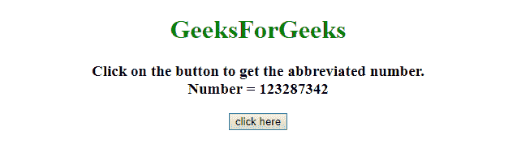
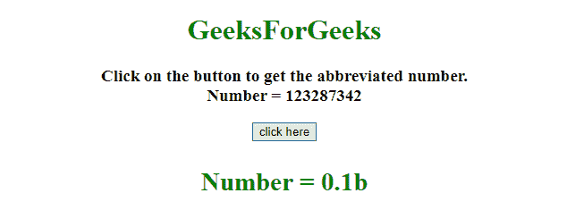
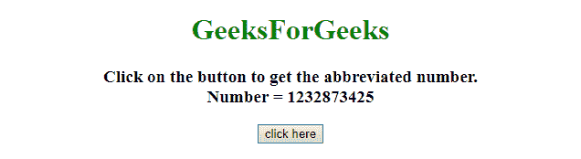
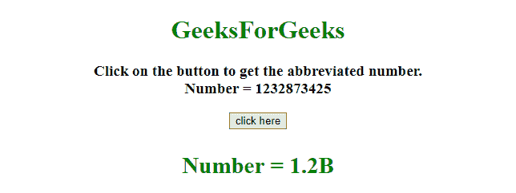

# 如何在 JavaScript 中将长数字转换成缩写字符串？

> 原文:[https://www . geesforgeks . org/如何将长数字转换为缩写的 javascript 字符串/](https://www.geeksforgeeks.org/how-to-convert-long-number-into-abbreviated-string-in-javascript/)

给定一个长数字，任务是将其转换为缩写字符串(例如..1234 到 1.2k)。这里讨论了借助 javaScript 的两种方法。
**进场 1:**

*   获取数组中的字符(ar = [" "、" k "、" m "、" b"])
*   将数字的长度除以 3，得到 var(sNum)值。
*   如果斯努姆！= 0，然后通过除以 1000^sNum.来计算数字的精确值
*   将数组中索引= sNum 处的字符附加到精确值上，最终得到缩写数字。

**示例 1:** 该示例实现了上述方法。

## 超文本标记语言

```
<!DOCTYPE HTML>
<html>

<head>
    <title>
        Convert long number into abbreviated string.
    </title>
    <script src=
"https://ajax.googleapis.com/ajax/libs/jquery/3.4.0/jquery.min.js">
    </script>
</head>

<body style="text-align:center;">
    <h1 style="color:green;">  
            GeeksForGeeks  
        </h1>
    <p id="GFG_UP">
    </p>

    <button onclick="GFG_Fun();">
        click here
    </button>
    <p id="GFG_DOWN" style="color: green;">
    </p>

    <script>
        var up = document.getElementById('GFG_UP');
        var down = document.getElementById('GFG_DOWN');
        var n = 123287342;
        up.innerHTML =
"Click on the button to get the abbreviated number.<br>Number = "
        + n;

        function convert(val) {

            // thousands, millions, billions etc..
            var s = ["", "k", "m", "b", "t"];

            // dividing the value by 3.
            var sNum = Math.floor(("" + val).length / 3);

            // calculating the precised value.
            var sVal = parseFloat((
              sNum != 0 ? (val / Math.pow(1000, sNum)) : val).toPrecision(2));

            if (sVal % 1 != 0) {
                sVal = sVal.toFixed(1);
            }

            // appending the letter to precised val.
            return sVal + s[sNum];
        }

        function GFG_Fun() {
            $('#GFG_DOWN').html('Number = ' + convert(n));
        }
    </script>
</body>

</html>
```

**输出:**

*   **点击按钮前:**



*   **点击按钮后:**



**进场 2:**

*   检查数字是否小于 1e3，如果小于 1e 3，则按原样返回数字。
*   如果数字大于或等于 1e3，小于 1e6，则删除最后三位数字，并附加字符“K”。
*   如果数字大于或等于 1e6，小于 1e9，则删除最后六位数字，并在后面加上字符“M”。
*   如果数字大于或等于 1e9，小于 1e12，则删除最后九位数字，并在后面加上字符“B”。
*   如果数字大于或等于 1e12，删除最后 12 位数字，并在后面加上字符“T”。

**示例 2:** 该示例实现了上述方法。

## 超文本标记语言

```
<!DOCTYPE HTML>
<html>

<head>
    <title>
        Convert long number into abbreviated string.
    </title>
    <script src=
"https://ajax.googleapis.com/ajax/libs/jquery/3.4.0/jquery.min.js">
    </script>
</head>

<body style="text-align:center;">
    <h1 style="color:green;">  
            GeeksForGeeks  
        </h1>
    <p id="GFG_UP">
    </p>

    <button onclick="GFG_Fun();">
        click here
    </button>
    <p id="GFG_DOWN" style="color: green;">
    </p>

    <script>
        var up = document.getElementById('GFG_UP');
        var down = document.getElementById('GFG_DOWN');
        var n = 1232873425;
        up.innerHTML = 
          "Click on the button to get the abbreviated number.<br>Number = "
        + n;
        const convert = n => {
            if (n < 1e3) return n;
            if (n >= 1e3 && n < 1e6) return +(n / 1e3).toFixed(1) + "K";
            if (n >= 1e6 && n < 1e9) return +(n / 1e6).toFixed(1) + "M";
            if (n >= 1e9 && n < 1e12) return +(n / 1e9).toFixed(1) + "B";
            if (n >= 1e12) return +(n / 1e12).toFixed(1) + "T";
        };

        function GFG_Fun() {
            $('#GFG_DOWN').html('Number = ' + convert(n));
        }
    </script>
</body>

</html>
```

**输出:**

*   **点击按钮前:**



*   **After clicking on the button:** 

    