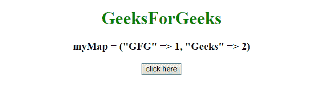
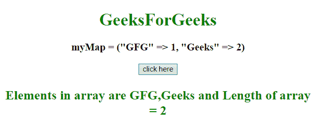

# 如何在 JavaScript 中将 Map 键转换成数组？

> 原文:[https://www . geesforgeks . org/如何将映射键转换为 javascript 数组/](https://www.geeksforgeeks.org/how-to-convert-map-keys-to-an-array-in-javascript/)

给定一个地图，任务是使用 JavaScript 将地图的键放入一个数组中。

**方法 1:**

*   声明新地图对象
*   显示地图内容
*   在地图对象上使用 key()方法获取地图的关键点。
*   然后使用 array.from()方法将地图对象转换为数组。

**示例 1:** 本示例使用 **array.from()** 方法获取数组中地图的关键点。

```
<!DOCTYPE HTML> 
<html> 
    <head> 
        <title> 
            How to convert Map keys to
            array in JavaScript ?
        </title>
    </head> 

    <body style = "text-align:center;">

        <h1 style = "color:green;" > 
            GeeksForGeeks 
        </h1>

        <p id = "GFG_UP" style =
            "font-size: 19px; font-weight: bold;">
        </p>

        <button onClick = "GFG_Fun()">
            click here
        </button>

        <p id = "GFG_DOWN" style =
            "color: green; font-size: 24px; font-weight: bold;">
        </p>

        <script>
            var up = document.getElementById('GFG_UP');
            var down = document.getElementById('GFG_DOWN');

            let myMap = new Map().set('GFG', 1).set('Geeks', 2);

            up.innerHTML = 'myMap = ("GFG" => 1, "Geeks" => 2)';

            function GFG_Fun() {
                var array = Array.from(myMap.keys());
                down.innerHTML = "Elements in array are " + array
                        + " and Length of array = " + array.length;
            }
        </script> 
    </body> 
</html>                    
```

**输出:**

*   **点击按钮前:**
    
*   **点击按钮后:**
    

**方法 2:**

*   声明新地图对象
*   显示地图内容
*   在地图对象上使用[ …myMap.keys() ]方法，以数组的形式获取地图的关键点。

**示例 2:** 本示例使用 **[ …Map.keys() ]** 方法获取数组中 Map 的键。

```
<!DOCTYPE HTML> 
<html> 
    <head> 
        <title> 
            How to convert Map keys to
            array in JavaScript
        </title>
    </head> 

    <body style = "text-align:center;">

        <h1 style = "color:green;" > 
            GeeksForGeeks 
        </h1>

        <p id = "GFG_UP" style =
            "font-size: 19px; font-weight: bold;">
        </p>

        <button onClick = "GFG_Fun()">
            click here
        </button>

        <p id = "GFG_DOWN" style =
            "color: green; font-size: 24px; font-weight: bold;">
        </p>

        <script>
            var up = document.getElementById('GFG_UP');
            var down = document.getElementById('GFG_DOWN');

            let myMap = new Map().set('GFG', 1).set('Geeks', 2);

            up.innerHTML = 'myMap = ("GFG" => 1, "Geeks" => 2)';

            function GFG_Fun() {
                var array = [ ...myMap.keys() ];
                down.innerHTML = "Elements in array are " + array
                        + " and Length of array = " + array.length;
            }
        </script> 
    </body> 
</html>
```

**输出:**

*   **点击按钮前:**
    
*   **点击按钮后:**
    