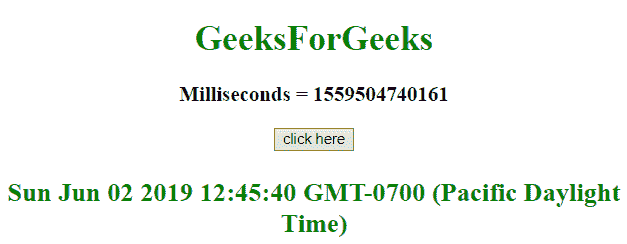
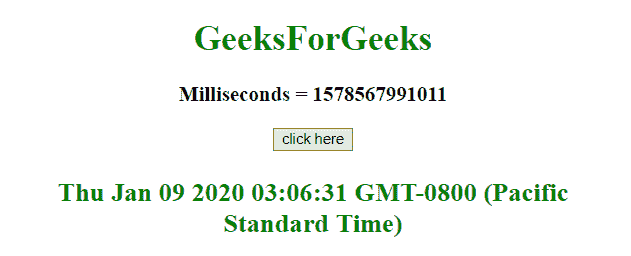

# JavaScript |将毫秒转换为日期。

> 原文:[https://www . geesforgeks . org/如何将毫秒转换为 javascript 中的日期/](https://www.geeksforgeeks.org/how-to-convert-milliseconds-to-date-in-javascript/)

给定毫秒数，任务是使用 javascript 将它们转换为日期。我们将讨论一些技巧。

**进场:**

*   首先声明变量**时间**，并使用 [**新日期()**](https://www.geeksforgeeks.org/javascript-date-objects/) 表示当前日期，使用 [**getTime()**](https://www.geeksforgeeks.org/javascript-date-gettime-method/) 表示从 1970 年 1 月 1 日开始以毫秒为单位返回当前日期。
*   将时间转换为日期对象，并存储到新变量**日期**中。
*   使用 [**date.toString()**](https://www.geeksforgeeks.org/javascript-date-tostring-function/) 函数将日期对象的内容转换为字符串

**示例 1:** 本示例首先获取当前日期和时间的毫秒数，然后使用该值通过 **Date()方法**获取日期。

```
<!DOCTYPE HTML>
<html>

<head>
    <title>
        JavaScript 
      | Converting milliseconds to date.
    </title>
</head>

<body style="text-align:center;" id="body">
    <h1 style="color:green;">  
            GeeksForGeeks  
        </h1>
    <p id="GFG_UP" style="font-size: 19px; 
              font-weight: bold;">
    </p>
    <button onClick="GFG_Fun()">
        click here
    </button>
    <p id="GFG_DOWN" style="color: green;
              font-size: 24px;
              font-weight: bold;">
    </p>
    <script>
        var up = document.getElementById('GFG_UP');
        var down = document.getElementById('GFG_DOWN');
        var time = new Date().getTime();
        up.innerHTML = "Milliseconds = " + time;

        function GFG_Fun() {
            var date = new Date(time);
            down.innerHTML = date.toString();
        }
    </script>
</body>

</html>
```

**输出:**

*   **点击按钮前:**
    
*   **点击按钮后:**
    

**方法 2:**

*   将给定时间转换为日期对象，并存储到新变量**日期**中。
*   Convert the date object’s contents into a string using **date.toString()** function

    **示例 2:** 本示例首先获取随机毫秒数(1578567991011 ms)，然后使用该值通过 **Date()方法**获取日期。

    ```
    <!DOCTYPE HTML>
    <html>

    <head>
        <title>
            JavaScript 
          | Converting milliseconds to date.
        </title>
    </head>

    <body style="text-align:center;"
          id="body">
        <h1 style="color:green;">  
                GeeksForGeeks  
            </h1>
        <p id="GFG_UP"
           style="font-size: 19px;
                  font-weight: bold;">
        </p>
        <button onClick="GFG_Fun()">
            click here
        </button>
        <p id="GFG_DOWN"
           style="color: green;
                  font-size: 24px; 
                  font-weight: bold;">
        </p>
        <script>
            var up = document.getElementById('GFG_UP');
            var down = document.getElementById('GFG_DOWN');
            var milliseconds = 1578567991011;
            up.innerHTML = "Milliseconds = " + milliseconds;

            function GFG_Fun() {
                var date = new Date(milliseconds);
                down.innerHTML = date.toString();
            }
        </script>
    </body>

    </html>
    ```

    **输出:**

    *   **点击按钮前:**
        
    *   **点击按钮后:**
        

    JavaScript 最出名的是网页开发，但它也用于各种非浏览器环境。您可以通过以下 [JavaScript 教程](https://www.geeksforgeeks.org/javascript-tutorial/)和 [JavaScript 示例](https://www.geeksforgeeks.org/javascript-examples/)从头开始学习 JavaScript。