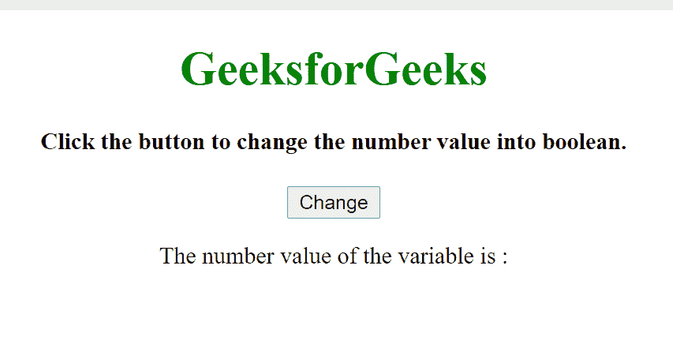
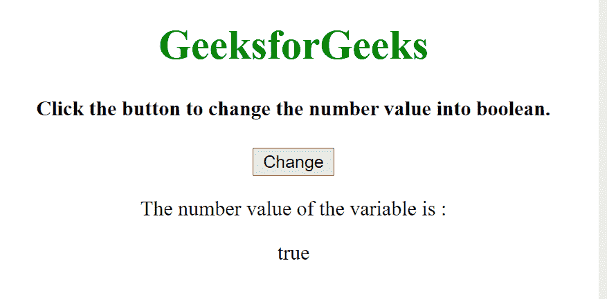

# 如何在 JavaScript 中将 Number 转换为 Boolean？

> 原文:[https://www . geesforgeks . org/如何将 javascript 中的数字转换为布尔值/](https://www.geeksforgeeks.org/how-to-convert-number-to-boolean-in-javascript/)

我们使用 JavaScript **布尔()**方法将一个数字转换为布尔。JavaScript 布尔值导致两个值之一，即*真*或*假*。但是，如果要将存储整数**“0”或“1”**的变量转换为布尔值，即**“真”或“假”。**

**语法:**

```html
Boolean(variable/expression)
```

**例**:

## 超文本标记语言

```html
<!DOCTYPE html>
<html>

<body>
    <center>
        <h1 style="color:green">
            GeeksforGeeks
        </h1>

        <h4>
            Click the button to change the
            number value into boolean.
        </h4>

        <button onclick="myFunction()">Change</button>

        <p>The number value of the variable is :</p>

        <p id="result"></p>

        <script>

            // Initializing boolvalue as true 
            var numvalue = 1;

            // JavaScript program to illustrate boolean 
            // conversion using ternary operator 
            function myFunction() {

                document.getElementById("result")
                    .innerHTML = Boolean(numvalue);
            } 
        </script>
    </center>
</body>

</html>
```

**注:**如果以上**布尔()**方法称为*T5】布尔(！numvalue)* ，则显示结果为“ *false* ”。同样如果叫作*布尔(！！numvalue)，*给出的结果为“*真*”。

**输出:**

**点击按钮前:**



**点击按钮后:**

