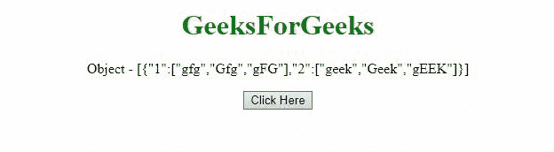

# 如何用 JavaScript 把 Object 的数组转换成数组？

> 原文:[https://www . geesforgeks . org/如何使用 javascript 将对象从数组转换为数组/](https://www.geeksforgeeks.org/how-to-convert-objects-array-to-an-array-using-javascript/)

给定一个对象数组，任务是在 JavaScript 的帮助下将对象值转换成数组。下面讨论两种方法:

**方法 1:** 我们可以使用 **map()方法**并返回组成数组的每个对象的值。

*   **例:**

    ```html
    <!DOCTYPE HTML>
    <html>

    <head>
        <title>
            Convert a JS object to
            an array using JQuery
        </title>

        <script src=
    "https://ajax.googleapis.com/ajax/libs/jquery/3.4.0/jquery.min.js">
        </script>
    </head>

    <body style="text-align:center;">

        <h1 style="color:green;">
            GeeksForGeeks
        </h1>

        <p id="GFG_UP"></p>

        <button onclick="myGFG()">
            Click Here
        </button>

        <p id="GFG_DOWN"></p>

        <script>
            var up = document.getElementById("GFG_UP");

            var JS_Obj = {
                1: ['gfg', 'Gfg', 'gFG'],
                2: ['geek', 'Geek', 'gEEK']
            };

            up.innerHTML = "Object - [" 
                    + JSON.stringify(JS_Obj) + "]";

            var down = document.getElementById("GFG_DOWN");

            function myGFG() {
                var array = $.map(JS_Obj, function (val, ind) {
                    return [val];
                });
                down.innerHTML = array;
            }
        </script>
    </body>

    </html>
    ```

*   **输出:**
    

**方法 2:**[**object . keys()方法**](https://www.geeksforgeeks.org/object-keys-javascript/) 用于获取对象的键，然后这些键用于从数组中获取对象的值。

*   **例:**

    ```html
    <!DOCTYPE HTML>
    <html>

    <head>
        <title>
            Convert a JS object to
            an array using JQuery
        </title>

        <script src=
    "https://ajax.googleapis.com/ajax/libs/jquery/3.4.0/jquery.min.js">
        </script>
    </head>

    <body style="text-align:center;">

        <h1 style="color:green;">
            GeeksForGeeks
        </h1>

        <p id="GFG_UP"></p>

        <button onclick="myGFG()">
            Click Here
        </button>
        <p id="GFG_DOWN"></p>

        <script>
            var up = document.getElementById("GFG_UP");

            var JS_Obj = {
                1: ['gfg', 'Gfg', 'gFG'],
                2: ['geek', 'Geek', 'gEEK']
            };

            up.innerHTML = "Object - [" 
                + JSON.stringify(JS_Obj) + "]";

            var down = document.getElementById("GFG_DOWN");

            function myGFG() {
                var arr = Object.keys(JS_Obj)
                    .map(function (key) 
                    { return JS_Obj[key]; });

                down.innerHTML = arr;
            }
        </script>
    </body>

    </html>
    ```

*   **输出:**
    