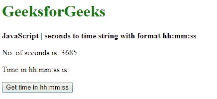
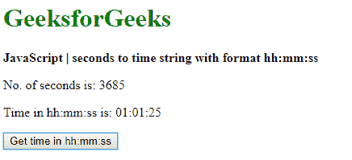

# 如何用 JavaScript 将秒转换为时间字符串格式 hh:mm:ss？

> 原文:[https://www . geesforgeks . org/如何将秒转换为时间-字符串-格式-hhmmss-使用-javascript/](https://www.geeksforgeeks.org/how-to-convert-seconds-to-time-string-format-hhmmss-using-javascript/)

给定以秒为单位的时间，任务是将时间转换为字符串格式 hh:mm:ss。有两种方法可以解决这个问题:

**方法 1:将秒传递给日期对象**

*   **Date()** 构造函数需要一个 UNIX 时间戳作为其形式之一。UNIX 时间戳是自纪元时间(世界协调时 1970 年 1 月 1 日 00:00:00)以来经过的毫秒数。将此构造函数转换为毫秒后，可以给它的秒数。
*   以秒为单位的时间通过乘以 **1000** 转换为以毫秒为单位的时间。这将传递给**日期()**建造商。创建的日期对象可用于访问格式所需的小时、分钟和秒。
*   **小时**值是使用**getutchhours()**方法从日期中提取的。使用 **getUTCMinutes()** 方法从日期中提取以 UTC 表示的**分钟**值。使用 **getSeconds()** 方法从日期中提取**秒**值。
*   最终格式化的日期是通过使用 **toString()** 方法将这些值转换为字符串，然后使用额外的**“0”**填充它们来创建的，如果该值是通过使用 **padStart()** 方法的一位数。然后用冒号(:)作为分隔符将各个部分连接在一起。该字符串的格式为**“hh:mm:ss”**。

**语法:**

```
dateObj = new Date(given_seconds * 1000);
hours = dateObj.getUTCHours();
minutes = dateObj.getUTCMinutes();
seconds = dateObj.getSeconds();

timeString = hours.toString().padStart(2, '0') + ':' + 
    minutes.toString().padStart(2, '0') + ':' + 
    seconds.toString().padStart(2, '0');

```

**示例:**

```
<!DOCTYPE html>
<html>

<head>
    <title>
        How to convert seconds to time string
        format hh:mm:ss using JavaScript ?
    </title>
</head>

<body>
    <h1 style="color: green">
        GeeksforGeeks
    </h1>

    <b>
        JavaScript | seconds to time
        string with format hh:mm:ss
    </b>

    <p>No. of secomds is: 3685</p>

    <p>
        Time in hh:mm:ss is:
        <span class="output"></span>
    </p>

    <button onclick="convertSecondstoTime()">
        Get time in hh:mm:ss
    </button>

    <script type="text/javascript">
        function convertSecondstoTime() {
            given_seconds = 3685;

            dateObj = new Date(given_seconds * 1000);
            hours = dateObj.getUTCHours();
            minutes = dateObj.getUTCMinutes();
            seconds = dateObj.getSeconds();

            timeString = hours.toString().padStart(2, '0')
                + ':' + minutes.toString().padStart(2, '0')
                + ':' + seconds.toString().padStart(2, '0');

            document.querySelector('.output').textContent
                        = timeString;
        }
    </script>
</body>

</html>
```

**输出:**

*   **点击按钮前:**
    
*   **点击按钮后:**
    

**方法二:分别计算小时、分钟、秒**

*   小时可以通过将秒除以 **3600** 来计算，因为一小时等于 3600 秒。这将找出小时数。通过使用**数学.地板()**函数，这个数字被降低到最接近的整数。
*   分钟可以通过找到减去小时数后剩余的秒数来计算。该值除以 60 得到分钟数。通过使用 **Math.floor()** 函数，这个数字被降低到最接近的整数。
*   可以通过从之前给出的总秒数中减去分钟值中的秒数和小时值中的秒数来计算秒数。
*   最终格式化的日期是通过使用 **toString()** 方法将这些值转换为字符串，然后使用额外的**“0”**填充它们来创建的，如果该值是通过使用 **padStart()** 方法的一位数。然后用冒号(:)作为分隔符将各个部分连接在一起。该字符串的格式为**“hh:mm:ss”**。

**语法:**

```
hours = Math.floor(given_seconds / 3600);
minutes = Math.floor((given_seconds - (hours * 3600)) / 60);
seconds = given_seconds - (hours * 3600) - (minutes * 60);

timeString = hours.toString().padStart(2, '0') + ':' + 
      minutes.toString().padStart(2, '0') + ':' + 
      seconds.toString().padStart(2, '0');

```

**示例:**

```
                        <!DOCTYPE html>
<html>

<head>
    <title>
        How to convert seconds to time string
        format hh:mm:ss using JavaScript ?
    </title>
</head>

<body>
    <h1 style="color: green">
        GeeksforGeeks
    </h1>

    <b>
        JavaScript | seconds to time 
        string with format hh:mm:ss
    </b>

    <p>No. of secomds is: 3685</p>
    <p>
        Time in hh:mm:ss is: 
        <span class="output"></span>
    </p>

    <button onclick="convertSecondstoTime()">
        Get time in hh:mm:ss
    </button>

    <script type="text/javascript">
        function convertSecondstoTime() {
            given_seconds = 3685;

            hours = Math.floor(given_seconds / 3600);
            minutes = Math.floor((given_seconds - (hours * 3600)) / 60);
            seconds = given_seconds - (hours * 3600) - (minutes * 60);

            timeString = hours.toString().padStart(2, '0') + ':' +
                minutes.toString().padStart(2, '0') + ':' +
                seconds.toString().padStart(2, '0');

            document.querySelector('.output').textContent
                        = timeString;
        }
    </script>
</body>

</html>
```

**输出:**

*   **点击按钮前:**
    
*   **点击按钮后:**
    