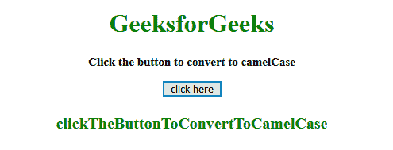
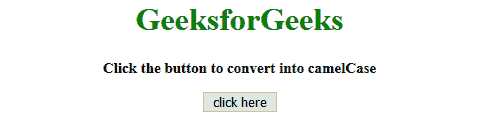
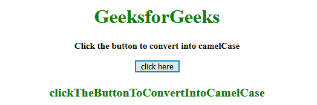

# 如何在 JavaScript 中将字符串转换成骆驼大小写？

> 原文:[https://www . geesforgeks . org/如何将字符串转换为 camel-in-case-JavaScript/](https://www.geeksforgeeks.org/how-to-convert-string-to-camel-case-in-javascript/)

给定一个字符串，任务是使用 JavaScript 将其转换为 **camelCase** 。在这种情况下，字符串的第一个字符转换为小写，空格后的其他字符将转换为大写。

**方法:**使用 [str.replace()](https://www.geeksforgeeks.org/javascript-string-replace/) 方法将字符串的第一个字符替换为小写，空格后的其他字符将替换为大写。使用[to ppercase()](https://www.geeksforgeeks.org/javascript-string-touppercase/)和[to owercase()](https://www.geeksforgeeks.org/javascript-string-prototype-tolowercase/)方法分别将字符串转换为大写和小写。

**示例 1:** 本示例使用 RegExp、toLowerCase()和 toUpperCase()方法将字符串转换为 camelCase。

```
<!DOCTYPE html>
<html>

<head>
    <title>
        How to convert string to camel case in JavaScript ?
    </title>
</head>

<body style="text-align:center;">

    <h1 style="color:green;"> 
        GeeksforGeeks 
    </h1>

    <p id="GFG_UP" style=
        "font-size: 15px; font-weight: bold;">
    </p>

    <button onclick="gfg_Run();">
        click here
    </button>

    <p id="GFG_DOWN" style=
        "color:green; font-size: 20px; font-weight: bold;">
    </p>

    <script>
        var el_up = document.getElementById("GFG_UP");
        var el_down = document.getElementById("GFG_DOWN");
        var str = 'Click the button to convert to camelCase';

        el_up.innerHTML = str;

        function camelCase(str) {
            return str.replace(/(?:^\w|[A-Z]|\b\w)/g, function(word, index)
            {
                return index == 0 ? word.toLowerCase() : word.toUpperCase();
            }).replace(/\s+/g, '');
        }

        function gfg_Run() {
            el_down.innerHTML = camelCase(str);
        }
    </script>
</body>

</html>                    
```

**输出:**

*   **点击按钮前:**
    
*   **点击按钮后:**
    

**示例 2:** 本示例使用 replace()，toLowerCase()和 toUpperCase()方法将字符串转换为 camelCase。

```
<!DOCTYPE html>
<html>

<head>
    <title>
        How to convert string to camel case in JavaScript ?
    </title>
</head>

<body style="text-align:center;">

    <h1 style="color:green;"> 
        GeeksforGeeks 
    </h1>

    <p id="GFG_UP" style=
        "font-size: 15px; font-weight: bold;">
    </p>

    <button onclick="gfg_Run();">
        click here
    </button>

    <p id="GFG_DOWN" style=
        "color:green; font-size: 20px; font-weight: bold;">
    </p>

    <script>
        var el_up = document.getElementById("GFG_UP");
        var el_down = document.getElementById("GFG_DOWN");
        var str = 'Click the button to convert to camelCase';

        el_up.innerHTML = str;

        function camelCase(str) {
            return str
                .replace(/\s(.)/g, function(a) {
                    return a.toUpperCase();
                })
                .replace(/\s/g, '')
                .replace(/^(.)/, function(b) {
                    return b.toLowerCase();
                });
        }

        function gfg_Run() {
            el_down.innerHTML = camelCase(str);
        }
    </script>
</body>

</html>                    
```

**输出:**

*   **点击按钮前:**
    
*   **点击按钮后:**
    