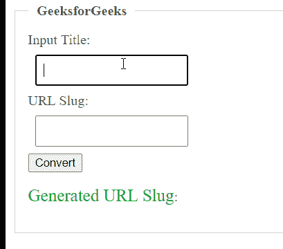

# 如何用 JavaScript 将标题转换成 URL Slug？

> 原文:[https://www . geesforgeks . org/如何使用 javascript 将标题转换为 URL-slug/](https://www.geeksforgeeks.org/how-to-convert-title-to-url-slug-using-javascript/)

给定一个标题，任务是使用 JavaScript 将标题转换为 URL slug。在本文中，我们将使用 HTML 来设计 body 的基本结构，使用 CSS 来设置 body 的样式，并使用 JavaScript 来实现逻辑结构。

**先决条件:**

*   [HTML 基础知识](https://www.geeksforgeeks.org/html-tutorials/)
*   [JavaScript 基础知识](https://www.geeksforgeeks.org/javascript-tutorial/)

基本上下面的程序会用 JavaScript 把一个标题转换成一个网址 Slug。

**进场:**

*   创建一个 HTML 表单，输入标题，输出具有唯一 id 的网址段。
*   给元素添加一些 CSS 样式。

下面是基本的 HTML 代码实现:

## 超文本标记语言

```html
<!DOCTYPE html>
<html>

<head>
    <style>
        fieldset.slugify {
            color: #515151;
            border: 1px solid #ccc;
            padding: 15px;
        }

        .slugify legend {
            font-size: 16px;
            font-weight: 600;
            padding: 0 10px;
        }

        .slugify input {
            display: block;
            padding: 8px;
            margin: 8px;
        }

        .slug-output {
            color: #05ab13;
            font-size: 20px;
            font-weight: 500;
        }
    </style>
</head>

<body>
    <form>
        <fieldset class="slugify">
            <legend>GeeksforGeeks</legend>

            <label for="slug-source">Input Title: </label>
            <input type="text" value="" id="slug-source" />

            <label for="slug-target">URL Slug: </label>
            <input type="text" value="" id="slug-target" />

            <button type="button" onClick="myFunction()">
                Convert
            </button>

<p>
                <span class="slug-ouput">
                    Generated URL Slug
                </span>:
                <span id="slug-target-span"></span>
            </p>

        </fieldset>
    </form>
</body>

</html>
```

*   在这里，我们使用了 JavaScript 中的 **replace()函数**来制作一个字符串 slug。
*   创建的段塞字符串可以进一步用于网址。

下面是 JavaScript 代码实现:

## java 描述语言

```html
<script>
    function myFunction() {

        var a = document.getElementById("slug-source").value;

        var b = a.toLowerCase().replace(/ /g, '-')
            .replace(/[^\w-]+/g, '');

        document.getElementById("slug-target").value = b;

        document.getElementById("slug-target-span").innerHTML = b;
    }
</script>
```

**示例:**在本例中，我们将结合上面两段代码(HTML 和 JavaScript 代码)将 title 转换为 URL slug。

## 超文本标记语言

```html
<!DOCTYPE html>
<html>

<head>
    <style>
        fieldset.slugify {
            color: #515151;
            border: 1px solid #ccc;
            padding: 15px;
        }

        .slugify legend {
            font-size: 16px;
            font-weight: 600;
            padding: 0 10px;
        }

        .slugify input {
            display: block;
            padding: 8px;
            margin: 8px;
        }

        .slug-output {
            color: #05ab13;
            font-size: 20px;
            font-weight: 500;
        }
    </style>
</head>

<body>
    <form>
        <fieldset class="slugify">
            <legend>GeeksforGeeks</legend>

            <label for="slug-source">Input Title: </label>
            <input type="text" value="" id="slug-source" />

            <label for="slug-target">URL Slug: </label>
            <input type="text" value="" id="slug-target" />

            <button type="button" onClick="myFunction()">
                Convert
            </button>

<p>
                <span class="slug-ouput">Generated URL Slug</span>:
                <span id="slug-target-span"></span>
            </p>

        </fieldset>
    </form>

    <script type="text/javascript">
        function myFunction() {

            var a = document.getElementById("slug-source").value;

            var b = a.toLowerCase().replace(/ /g, '-')
                .replace(/[^\w-]+/g, '');

            document.getElementById("slug-target").value = b;

            document.getElementById("slug-target-span").innerHTML = b;
        }
    </script>
</body>

</html>
```

**输出:**

