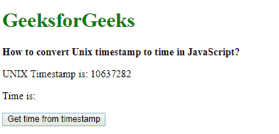
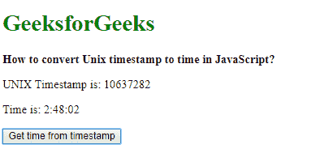
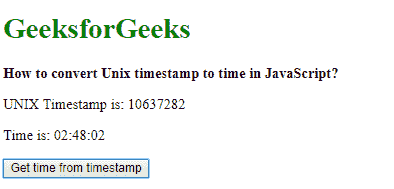

# 如何在 JavaScript 中将 Unix 时间戳转换为时间？

> 原文:[https://www . geesforgeks . org/how-convert-UNIX-timestamp-to-time-in-JavaScript/](https://www.geeksforgeeks.org/how-to-convert-unix-timestamp-to-time-in-javascript/)

UNIX 时间戳可以通过两种方法转换为时间:

**方法 1:使用 toUTCString()方法:**
由于 JavaScript 的工作时间是以毫秒为单位的，所以需要将时间乘以 1000 再转换成毫秒。然后将该值赋予**日期()**函数，以创建新的日期对象。

**TouchString()**方法用于将日期对象表示为世界协调时时间格式的字符串。从这个日期字符串开始的时间可以通过提取从字符串的第 11 个到最后一个到第 4 个到最后一个字符来找到。这是使用**切片()**功能提取的。该字符串是 UNIX 时间戳的时间表示。

**语法:**

```
dateObj = new Date(unixTimestamp * 1000);
utcString = dateObj.toUTCString();
time = utcString.slice(-11, -4);
```

**示例:**

```
<!DOCTYPE html>
<html>

<head>
    <title>
      How to convert Unix timestamp
      to time in JavaScript?
  </title>
</head>

<body>
    <h1 style="color: green">
      GeeksforGeeks
  </h1>
    <b>
      How to convert Unix 
      timestamp to time in JavaScript?
  </b>
    <p>
      UNIX Timestamp is: 10637282
  </p>
    <p>Time is: <span class="output">
      </span>
  </p>

    <button onclick="convertTimestamptoTime()">
      Get time from timestamp
  </button>
    <script type="text/javascript">
        function convertTimestamptoTime() {
            unixTimestamp = 10637282;

            // convert to milliseconds and 
            // then create a new Date object
            dateObj = new Date(unixTimestamp * 1000);
            utcString = dateObj.toUTCString();

            time = utcString.slice(-11, -4);

            document.querySelector(
              '.output').textContent = time;
        }
    </script>
</body>

</html>
```

**输出:**

*   **点击按钮前:**
    
*   **点击按钮后:**
    

**方法二:获取个人小时、分、秒**
由于 JavaScript 是以毫秒为单位工作的，在转换之前需要将时间乘以 1000 转换成毫秒。然后将该值赋予**日期()**函数，以创建新的日期对象。

时间的每一部分都是从日期对象中提取的。使用**getutchhours()**方法从日期中提取以 UTC 表示的小时值。使用 **getUTCMinutes()** 方法从日期中提取以 UTC 表示的分钟值。使用**getutcsters()**方法从日期中提取秒的 UTC 值。

通过使用 **toString()** 方法将这些值转换为字符串，然后使用 **padStart()** 方法将它们填充一个额外的“0”(如果值是一位数)，从而创建最终的格式化日期。然后用冒号(:)作为分隔符将各个部分连接在一起。该字符串是 UNIX 时间戳的时间表示。

**语法:**

```
dateObj = new Date(unixTimestamp * 1000);

// Get hours from the timestamp
hours = dateObj.getUTCHours();

// Get minutes part from the timestamp
minutes = dateObj.getUTCMinutes();

// Get seconds part from the timestamp
seconds = dateObj.getUTCSeconds();

formattedTime = hours.toString().padStart(2, '0') + ':' + 
                minutes.toString().padStart(2, '0') + ':' + 
                seconds.toString().padStart(2, '0');
```

**示例:**

```
<!DOCTYPE html>
<html>

<head>
    <title>
      How to convert Unix timestamp 
      to time in JavaScript?
  </title>
</head>

<body>
    <h1 style="color: green">
      GeeksforGeeks
  </h1>
    <b>
      How to convert Unix timestamp
      to time in JavaScript?
  </b>
    <p>UNIX Timestamp is: 10637282</p>
    <p>Time is: <span class="output">
      </span>
  </p>

    <button onclick="convertTimestamptoTime()">
      Get time from timestamp
  </button>
    <script type="text/javascript">
        function convertTimestamptoTime() {
            unixTimestamp = 10637282;

            // convert to milliseconds
            // and then create a new Date object
            dateObj = new Date(unixTimestamp * 1000);

            // Get hours from the timestamp
            hours = dateObj.getUTCHours();

            // Get minutes part from the timestamp
            minutes = dateObj.getUTCMinutes();

            // Get seconds part from the timestamp
            seconds = dateObj.getUTCSeconds();

            formattedTime = hours.toString().padStart(2, '0') + ':' +
                minutes.toString().padStart(2, '0') + ':' +
                seconds.toString().padStart(2, '0');

            document.querySelector('.output').textContent = formattedTime;
        }
    </script>
</body>

</html>
```

**输出:**

*   **点击按钮前:**
    
*   **点击按钮后:**
    