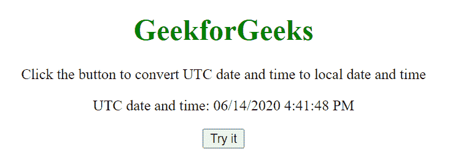
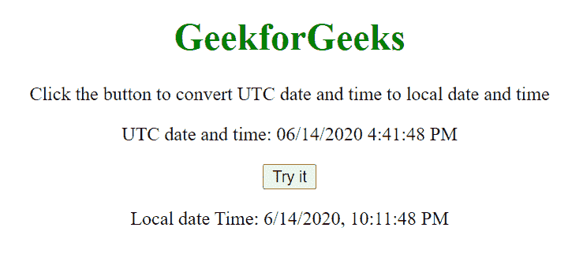

# 如何用 JavaScript 将 UTC 日期时间转换为本地日期时间？

> 原文:[https://www . geesforgeks . org/如何使用 javascript 将-utc-date-time 转换为-local-date-time/](https://www.geeksforgeeks.org/how-to-convert-utc-date-time-into-local-date-time-using-javascript/)

给定一个 UTC 日期，任务是使用 JavaScript**[to localestring()](https://www.geeksforgeeks.org/javascript-date-tolocalestring/)**函数将 UTC 日期时间转换为本地日期时间。

**语法:**

```html
var theDate = new Date(Date.parse('06/14/2020 4:41:48 PM UTC'))
theDate.toLocaleString()
```

**JavaScript 代码:**

```html
// Funcion to convert UTC date-time
// to Local date-time
function myFunction() {
    var theDate = new Date(Date.parse(
            '06/14/2020 4:41:48 PM UTC'));

    document.write("Local date Time: ", 
            theDate.toLocaleString());
}
```

**示例:**本示例使用 JavaScript 将 UTC 日期时间转换为本地日期时间。

```html
<!DOCTYPE html>
<html>

<head>
    <title>
        How to convert UTC date time
        into local date time?
    </title>

    <style>
        h1 {
            color: green;
        }

        body {
            text-align: center;
        }
    </style>
</head>

<body>
    <h1>GeekforGeeks</h1>

    <p>
        Click the button to convert
        UTC date and time to local
        date and time
    </p>

    <p>
        UTC date and time:
        06/14/2020 4:41:48 PM
    </p>

    <button onclick="myGeeks()">
        Try it
    </button>

    <p id="demo"></p>

    <script>
        function myGeeks() {
            var theDate = new Date(Date.parse(
                '06/14/2020 4:41:48 PM UTC'));

            document.getElementById("demo")
                .innerHTML = "Local date Time: "
                + theDate.toLocaleString();
        }
    </script>
</body>

</html>
```

**输出:**

*   **点击按钮前:**
    
*   **点击按钮后:**
    