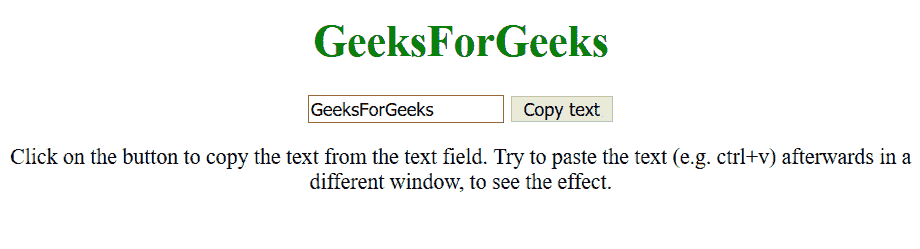
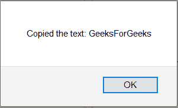
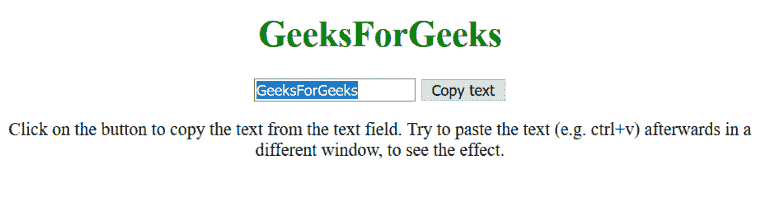
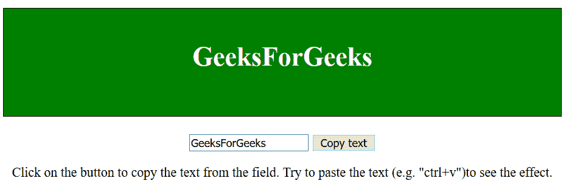
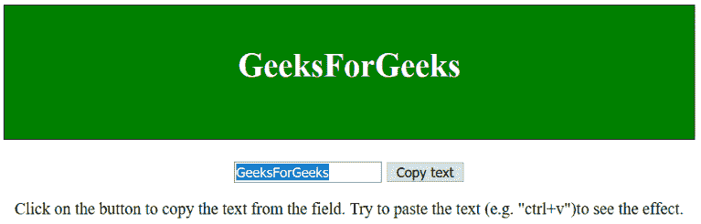

# 如何在 JavaScript 中将文本复制到剪贴板？

> 原文:[https://www . geesforgeks . org/如何将文本复制到 javascript 剪贴板/](https://www.geeksforgeeks.org/how-to-copy-the-text-to-the-clipboard-in-javascript/)

为了在 **javascript** 中将文本复制到剪贴板，我们使用***document . exec command()***方法。这可以分两步完成
**第一步:**编写 HTML 代码:

```
<!-- The text field -->
<input type="text" value="GeeksForGeeks" id="GfGInput">

<!-- The button used to copy the text -->
<button onclick="GeeksForGeeks()">Copy text</button> 
```

**步骤 2 :** 编写 JavaScript 代码:

```
function GeeksForGeeks() {
  /* Get the text field */
  var copyGfGText = document.getElementById("GfGInput");

  /* Select the text field */
  copyGfGText.select();

  /* Copy the text inside the text field */
  document.execCommand("copy");

  /* Alert the copied text */
  alert("Copied the text: " + copyGfGText.value);
} 
```

**注意:**IE8 及更早版本不支持 document.execCommand()方法。

**例 1:**

```
<!DOCTYPE html>
<html>
    <body style = "text-align:center;">
        <h1 style = "color:green;" >  
            GeeksForGeeks  
        </h1>
        <input type="text" value="GeeksForGeeks" id="GfGInput">
        <button onclick="GeeksForGeeks()">Copy text</button> 
        <script>
            function GeeksForGeeks() {
              var copyGfGText = document.getElementById("GfGInput");
              copyGfGText.select();
              document.execCommand("copy");
              alert("Copied the text: " + copyGfGText.value);
            } 
        </script>
        <p>
            Click on the button to copy the text from the
            text field. Try to paste the text (e.g. ctrl+v)
            afterwards in a different window, to see the
            effect.
        </p>
    </body>
</html>
```

**输出:**

**点击元素后:**

**选中的文字被复制:**


**例 2:**

```
<!DOCTYPE html>
<html>
    <head>
        <style> 
            h1 { 
            border: 1px solid black; 
            height: 90px; 
            padding-top: 40px; 
            background: green; 
            color: white; 
            } 
        </style>
    </head>
    <body style = "text-align:center;">
        <h1 style = "color:white;" >  
            GeeksForGeeks  
        </h1>
        <input type="text" value="GeeksForGeeks" id="GfGInput">
        <button onclick="GeeksForGeeks()">Copy text</button> 
        <script>
            function GeeksForGeeks() {
              var copyGfGText = document.getElementById("GfGInput");
              copyGfGText.select();
              document.execCommand("copy");
              alert("Copied the text: " + copyGfGText.value);
            } 
        </script>
        <p>Click on the button to copy the text from the field.
            Try to paste the text (e.g. "ctrl+v")to see the effect.
        </p>
    </body>
</html>
```

**输出:**

**点击元素后:**

**选中的文字被复制:**
