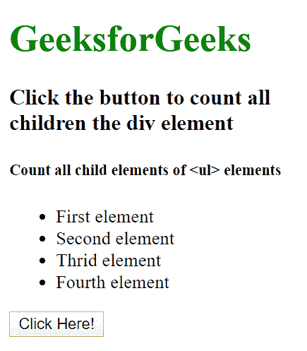
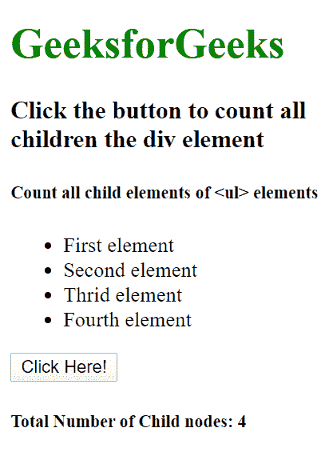

# 如何使用 JavaScript 统计特定元素的所有子元素？

> 原文:[https://www . geesforgeks . org/如何使用 javascript 计算特定元素的所有子元素/](https://www.geeksforgeeks.org/how-to-count-all-child-elements-of-a-particular-element-using-javascript/)

给定一个包含一些元素嵌套元素的 HTML 文档，任务是统计特定元素的所有子元素。使用 JavaScript 计算特定元素的子元素数量非常简单。例如:如果您有一个由许多子元素组成的父元素，那么您可以使用**[HTML DOM childElementCount 属性](https://www.geeksforgeeks.org/html-dom-childelementcount-property/)** 来计算特定元素的所有子元素。

**语法**

```html
node.childElementCount
```

**示例:**

```html
<!DOCTYPE html>
<html>

<head>
    <title>
        How to count all child elements of a
        particular element using JavaScript?
    </title>
</head>

<body>
    <h1 style="color:green">GeeksforGeeks</h1>

    <h3>
        Click the button to count all<br>
        children the div element
    </h3>

    <h5>Count all child elements of <ul> elements</h5>
    <ul id="parentID">
        <li>First element</li>
        <li>Second element</li>
        <li>Thrid element</li>
        <li>Fourth element</li>
    </ul>

    <button onclick="myGeeks()">
        Click Here!
    </button>

    <h5 id="GFG"></h5>

    <script>

        // This function count the child elements
        function myGeeks() {
            var count = document.getElementById(
                "parentID").childElementCount;

            document.getElementById("GFG").innerHTML
                = "Total Number of Child node: "
                + count;
        }
    </script>
</body>

</html>
```

**输出:**

*   **点击按钮前:**
    
*   **点击按钮后:**
    