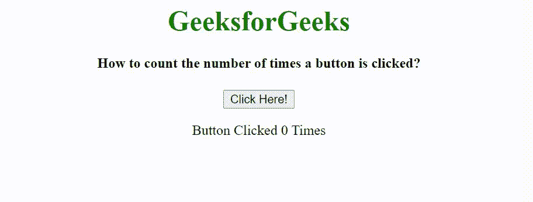

# 如何用 JavaScript 统计按钮被点击的次数？

> 原文:[https://www . geesforgeks . org/如何使用 javascript 计算按钮被点击的次数/](https://www.geeksforgeeks.org/how-to-count-the-number-of-times-a-button-is-clicked-using-javascript/)

我们已经给出了一个按钮，任务是使用 JavaScript 计算按钮被点击的次数。

**方法:**首先，我们将创建一个 HTML 按钮和一个段落元素，我们在其中显示按钮点击次数。单击按钮时，会调用 JavaScript 函数。我们声明一个计数变量，并将其初始化为 0。当用户点击按钮时，计数值增加 1 并显示在屏幕上。

**示例:**

## 超文本标记语言

```html
<!DOCTYPE HTML>
<html>

<head>
    <meta http-equiv="Content-Type" content="text/html; charset=utf-8">
    <title>Increment count when button is clicked</title>
</head>

<body style="text-align: center;">
    <h1 style="color: green;">
        GeeksforGeeks
    </h1>

    <h4>
        How to count the number of 
        times a button is clicked?
    </h4>

    <button id="btn">Click Here!</button>

    <p>
        Button Clicked <span 
        id="display">0</span> Times
    </p>

    <script type="text/javascript">
        var count = 0;
        var btn = document.getElementById("btn");
        var disp = document.getElementById("display");

        btn.onclick = function () {
            count++;
            disp.innerHTML = count;
        }
    </script>
</body>

</html>
```

**输出:**

