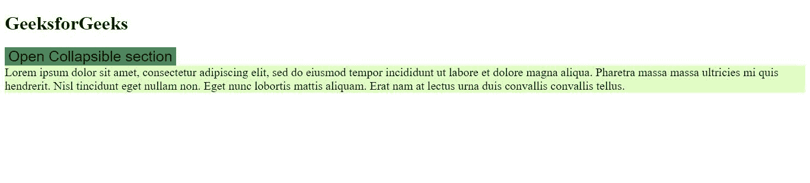
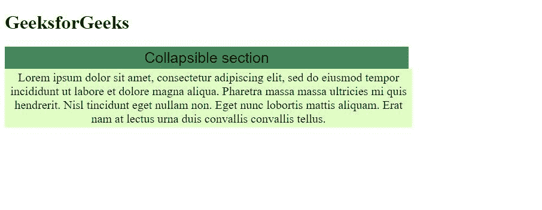

# 如何使用 CSS 和 JavaScript 创建可折叠的节？

> 原文:[https://www . geesforgeks . org/如何使用 css 和 javascript 创建可折叠部分/](https://www.geeksforgeeks.org/how-to-create-a-collapsible-section-using-css-and-javascript/)

可折叠部分是内容的一部分，可以通过单击它们来收缩和展开。它们是一种流行的组织内容的方式，用户只有在希望的情况下才能看到一个部分的内容。在本文中，我们将学习如何使用 CSS 和 JavaScript 创建一个简单的可折叠部分。

这是通过使用一个按钮并将该部分的内容包含在 div 中来完成的。事件侦听器被添加到按钮中，以侦听鼠标单击。“活动”类别在每次按钮点击时切换。展开该部分时，按钮的背景颜色会发生变化。此外，内容的“显示”属性在单击按钮事件时更改为“阻止”，使其在“无”(隐藏)时可见，反之亦然，如下所示。

**例 1:**

```html
<!DOCTYPE html>
<html>
<style>

    .collapse {
        background-color: #a2de96;
        border: none;
        outline: none;
        font-size: 25px;
    }

    .active,
    .collapse:hover {
        background-color: #438a5e;
    }

    .text {
        background-color: #e1ffc2;
        display: none;
        font-size: 20px;
    }
</style>

<body>
    <h1>GeeksforGeeks</h1>
    <button type="button" class="collapse">
        Open Collapsible section
    </button>

    <div class="text">
        A Computer Science portal for geeks. 
        It contains well written, well thought 
        and well explained computer science and
        programming articles, quizzes and ...
    </div>

    <script>
        var btn = document.getElementsByClassName("collapse");

        btn[0].addEventListener("click", function () {
            this.classList.toggle("active");
            var content = this.nextElementSibling;
            if (content.style.display === "block") {
                content.style.display = "none";
            } else {
                content.style.display = "block";
            }
        });

    </script>
</body>

</html>
```

**输出:**

***   Collapse:**

*   **Expanded:**
    

    **示例 2:** 折叠按钮和内容的“宽度”设置为 50%，内容“居中”对齐。

    ```html
    <!DOCTYPE html>
    <html>

    <head>
    <style>
        .collapse {
            background-color: #a2de96;
            border: none;
            outline: none;
            font-size: 25px;
        }

        .active,
        .collapse:hover {
            background-color: #438a5e;
        }

        .text {
            background-color: #e1ffc2;
            display: none;
            font-size: 20px;
        }
    </style>
    </head>

    <body>
        <h1>GeeksforGeeks</h1>
        <button type="button" class="collapse">
            Open Collapsible section
        </button>

        <div class="text">
            How to create a collapsible 
            section using CSS and JavaScript?
        </div>

        <script>
            var btn = document
                .getElementsByClassName("collapse");

            btn[0].addEventListener("click", function () {
                this.classList.toggle("active");
                var content = this.nextElementSibling;
                if (content.style.display === "block") {
                    content.style.display = "none";
                } else {
                    content.style.display = "block";
                }
            });

        </script>
    </body>

    </html>                    
    ```

    **输出:**

    *   **坍塌:**
        
    *   **扩展:**
        