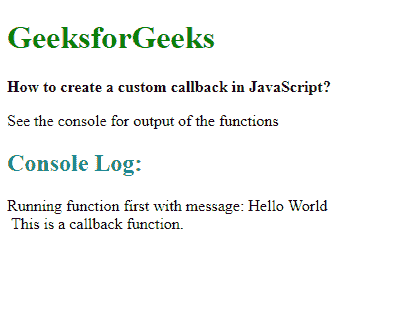
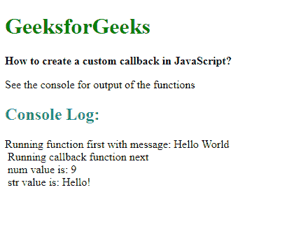

# 如何在 JavaScript 中创建自定义回调？

> 原文:[https://www . geesforgeks . org/如何在 javascript 中创建自定义回调/](https://www.geeksforgeeks.org/how-to-create-a-custom-callback-in-javascript/)

回调是在函数完成执行后调用的函数。由于 JavaScript 是一种事件驱动的语言，它不会等待一个函数完成它的执行，然后再进入下一个函数。回调使得一个函数只有在另一个函数执行完之后才能执行。

JavaScript 中的所有函数都是对象，因此像任何其他对象一样，JavaScript 函数可以作为参数传递给另一个函数。有许多使用回调的内置函数。

使用**回调**关键字作为最后一个参数，可以创建自定义回调函数。然后可以通过在函数末尾调用回调()函数来调用它。运算符的**类型可选用于检查传递的参数是否实际上是一个函数。**

**语法:**

```
function processThis(message, callback) {
            console.log("Running function first with message: " + message);

            if (typeof callback == "function")
                callback();
        }

        processThis("Hello World", function callFunction() {
            console.log("This is a callback function.")
        });
```

**示例:**

```
<!DOCTYPE html>
<html>

<head>
    <title>
      How to create a custom 
      callback in JavaScript? 
  </title>
</head>

<body>
    <h1 style="color: green">
      GeeksforGeeks
  </h1>
    <b>
      How to create a custom 
      callback in JavaScript? 
  </b>
    <p>
      See the console for 
      output of the functions
  </p>
    <script type="text/javascript">
        function processThis(message, callback) {
            console.log(
              "Running function first with message: "
              + message);

            if (typeof callback == "function")
                callback();
        }

        processThis("Hello World", function callbackFunction() {
            console.log("This is a callback function.")
        });
    </script>
</body>

</html>
```

**输出:**


**非匿名回调函数:**
回调函数并不总是要求定义为匿名函数。它可以在其他地方定义，这个函数可以在以后用作回调。传递回调函数时不使用括号。

**示例:**

```
<!DOCTYPE html>
<html>

<head>
    <title>
      How to create a custom 
      callback in JavaScript?
  </title>
</head>

<body>
    <h1 style="color: green">
      GeeksforGeeks
  </h1>
    <b>How to create a custom
      callback in JavaScript? </b>

    <p>See the console for output 
      of the functions</p>
    <script type="text/javascript">
        function processThis(message, callback) {
            console.log("Running function first
                        with message: " + message);

            if (typeof callback == "function")
                callback();
        }

        function callbackFunction() {
            console.log(
              "Running callback function next");
        }

        processThis("Hello World", callbackFunction);
    </script>
</body>

</html>
```

**输出:**


**回调函数中的参数:**
回调函数也可以有自己的参数，并且在调用回调函数时可以在调用函数体中传递这些值。

**示例:**

```
<!DOCTYPE html>
<html>

<head>
    <title>
      How to create a custom 
      callback in JavaScript?
  </title>
</head>

<body>
    <h1 style="color: green">
      GeeksforGeeks
  </h1>

    <b>How to create a custom callback
      in JavaScript?</b>
    <p>See the console for output of the functions</p>

    <script type="text/javascript">
        function processThis(message, callback) {
            console.log(
              "Running function first with message: "
              + message);

            if (typeof callback == "function")
                callback(9, "Hello!");
        }

        function callbackFunction(num, str) {
            console.log("Running callback function next");
            console.log("num value is: " + num);
            console.log("str value is: " + str);
        }

        processThis("Hello World", callbackFunction);
    </script>
</body>

</html>
```

**输出:**
