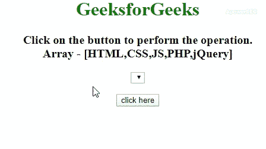

# 如何用 JavaScript 创建带有数组值的下拉列表？

> 原文:[https://www . geesforgeks . org/如何使用 javascript 创建带数组值的下拉列表/](https://www.geeksforgeeks.org/how-to-create-a-dropdown-list-with-array-values-using-javascript/)

任务是从 JavaScript 数组中向 select 元素添加元素。我们也可以使用 JavaScript 在下拉列表中获取选定的值。这里，我们将用数组填充下拉列表。下面是 JavaScript 中常用方法的描述。

**示例 1:** 在此示例中， [**长度属性**](https://www.geeksforgeeks.org/jquery-length-property/) 用于遍历数组的元素，并在每个元素上创建一个 [**选项元素**](https://www.geeksforgeeks.org/html-option-tag/) ，并通过 [**appendChild()方法**](https://www.geeksforgeeks.org/html-dom-appendchild-method/) 将此新元素追加到 select 元素中。

*   **程序:**

## 超文本标记语言

```html
<!DOCTYPE html>
<html>

<head>
    <title>
        Populate dropdown list
        with array values
    </title>
</head>

<body style="text-align:center;">

    <h1 style="color:green;"> 
        GeeksforGeeks 
    </h1>

    <p id="geeks" style=
        "font-size:20px; font-weight:bold">
    </p>

    <select id="arr"></select>

    <br><br>

    <button onclick="GFG_Fun();">
        click here
    </button>

    <p id="gfg" style="font-size: 26px;
        font-weight: bold;color: green;">
    </p>

    <script>
        var up = document.getElementById('geeks');
        var down = document.getElementById('gfg');
        var select = document.getElementById("arr");
        var elmts = ["HTML", "CSS", "JS", "PHP", "jQuery"];
        up.innerHTML = "Click on the button to "
                    + "perform the operation"+
                    ".<br>Array - [" + elmts + "]";

        // Main function
        function GFG_Fun() {
            for (var i = 0; i < elmts.length; i++) {
                var optn = elmts[i];
                var el = document.createElement("option");
                el.textContent = optn;
                el.value = optn;
                select.appendChild(el);
            }
            down.innerHTML = "Elements Added";
        }
    </script>
</body>

</html>
```

*   **输出:**



**示例 2:** 在本例中， [**每个()方法**](https://www.geeksforgeeks.org/jquery-misc-each-method/) 用于遍历数组的元素，并在每个元素上创建一个 [**选项元素**](https://www.geeksforgeeks.org/html-option-tag/) ，并通过 JQuery 中的 [**追加()方法**](https://www.geeksforgeeks.org/html-dom-appendchild-method/) 将这个新元素追加到 select 元素中。

*   **程序:**

## 超文本标记语言

```html
<!DOCTYPE html>
<html>

<head>
    <title>
        Populate dropdown list
        with array values
    </title>

    <script src=
"https://ajax.googleapis.com/ajax/libs/jquery/3.4.1/jquery.min.js"> 
    </script>
</head>

<body style="text-align:center;">

    <h1 style="color:green;"> 
        GeeksforGeeks 
    </h1>

    <p id="geeks" style=
        "font-size: 20px;font-weight: bold">
    </p>

    <select id="arr"></select>

    <br><br>

    <button onclick="GFG_Fun();">
        click here
    </button>

    <p id="gfg" style="font-size: 26px;
        font-weight: bold; color: green;">
    </p>

    <script>
        var up = document.getElementById('geeks');
        var down = document.getElementById('gfg');
        var select = document.getElementById("arr");
        var elmts = ["HTML", "CSS", "JS", "PHP", "jQuery"];
        up.innerHTML = "Click on the button to "
                + "perform the operation"+
                ".<br>Array - [" + elmts + "]";

        // Main function
        function GFG_Fun() {
            $.each(elmts, function(i, p) {
                $('#arr').append($('<option></option>')
                            .val(p).html(p));
            });
            down.innerHTML = "Elements Added";
        }
    </script>
</body>

</html>
```

*   **输出:**


CSS 是网页的基础，通过设计网站和网络应用程序用于网页开发。你可以通过以下 [CSS 教程](https://www.geeksforgeeks.org/css-tutorials/)和 [CSS 示例](https://www.geeksforgeeks.org/css-examples/)从头开始学习 CSS。