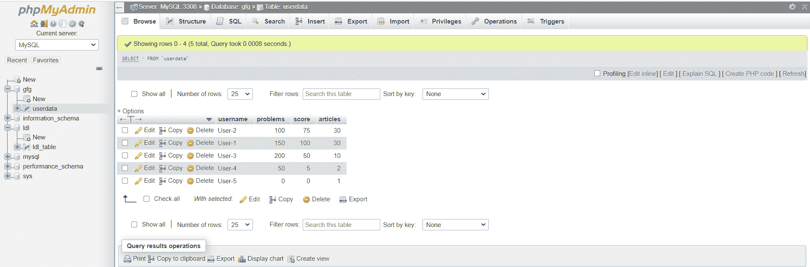
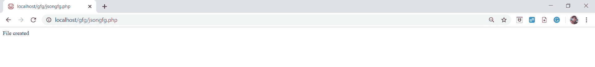
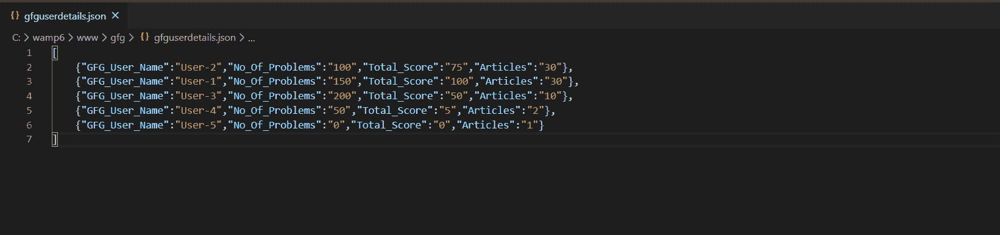

# 如何从 localserver 数据库中取数创建动态 JSON 文件？

> 原文:[https://www . geesforgeks . org/如何通过从本地服务器数据库中获取数据来创建动态 json 文件/](https://www.geeksforgeeks.org/how-to-create-a-dynamic-json-file-by-fetching-data-from-localserver-database/)

JSON 代表 JavaScript 对象符号，是一种用于存储和传输数据的结构化格式。它充当服务器和网页之间的接口。这是一种轻量级的数据交换格式。它独立于语言，易于理解。它来源于 Javascript。使用 stringify()和 parse()等函数，可以将 JSON 对象转换为 javascript 对象，反之亦然。
这里，在浏览程序之前，我们需要在本地主机服务器中创建一个 MySQL 数据库。PHP 用于连接本地主机服务器，并通过评估 MySQL 查询从本地主机服务器中的数据库表中获取数据。Wampserver 帮助启动 Apache 和 MySQL，并用 PHP 文件连接它们。在我们的 PHP 代码中，我们将创建一个从数据库中获取的数据数组，然后将它们转换为 JSON。将创建一个动态 JSON 文件来存储 JSON 对象的数组。

考虑一下，我们有一个名为 **gfg** 的数据库，一个名为 **userdata** 的表。现在，下面是从数据库中获取数据并将它们存储到名为**的 json 文件中的 PHP 代码，通过将它们转换成 JSON 对象的数组来实现。**

**创建数据库:**


**示例:**

```
<?php

// PHP program to connect with
// localserver database
$user = 'root';
$password = ''; 
$database = 'gfg'; 
$servername ='localhost:3308';

$mysqli = new mysqli($servername, 
    $user, $password, $database);

if ($mysqli->connect_error) {
    die('Connect Error (' . 
        $mysqli->connect_errno . ') '. 
        $mysqli->connect_error);
}

// SQL query to select data
// from database
$sql2 = "SELECT * FROM userdata";
$result = $mysqli->query($sql2);

// Fetching data from the database
// and storing in array of objects
while($row = $result->fetch_array()) {
    $studentdata[] = array(
        "GFG_User_Name" => $row["username"],
        "No_Of_Problems" => $row["problems"],
        "Total_Score" => $row["score"],
        "Articles" => $row["articles"],
    );
}

// Creating a dynamic JSON file
$file = "gfguserdetails.json";

// Converting data into JSON and putting
// into the file
// Checking for its creation
if(file_put_contents($file, 
        json_encode($studentdata)))
    echo("File created");
else
    echo("Failed");

// Closing the database
$mysqli->close();

?>
```

**输出:**


在浏览器上运行代码后创建的动态 JSON 文件:
