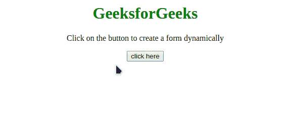
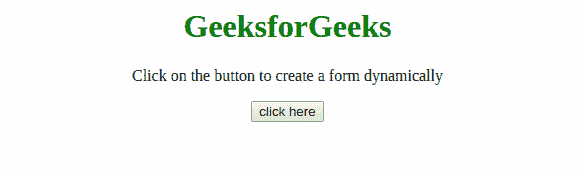

# 如何用 JavaScript 动态创建表单？

> 原文:[https://www . geeksforgeeks . org/如何使用 javascript 动态创建表单/](https://www.geeksforgeeks.org/how-to-create-a-form-dynamically-with-the-javascript/)

任务是在 JavaScript 的帮助下动态创建一个 HTML 表单。下面讨论两种方法。

**方法 1:** 使用[**document . createelement()**](https://www.geeksforgeeks.org/html-dom-createelement-method/)创建新元素，使用 [**setAttribute()**](https://www.geeksforgeeks.org/how-to-add-update-an-attribute-to-an-html-element-using-javascript/) 方法设置元素的属性。通过[**appendChild()**](https://www.geeksforgeeks.org/html-dom-appendchild-method/)方法将这些元素追加到 **<表单>** 元素中。最后将 **<表单>** 元素追加到文档的 **<正文>** 元素中。本示例创建一个注册表单。

*   **例:**

    ```html
    <!DOCTYPE html>
    <html>
        <head>
            <title>
                Create a Form Dynamically with 
                the JavaScript
            </title>
        </head>
        <body style="text-align: center;">
            <h1 style="color: green;">
                GeeksforGeeks
            </h1>
            <p>
              Click on the button to create
              a form dynamically
            </p>
            <button onClick="GFG_Fun()">
                click here
            </button>
            <p id="GFG_DOWN"></p>
     <script>
        var down = document.getElementById("GFG_DOWN");

        // Create a break line element
        var br = document.createElement("br"); 
        function GFG_Fun() {

        // Create a form synamically
        var form = document.createElement("form");
        form.setAttribute("method", "post");
        form.setAttribute("action", "submit.php");

        // Create an input element for Full Name
        var FN = document.createElement("input");
        FN.setAttribute("type", "text");
        FN.setAttribute("name", "FullName");
        FN.setAttribute("placeholder", "Full Name");

         // Create an input element for date of birth
         var DOB = document.createElement("input");
         DOB.setAttribute("type", "text");
         DOB.setAttribute("name", "dob");
         DOB.setAttribute("placeholder", "DOB");

         // Create an input element for emailID
         var EID = document.createElement("input");
         EID.setAttribute("type", "text");
         EID.setAttribute("name", "emailID");
         EID.setAttribute("placeholder", "E-Mail ID");

          // Create an input element for password
          var PWD = document.createElement("input");
          PWD.setAttribute("type", "password");
          PWD.setAttribute("name", "password");
          PWD.setAttribute("placeholder", "Password");

           // Create an input element for retype-password
           var RPWD = document.createElement("input");
           RPWD.setAttribute("type", "password");
           RPWD.setAttribute("name", "reTypePassword");
           RPWD.setAttribute("placeholder", "ReEnter Password");

                    // create a submit button
                    var s = document.createElement("input");
                    s.setAttribute("type", "submit");
                    s.setAttribute("value", "Submit");

                    // Append the full name input to the form
                    form.appendChild(FN); 

                    // Inserting a line break
                    form.appendChild(br.cloneNode()); 

                    // Append the DOB to the form
                    form.appendChild(DOB); 
                    form.appendChild(br.cloneNode()); 

                    // Append the emailID to the form
                    form.appendChild(EID); 
                    form.appendChild(br.cloneNode()); 

                    // Append the Password to the form
                    form.appendChild(PWD); 
                    form.appendChild(br.cloneNode()); 

                    // Append the ReEnterPassword to the form
                    form.appendChild(RPWD); 
                    form.appendChild(br.cloneNode()); 

                    // Append the submit button to the form
                    form.appendChild(s); 

                    document.getElementsByTagName("body")[0]
                   .appendChild(form);
                }
            </script>
        </body>
    </html>
    ```

*   **输出:** 

**方法 2:** 这种方法有点类似于前面的方法，但是使用 JQuery 方法来追加元素。使用[**document . createelement()**](https://www.geeksforgeeks.org/html-dom-createelement-method/)创建新元素，使用 [**setAttribute()**](https://www.geeksforgeeks.org/how-to-add-update-an-attribute-to-an-html-element-using-javascript/) 方法设置元素的属性。通过 JQuery 的 [**append()**](https://www.geeksforgeeks.org/jquery-append-method/) 方法将这些元素追加到<表单>元素中。最后将 **<表单>** 元素追加到文档的 **<正文>** 元素中。本示例创建一个 LOGIN 表单。

*   **例:**

    ```html
    <!DOCTYPE html>
    <html>
        <head>
            <title>
                Create a Form Dynamically 
                with the JavaScript
            </title>
        </head>
        <body style="text-align: center;">
            <h1 style="color: green;">
                GeeksforGeeks
            </h1>
            <p>
                  Click on the button to create 
                a form dynamically
            </p>
            <button onClick="GFG_Fun()">
                click here
            </button>
            <p id="GFG_DOWN"></p>
            <script>
                var down = document.getElementById("GFG_DOWN");
                function GFG_Fun() {

                    // Create a form synamically
                    var form = document.createElement("form");
                    form.setAttribute("method", "post");
                    form.setAttribute("action", "submit.php");

                    // Create an input element for emailID
                    var ID = document.createElement("input");
                    ID.setAttribute("type", "text");
                    ID.setAttribute("name", "emailID");
                    ID.setAttribute("placeholder", "E-Mail ID");

                    // Create an input element for password
                    var PWD = document.createElement("input");
                    PWD.setAttribute("type", "password");
                    PWD.setAttribute("name", "password");
                    PWD.setAttribute("placeholder", "Password");

                    // Create a submit button
                    var s = document.createElement("input");
                    s.setAttribute("type", "submit");
                    s.setAttribute("value", "Submit");

                    // Append the email_ID input to the form
                    form.append(ID); 

                    // Append the password to the form
                    form.append(PWD); 

                    // Append the button to the form
                    form.append(s); 

                    document.getElementsByTagName("body")[0]
                   .appendChild(form);
                }
            </script>
        </body>
    </html>
    ```

*   **输出:** 

JavaScript 最出名的是网页开发，但它也用于各种非浏览器环境。您可以通过以下 [JavaScript 教程](https://www.geeksforgeeks.org/javascript-tutorial/)和 [JavaScript 示例](https://www.geeksforgeeks.org/javascript-examples/)从头开始学习 JavaScript。

HTML 是网页的基础，通过构建网站和网络应用程序用于网页开发。您可以通过以下 [HTML 教程](https://www.geeksforgeeks.org/html-tutorials/)和 [HTML 示例](https://www.geeksforgeeks.org/html-examples/)从头开始学习 HTML。

CSS 是网页的基础，通过设计网站和网络应用程序用于网页开发。你可以通过以下 [CSS 教程](https://www.geeksforgeeks.org/css-tutorials/)和 [CSS 示例](https://www.geeksforgeeks.org/css-examples/)从头开始学习 CSS。