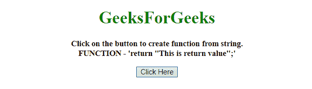
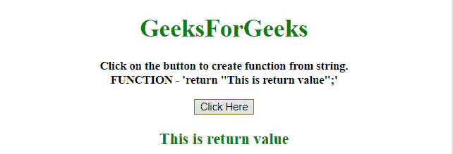
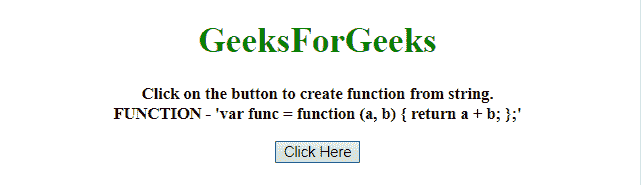
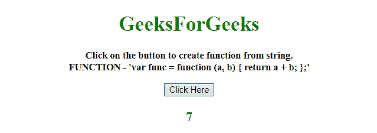

# 如何在 JavaScript 中用字符串创建函数？

> 原文:[https://www . geesforgeks . org/如何从 javascript 字符串创建函数/](https://www.geeksforgeeks.org/how-to-create-a-function-from-a-string-in-javascript/)

任务是根据函数格式给出的字符串创建一个函数。这里讨论了一些借助 JavaScript 的技术。

**方法 1:**

*   使用**函数()构造器**从字符串创建函数。
*   它接受任意数量的参数(以字符串的形式)。最后一个应该是函数体。
*   在本例中，只传递了返回值的函数体。

**示例 1:** 该示例使用如上所述的方法

```
<!DOCTYPE HTML>
<html>

<head>
    <title>
        create a function from a string in JavaScript 
    </title>
</head>

<body style="text-align:center;" id="body">
    <h1 style="color:green;">  
            GeeksForGeeks  
        </h1>
    <p id="GFG_UP"
       style="font-size: 15px;
              font-weight: bold;">
    </p>
    <button onclick="GFG_Fun()">
        Click Here
    </button>
    <p id="GFG_DOWN"
       style="color:green;
              font-size: 20px;
              font-weight: bold;">
    </p>
    <script>
        var up = document.getElementById('GFG_UP');
        var down = document.getElementById('GFG_DOWN');
        var func = 'return "This is return value";';
        up.innerHTML = 
          "Click on the button to create "+
          "function from string.<br>FUNCTION - '" 
        + func + "'";

        // Till this point we can use 'func' as function.
        function GFG_Fun() {
            var func2 = Function(func); 
          // Now 'func' can be used as function.
            down.innerHTML = func2();
        }
    </script>
</body>

</html>
```

**输出:**

*   **点击按钮前:**
    
*   **点击按钮后:**
    

**方法 2:**

*   使用 **eval()方法**从字符串创建函数。
*   它接受字符串形式的函数，并将其转换为 JavaScript 函数。
*   在本例中，它采用 2 个参数，并返回两个数字的总和。

**示例 2:** 该示例使用如上所述的方法。

```
<!DOCTYPE HTML>
<html>

<head>
    <title>
        create a function from a string in JavaScript
    </title>
</head>

<body style="text-align:center;"
      id="body">
    <h1 style="color:green;">  
            GeeksForGeeks  
        </h1>
    <p id="GFG_UP" 
       style="font-size: 15px;
              font-weight: bold;">
    </p>
    <button onclick="GFG_Fun()">
        Click Here
    </button>
    <p id="GFG_DOWN" 
       style="color:green;
              font-size: 20px; 
              font-weight: bold;">
    </p>
    <script>
        var up = document.getElementById('GFG_UP');
        var down = document.getElementById('GFG_DOWN');
        var str = "var func = function (a, b) { return a + b; };";
        up.innerHTML = 
          "Click on the button to create "+
          "function from string.<br>FUNCTION - '" + str + "'";

        // Till this point we can use 'func' as function.
        function GFG_Fun() {
          // converting the string to function.
            eval(str); 
            down.innerHTML = func(2, 5);
        }
    </script>
</body>

</html>
```

**输出:**

*   **点击按钮前:**
    
*   **点击按钮后:**
    