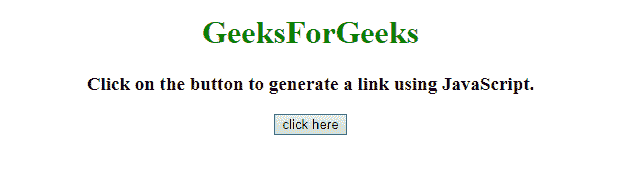
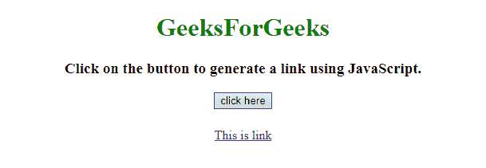
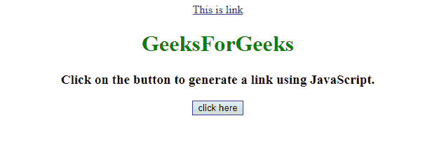

# 如何在 JavaScript 中创建链接？

> 原文:[https://www . geesforgeks . org/如何创建 javascript 中的链接/](https://www.geeksforgeeks.org/how-to-create-a-link-in-javascript/)

给定一个 HTML 文档，任务是创建一个 JavaScript 链接，并使用 JavaScript 将其添加到文档中。

**进场:**

*   创建一个锚点
*   创建一个文本节点，其中包含一些将显示为链接的文本。
*   将文本节点附加到锚点
*   设置
*   在正文中追加

**示例 1:** 在本例中，节点被创建，属性由 JavaScript 方法设置。

```
<!DOCTYPE HTML> 
<html> 
    <head> 
        <title> 
            How to create a link in JavaScript ?
        </title>
    </head> 

    <body style = "text-align:center;">

        <h1 style = "color:green;" > 
            GeeksForGeeks
        </h1>

        <p id = "GFG_UP" style =
            "font-size: 19px; font-weight: bold;">
        </p>

        <button onclick = "GFG_Fun()">
            click here
        </button>

        <p id = "GFG_DOWN" style =
            "color: green; font-size: 24px; font-weight: bold;">
        </p>

        <script>
            var el_up = document.getElementById("GFG_UP");
            var el_down = document.getElementById("GFG_DOWN");

            el_up.innerHTML = "Click on the button to generate "
                    + "a link using JavaScript.";

            function GFG_Fun() {

                // Create anchor element.
                var a = document.createElement('a'); 

                // Create the text node for anchor element.
                var link = document.createTextNode("This is link");

                // Append the text node to anchor element.
                a.appendChild(link); 

                // Set the title.
                a.title = "This is Link"; 

                // Set the href property.
                a.href = "https://www.geeksforgeeks.org"; 

                // Append the anchor element to the body.
                document.body.appendChild(a); 
            }
        </script> 
    </body> 
</html>                    
```

**输出:**

*   **点击按钮前:**
    
*   **点击按钮后:**
    

**示例 2:** 此示例与上面的示例类似，但使用 prepend()方法向正文中添加锚点元素。

```
<!DOCTYPE HTML> 
<html> 
    <head> 
        <title> 
            How to create a link in JavaScript ?
        </title>
    </head> 

    <body style = "text-align:center;">

        <h1 style = "color:green;" > 
            GeeksForGeeks
        </h1>

        <p id = "GFG_UP" style =
            "font-size: 19px; font-weight: bold;">
        </p>

        <button onclick = "GFG_Fun()">
            click here
        </button>

        <p id = "GFG_DOWN" style =
            "color: green; font-size: 24px; font-weight: bold;">
        </p>

        <script>
            var el_up = document.getElementById("GFG_UP");
            var el_down = document.getElementById("GFG_DOWN");

            el_up.innerHTML = "Click on the button to generate "
                    + "a link using JavaScript.";

            function GFG_Fun() {

                // Create anchor element.
                var a = document.createElement('a'); 

                // Create the text node for anchor element.
                var link = document.createTextNode("This is link");

                // Append the text node to anchor element.
                a.appendChild(link); 

                // Set the title.
                a.title = "This is Link"; 

                // Set the href property.
                a.href = "https://www.geeksforgeeks.org"; 

                // Append the anchor element to the body.
                document.body.prepend(a); 
            }
        </script> 
    </body> 
</html>                    
```

**输出:**

*   **点击按钮前:**
    
*   **点击按钮后:**
    

JavaScript 最出名的是网页开发，但它也用于各种非浏览器环境。您可以通过以下 [JavaScript 教程](https://www.geeksforgeeks.org/javascript-tutorial/)和 [JavaScript 示例](https://www.geeksforgeeks.org/javascript-examples/)从头开始学习 JavaScript。