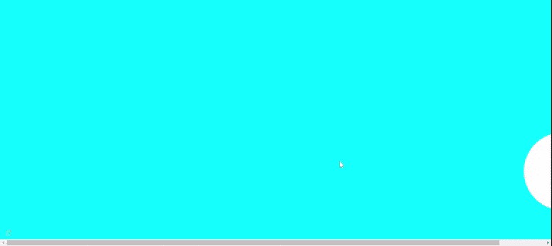

# 如何用 JavaScript 创建移动 div？

> 原文:[https://www . geesforgeks . org/如何使用 javascript 创建移动 div/](https://www.geeksforgeeks.org/how-to-create-a-moving-div-using-javascript/)

在本文中，我们将学习使用 JavaScript 创建一个移动的 HTML [*div*](https://www.geeksforgeeks.org/div-tag-html/) 。 *div* 将使用 [HTML](https://www.geeksforgeeks.org/html-tutorials/) 、 [CSS](https://www.geeksforgeeks.org/css-tutorials/) 和 [JavaScript](https://www.geeksforgeeks.org/javascript-tutorial/) 从左向右移动。

**进场:**

1.  我们必须创建一个 HTML *div* ，并使用一个类*球*给 *div* 添加一些 CSS。
2.  在 CSS 中，我们给身体添加一些 [*背景色*](https://www.geeksforgeeks.org/css-background-color-property/) ，给 *div* 一些高度、宽度和颜色。
3.  现在我们将使用 JavaScript 在*分区*中添加 [*左边距*](https://www.geeksforgeeks.org/css-margin-left-property/) 。所以它会从左向右移动。
4.  在 JavaScript 中，我们使用 id 名称获取 *div* 。经过一段时间后，我们将把*左边距*添加到*分区*中。

**HTML 代码:**

## 超文本标记语言

```
<!DOCTYPE html>
<html lang="en">
  <head>
    <meta charset="UTF-8" />
    <meta http-equiv="X-UA-Compatible" 
          content="IE=edge" />
    <meta name="viewport" 
          content="width=device-width, initial-scale=1.0" />

    <style>
      body {
        background-color: aqua;
        display: flex;
        align-items: center;
      }

      .ball {
        height: 12rem;
        width: 12rem;
        background-color: white;
        border-radius: 50%;
        margin-top: 20rem;
      }
    </style>
  </head>
  <body>
    <div class="container">
      <div class="ball" id="ballID"></div>
    </div>
    <script>
      let ball = document.getElementById("ballID");

      var myVar = setInterval(spostaDiv, 90);
      var margin = 0;

      let l = window.screen.width;
      let w = 1300;

      function spostaDiv() {
        console.log(w);
        if (margin == w) {
          margin = 0 + "px";
        } else {
          ball.style.marginLeft = margin + "px";
        }
        margin += 10;
      }
    </script>
  </body>
</html>
```

**输出:**

